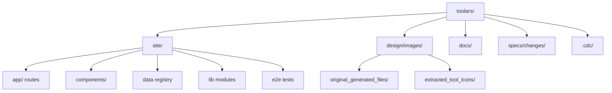
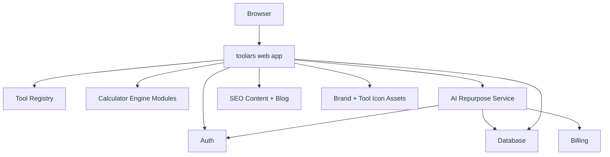

# toolars · Architecture

> Initialized by CDC on 2026-05-30.
> Schema v1.
>
> ARCHITECTURE.md records current and intended structural facts for toolars.
> It complements [CONTEXT.md](./CONTEXT.md), which records product and repo facts.

## Metadata

```yaml
project: toolars
last_synced: 2026-06-06
covered_changes:
  - merge-toolars-platform
  - design-conformance-pass
  - toolars-v1-design-integration
  - seo-discovery-manifests-pass
  - site-graph-metadata-pass
  - tools-query-search-pass
curator: codex + context-refresh-and-integration-pass
spec_version: v1
mode: A-architect
status: current runnable architecture plus open productionization work
```

## 1. Current Repository Shape

The current repository contains a runnable Next.js App Router implementation
under `site/`, CDC workflow state under `.cdc/`, implementation specs under
`specs/changes/`, product/architecture/QA docs under `docs/`, and design
artifacts under `design/`.



Current site stack:

| Area | Current implementation |
|---|---|
| Framework | Next.js App Router 16.2.6 under `site/` |
| Language | TypeScript 5.9.3 |
| UI | Tailwind CSS 4, local shadcn-style primitives, Lucide icons |
| Tests | Vitest + Testing Library + Playwright |
| Public data | Typed calculator, AI tool, locale, blog, category registries |
| Calculator logic | Pure `site/lib/calculators` engines independent of React/browser/network |
| Search | Shared `site/lib/search` helper used by command palette and `/tools?search=` |
| SEO/GEO | Metadata helpers, sitemap, robots, llms.txt, JSON-LD schemas |

## 2. Intended Product Architecture

The target product merges calculator/static tool discovery with account-gated AI SaaS workflows.



## 3. Proposed Module Map

The current module map is a Next.js App Router application under `site/`:

```text
site/
  app/                            route layer
    page.tsx                      search-first home dashboard
    tools/page.tsx                public tools directory; reads `search` query
    tools/[slug]/page.tsx         calculator detail pages
    categories/*                  health and finance category pages
    ai/page.tsx                   public AI tools directory
    app/*                         account/AI app pages
    api/*                         AI repurpose and billing webhook route handlers
    blog/*                        SEO blog index and article routes
    sitemap.ts, robots.ts         discovery manifests
    llms.txt/route.ts             LLM discovery summary
  components/
    layout/                      shell, header, sidebar, footer
    navigation/                  mega menu, mobile drawer
    search/                      command palette and global search
    tools/                       tool cards, directory, category pages
    calculators/                 calculator form/result primitives
    ai/                          repurpose dashboard, output cards, platform picker
    ui/                          design-system primitives
  data/
    tools.ts                     central ToolRegistry
    calculators.ts               calculator definitions
    ai-platforms.ts              platform definitions
  lib/
    calculators/                 pure calculation functions
    seo/                         metadata and schema helpers
    formatting/                  number, currency, unit formatting
    auth/                        auth helpers
    ai/                          provider/client wrappers
```

Note: `auth/`, `ai/`, and `billing/` currently contain preview-safe
implementation logic and tests. They are not yet connected to real Supabase,
provider APIs, billing account storage, or production usage metering.

## 4. Dependency Rules

These rules should hold regardless of final framework choice.

| From | Can Depend On | Must Not Depend On | Reason |
|---|---|---|---|
| Route layer | components, data, lib/seo | raw DB drivers inside public calculator pages | Keep public pages static/fast where possible. |
| Components | UI primitives, typed data, formatting helpers | provider SDKs, DB clients | Components stay presentational and testable. |
| Calculator UI | calculator definitions, calculator engine modules | AI service, billing | Free calculators must remain independent from account-gated AI flows. |
| Calculator engine | pure utility modules | browser DOM, React, network | Enables unit tests and deterministic calculations. |
| AI app UI | AI service client, auth state, platform config | calculator internals | Keep SaaS workflow separate from public calculators. |
| Tool registry | metadata only | executable AI/provider code | Registry remains indexable and safe to render publicly. |
| SEO/content helpers | tool registry, page metadata | account state | Crawlable pages must not depend on user session. |

## 5. Cross-Module Contracts To Define

| Contract | Producer | Consumers | Status |
|---|---|---|---|
| `ToolDefinition` | data registry | home, directory, category pages, search, related tools | Suggested in `DESIGN.md`; needs final schema. |
| `CalculatorDefinition` | calculator registry | shared calculator template, validation, SEO, tests | Suggested in `DESIGN.md`; needs final schema. |
| Calculator result shape | calculator engine | result panel, compare/save/share, exports | Open. |
| Search index shape | tool/content registry | command palette, global search, mega menu | Open. |
| AI repurpose job shape | AI service | dashboard, history, analytics | Suggested in `DESIGN.md`; must align with chosen backend. |
| Anonymous local state | browser storage | favorites, recent tools, saved calculator results | Open account-sync boundary. |
| Account state | auth + DB | AI history, brand voices, settings, billing | Open provider/schema choice. |

## 6. Technology Choices

| Layer | Approved choice | Rationale |
|---|---|---|
| Web framework | Next.js App Router | Unified public SEO pages, AI streaming, route handlers, and SaaS app. |
| Language | TypeScript | Typed registries, calculator definitions, and API contracts. |
| Styling | Tailwind CSS + shadcn-style primitives | Matches `design/DESIGN.md`. |
| Auth/DB | Supabase Auth + Postgres | Aligns with source AI SaaS project and account data needs. |
| AI | Vercel AI SDK provider adapters | Fits streaming, multi-provider AI workflows. |
| Billing | Lemon Squeezy | Existing source-project direction and indie SaaS fit. |
| Tests | Vitest + Testing Library + Playwright | Unit, component, and E2E gates. |

Current implementation status:

| Layer | Status |
|---|---|
| Web framework | Implemented and verified under `site/`. |
| Language | Implemented as TypeScript. |
| Styling | Implemented with Tailwind CSS and local primitives; design conformance passes exist. |
| Auth/DB | Preview auth only; Supabase/Postgres not yet implemented. |
| AI | Deterministic preview generator; provider adapters not yet implemented. |
| Billing | Plan gates and webhook signature parsing exist; subscription persistence not yet implemented. |
| Tests | Implemented; latest current-branch evidence includes 78 unit/component tests and 38 E2E tests. |

## 7. Data Architecture Questions

The product likely needs separate persistence tiers:

- Local browser storage for anonymous calculator favorites, recent tools, and saved comparisons.
- Account database for AI users, brand voices, AI history, usage, settings, API keys, subscription state.
- Static/content layer for calculator definitions, blog content, category pages, i18n dictionaries, and SEO metadata.

Open decisions:

- Anonymous calculator saves are local by default; account sync is an explicit
  Pro/account action.
- All 73 calculators should be registry-driven through a shared template, with
  bespoke overrides only where the template cannot safely express the tool.
- Blog/content is file-based for v1 unless a later spec approves a CMS.
- Billing uses Lemon Squeezy unless a later spec supersedes this decision.

## 8. Observability and Quality Gates

Minimum gates before implementation can be called complete:

- Unit tests for calculator engine modules.
- Component tests for shared calculator form/result states.
- Integration tests for command palette, favorites, compare/save, and AI generation cancel/copy states.
- Accessibility checks for keyboard navigation, focus, modal/drawer/search interactions.
- SEO/schema validation for representative calculator, category, blog, and home pages.
- Performance checks for public calculator pages and search.

Current verification baseline:

```bash
pnpm --dir site lint
pnpm --dir site type-check
pnpm --dir site test
pnpm --dir site test:e2e
pnpm --dir site build
cdc-workflow gate --mode standard --root .
cdc-workflow ship-preview --change <change-id> --root .
```

The current branch stack passes these gates as of `tools-query-search-pass`.
The `/tools` route is now dynamic because it reads `searchParams` for
server-rendered query results; public calculator detail routes remain SSG via
`generateStaticParams`.

## 9. Known Architecture Risks

| Risk | Impact | Mitigation |
|---|---|---|
| Trying to manually build 73 unique calculator UIs | High maintenance and inconsistent UX | Use shared templates driven by typed calculator definitions; allow overrides only when needed. |
| Mixing anonymous calculator UX with account-gated AI SaaS too early | User friction and unclear monetization | Keep calculators no-signup by default; gate only sync/export/AI/premium actions. |
| Choosing framework before deciding SEO vs SaaS priority | Rework | Confirm framework strategy before PRD/architecture finalization. |
| Generated image set is incomplete | Design ambiguity for many calculator states | Treat `DESIGN.md` as source of truth and request missing page/state designs if pixel-perfect implementation is required. |
| Importing source project tech debt wholesale | Bloated product | Use source projects as feature inventory; design new registry and shared primitives. |

## 10. Maintenance

- Update this file after major branch-stack integration, before real backend
  implementation, and before production release review.
- Add ADRs for framework choice, data model, auth/billing, i18n routing, and calculator registry strategy.
- Use `cdc-workflow gate --mode standard --root .` before spec/propose and implementation phases.
- Run `cdc-role-security-audit` before releasing real auth, AI provider, billing, API key, or cross-device persistence features.
