# Toolars 静态高保真设计方案

版本: v1.0
日期: 2026-06-09
阶段: 静态高保真设计稿
范围: 全领域混合工具平台, 包含传统工具、AI 工具和工作流

## 1. 核心结论

Toolars 不应该只是把现有 VitalCalc 扩成更多分类的工具目录。它的商业级定位应是:

> All tools. One workspace.

中文表达:

> 所有工具, 一个工作台。

最终推荐方案采用组合式架构:

- 首页和发现页采用 Tool Market 模型: 可规模化承载大量工具、分类、标签和商业化入口。
- 顶部和首屏强化 Command Search: 用户输入任务, 直接匹配传统工具、AI 工具或工作流。
- 工具详情页采用 Unified Workspace: 传统处理、AI 增强、历史结果和下一步工作流在同一个工作台完成。

这套方向保留了 10015.io 的核心优点: 一站式、路径短、分类清楚。但 Toolars 的差异是更明确地区分传统工具、AI 工具、工作流, 并把工具从“打开即用”升级为“可连续处理任务”。

## 2. 参考对象分析

参考站点:

- 10015.io 首页: `references/10015-home-reference.png`
- 10015.io Product Finder: `references/10015-product-finder-reference.png`

可借鉴点:

- 首页搜索入口清楚, 用户能快速找到工具。
- 分类结构直接, 工具路径短。
- Product Finder 已经从工具站走向目录/平台, 适合作为 Toolars 的定位参考。
- 工具卡片包含标题、描述、标签和访问入口, 信息密度较高。

Toolars 需要升级的点:

- 不能只面向开发者和设计师, 需要支持全领域。
- 不能把 AI 工具混在普通工具里, 需要明确标识 AI 处理和用户授权。
- 需要工作流层: 多个工具可以组合完成任务, 例如 PDF 总结、CSV 清洗并制图、图片社媒尺寸处理。
- 需要更强的商业可信度: 本地处理、AI 同意、文件保留策略、工具审核状态。

## 3. 产品定位

### 3.1 用户心智

Toolars 是一个全领域工具工作台:

- 当用户知道工具名: 直接搜索打开。
- 当用户只知道要完成什么任务: 输入自然语言任务, Toolars 推荐传统工具、AI 工具或工作流。
- 当用户完成一次处理后: 可以继续保存、复制、下载、分享、转入下一步工具。

### 3.2 目标用户

首批目标用户:

- 知识工作者: PDF、写作、总结、表格、邮件、翻译。
- 创作者和运营: 图片处理、社媒文案、视频笔记、配色、二维码。
- 开发者和产品人员: JSON、CSS、正则、编码转换、接口辅助。
- 普通用户: 金融计算、健康计算、单位换算、日常实用工具。

### 3.3 核心产品承诺

- 快: 输入任务即可进入工具。
- 全: 覆盖传统工具、AI 工具、工作流。
- 清楚: Local、AI、Workflow、Free、Freemium 等标签明确。
- 可信: 本地处理优先, AI 处理前明确授权。
- 连续: 结果可以继续被其他工具处理。

## 4. 信息架构

### 4.1 一级导航

- Explore: 默认发现页和工具目录。
- Workflows: 多工具组合任务。
- Collections: 用户或平台整理的工具合集。
- My tools: 最近使用、收藏、输出历史。
- Submit tool: 工具提交入口, 支持平台生态。
- Sign in: 登录后同步收藏、历史、集合、订阅。

### 4.2 工具分类

建议首批分类:

- AI
- Productivity
- Developer
- Design
- Writing
- PDF
- Image
- Finance
- Health
- Marketing
- Social
- Data

当前 VitalCalc 的健康和金融工具可作为 Health 与 Finance 的第一批高质量传统工具资产迁入 Toolars。

### 4.3 工具类型

每个工具至少有一个类型标签:

- Traditional: 传统工具, 例如 JSON Formatter、Mortgage Calculator、Unit Converter。
- AI-powered: AI 工具, 例如 AI PDF Summarizer、Resume Optimizer。
- Workflow: 多步骤组合, 例如 Turn PDF into summary、Clean CSV then chart。

### 4.4 处理方式标签

用于建立信任:

- Local: 在浏览器本地处理。
- Cloud: 需要服务端处理。
- AI consent: 用户确认后才发送给 AI。
- No sign-in: 无需登录。
- Free / Freemium / Paid: 商业状态。

## 5. 静态高保真产物

### 5.1 桌面首页 / 发现页

文件: `01-toolars-home-desktop.png`

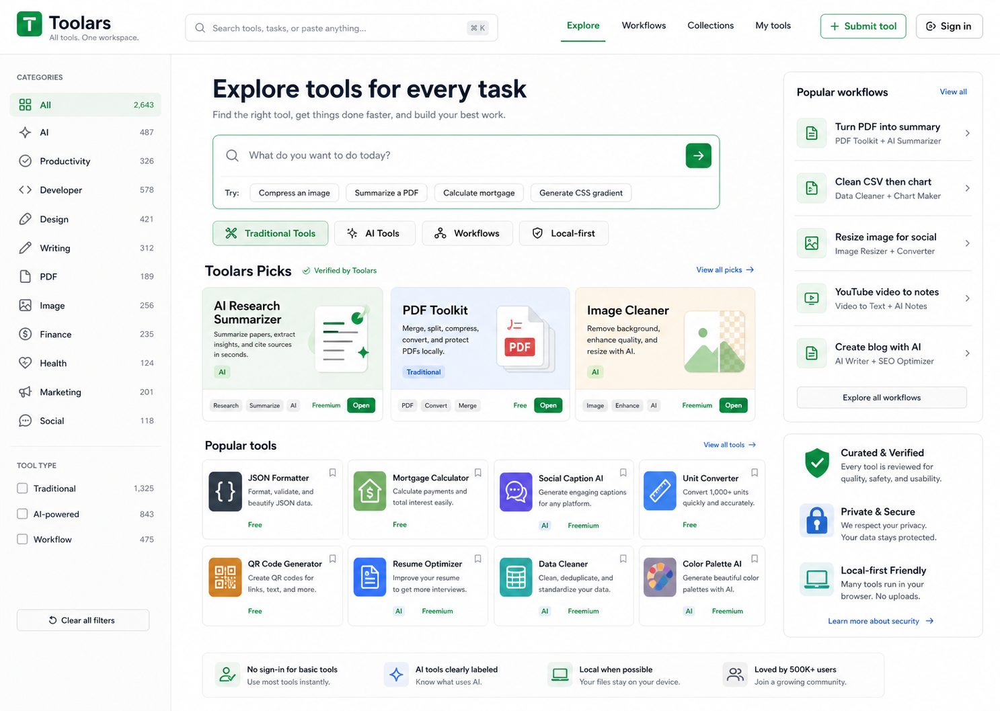

设计目标:

- 让用户 5 秒内理解 Toolars 是全领域工具平台。
- 首屏同时支持搜索型用户和浏览型用户。
- 用右侧 Popular workflows 建立“平台不只是工具目录”的认知。

关键模块:

- 全局搜索和命令入口。
- 首页任务命令栏。
- Traditional / AI / Workflow / Local-first 模式芯片。
- 左侧分类和工具类型筛选。
- Toolars Picks 精选工具区。
- Popular workflows 工作流侧栏。
- Curated & Verified、Private & Secure、Local-first Friendly 信任模块。

设计判断:

- 采用方案 2 的目录平台骨架, 但首屏加入方案 1 的任务命令栏。
- 工具卡片不使用过多视觉装饰, 保持可扩展性。
- 右侧工作流区是商业化和差异化的核心入口。

### 5.2 PDF 工具目录 / 搜索结果页

文件: `02-toolars-pdf-directory-desktop.png`

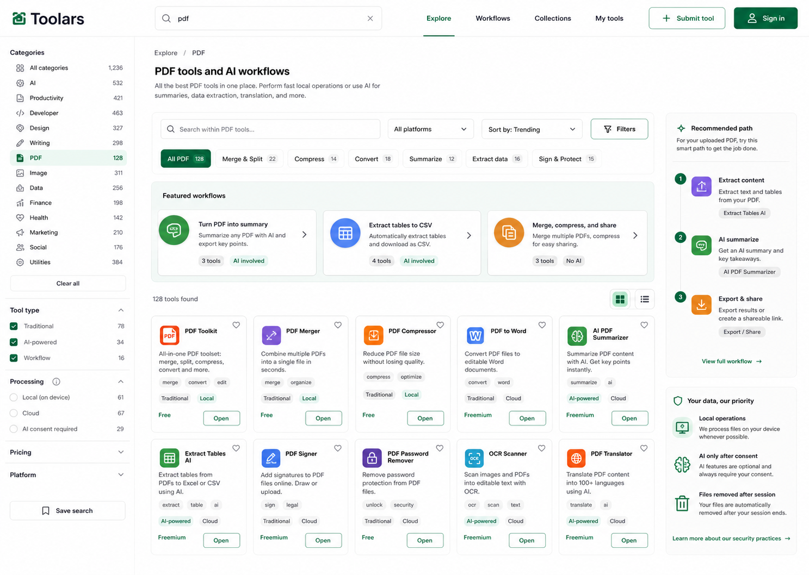

设计目标:

- 定义大量工具筛选、搜索、分组和推荐的标准模式。
- 让 AI 工具、传统工具、工作流在同一个目录里清晰共存。

关键模块:

- `Explore / PDF` 面包屑。
- PDF 子分类标签: Merge & Split、Compress、Convert、Summarize、Extract data、Sign & Protect。
- 左侧高级筛选: 工具类型、处理方式、价格、平台。
- Featured workflows 横向推荐。
- 结果卡片: title、description、tags、type badge、processing badge、pricing badge、Open。
- Recommended path 推荐路径。
- 信任说明: Local operations、AI only after consent、Files removed after session。

设计判断:

- PDF 是适合验证 Toolars 模式的核心分类, 因为它天然包含传统处理和 AI 总结。
- 筛选项需要从第一版就规范, 否则未来工具量上来后目录会失控。

### 5.3 PDF + AI 工作台

文件: `03-toolars-pdf-ai-workspace-desktop.png`

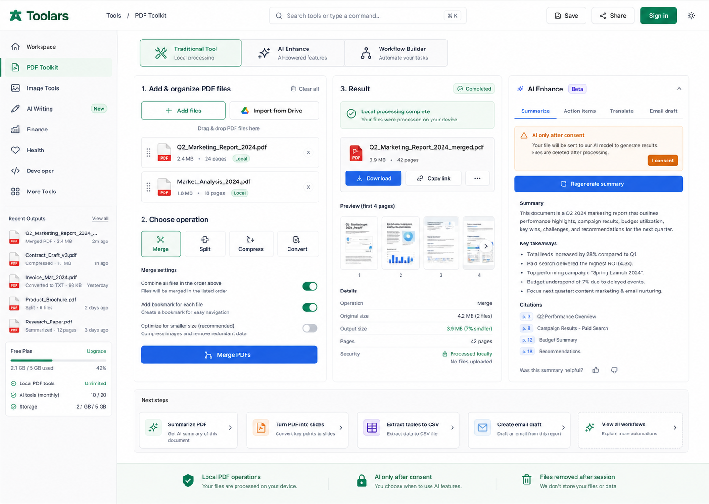

设计目标:

- 展示 Toolars 的核心差异: 不只是找到工具, 还能在统一工作台里完成连续任务。
- 明确区分本地传统处理和 AI 增强处理。

关键模块:

- 顶部模式切换: Traditional Tool、AI Enhance、Workflow Builder。
- 左侧文件上传和操作区。
- 中间结果区: 输出文件、下载、复制链接、预览、详情。
- 右侧 AI Enhance 面板: Summary、Action items、Translate、Email draft。
- AI consent 提示: 文件只在用户点击 Generate 后发送给 AI。
- 底部 Next steps: Summarize PDF、Turn PDF into slides、Extract tables to CSV、Create email draft。
- 底部信任条: Local PDF operations、AI only after consent、Files removed after session。

设计判断:

- 传统工具必须默认可用, AI 是增强层, 不是强制入口。
- 工作台页是后续付费、账号、历史、批量处理和工作流的承载容器。
- 这页应作为后续前端原型的核心页面。

### 5.4 移动首页 / 发现页

文件: `04-toolars-home-mobile.png`

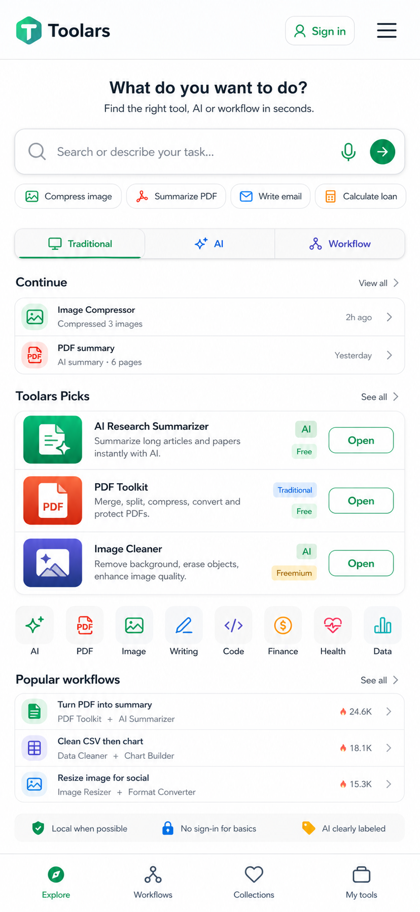

设计目标:

- 验证 Toolars 在移动端不是桌面页缩小版。
- 保留最重要路径: 任务搜索、最近使用、精选工具、分类、工作流。

关键模块:

- 顶部 Toolars 品牌和菜单。
- 大命令搜索: What do you want to do?
- 示例任务芯片: Compress image、Summarize PDF、Write email、Calculate loan。
- Traditional / AI / Workflow 切换。
- Continue 最近任务。
- Toolars Picks 纵向卡片。
- Category chips。
- Popular workflows 列表。
- 底部导航: Explore、Workflows、Collections、My tools。

设计判断:

- 移动端第一优先级是快速打开工具, 不是完整筛选。
- 工作流入口保留在首页下半部分, 支撑长期平台心智。

## 6. 视觉系统

### 6.1 品牌气质

关键词:

- Efficient
- Trustworthy
- Broad but organized
- AI-aware
- Work-focused

避免:

- 过度营销化的 hero。
- 大面积紫色渐变。
- 卡片套卡片。
- 把每个列表项都做成重阴影卡片。
- 模糊的 AI 魔法感。

### 6.2 色彩建议

主色:

- Emerald 600: `#059669`
- Emerald 50: `#ecfdf5`
- Emerald 100: `#d1fae5`

文字:

- Ink: `#111827`
- Ink secondary: `#374151`
- Ink muted: `#6b7280`

背景和边框:

- Canvas: `#ffffff`
- Canvas soft: `#f8fafc`
- Surface: `#f9fafb`
- Border: `#e5e7eb`

辅助色:

- Cobalt: `#2563eb`, 用于链接、活跃工作台操作。
- Amber: `#f59e0b`, 用于提示、精选、注意事项。
- Success: `#10b981`
- Danger: `#ef4444`

### 6.3 字体和排版

建议使用:

- Geist 或 Inter 作为主字体。
- 数字和结果值可使用 tabular nums。

尺度:

- 页面标题: 28-32px, 700。
- 区块标题: 16-20px, 650。
- 工具标题: 14-16px, 600。
- 正文: 13-15px。
- 标签: 11-12px。

原则:

- 工具平台应该信息密度较高, 但必须保持行高和分组清晰。
- 目录页不要使用过大标题抢占工具列表空间。

### 6.4 圆角、边框和阴影

- 默认控件圆角: 8px。
- 大面板圆角: 10-12px。
- 边框优先于阴影。
- 阴影只用于浮层、菜单、重要行动区。

## 7. 组件规范

### 7.1 Command Search

作用:

- 既是搜索, 也是任务路由入口。

输入示例:

- Compress an image
- Summarize a PDF
- Calculate mortgage
- Generate CSS gradient
- Clean CSV and chart it

结果建议:

- Top match: 直接工具。
- AI option: AI 处理。
- Workflow option: 多步骤任务。
- Related category: 分类入口。

### 7.2 Tool Card

标准内容:

- 工具图标或缩略图。
- 标题。
- 一句话描述。
- 标签。
- 工具类型 badge。
- 价格 badge。
- 处理方式 badge。
- Open 按钮。
- Favorite 图标。

状态:

- 默认。
- Hover。
- Favorite selected。
- AI consent required。
- Local-first。
- Premium/Freemium。

### 7.3 Workflow Card

标准内容:

- 工作流名称。
- 包含工具数量。
- 是否包含 AI 步骤。
- 使用人数或趋势。
- 进入按钮。

工作流例子:

- Turn PDF into summary。
- Clean CSV then chart。
- Resize image for social。
- YouTube video to notes。
- Create blog with AI。

### 7.4 Processing Badge

处理标识必须清楚:

- Local: 文件不离开浏览器。
- Cloud: 需要上传到服务器。
- AI consent: 用户授权后才发送给 AI。
- Removed after session: 会话后移除。

### 7.5 Workspace Panel

工具工作台标准三区:

- Input: 用户输入、上传、参数。
- Result: 结果、预览、导出。
- Enhance: AI 增强或下一步工作流。

这个结构可复用到:

- PDF Toolkit。
- Image Cleaner。
- Data Cleaner。
- Resume Optimizer。
- Mortgage Calculator。
- AI Email Writer。

## 8. 交互策略

静态稿阶段只定义状态, 后续原型建议优先实现这些交互:

1. Command Search 输入后显示结果分组。
2. 分类、工具类型、价格筛选。
3. 工具卡片打开工作台。
4. PDF 工作台: 上传文件、选择操作、生成结果。
5. AI Enhance: 用户确认后显示 AI 生成结果。
6. Favorite、History、Recent outputs。
7. 移动端底部导航和搜索。

## 9. 商业化入口

建议不要一开始把商业化做得太重。首版可放:

- Freemium badge。
- Upgrade plan 小入口。
- Sign in to save history。
- Collections。
- Submit tool。
- Featured/Picks 运营位。

后续可扩展:

- Pro plan: 批量处理、更大文件、更多 AI 次数。
- Team plan: 团队集合、共享工作流、历史同步。
- Tool submission marketplace: 工具提交、审核、推荐位。
- API/extension: 浏览器插件和 API 使用。

## 10. 从 VitalCalc 到 Toolars 的迁移建议

当前 VitalCalc 的优势:

- 已有大量健康和金融工具。
- Astro 多语言基础完整。
- 已有搜索、收藏、分享、比较、FAQ、SEO 结构。
- 已经有较成熟的工具卡片和导航系统。

迁移建议:

1. 品牌层: VitalCalc 改为 Toolars, Health/Finance 成为两个分类。
2. 导航层: 从 Health/Finance 导航扩为全领域分类。
3. 数据层: 建立统一 tools registry, 每个工具包含 category、type、processing、pricing、tags。
4. 页面层: 首页改为 Tool Market, 工具页改为 Workspace。
5. AI 层: 新增 AI consent 状态和 AI 工具注册字段。
6. 工作流层: 新增 workflows registry, 组合多个工具。

## 11. 后续可交互原型建议

建议第一版原型实现 4 条路径:

### 路径 A: 首页找工具

首页输入 `summarize pdf` -> 展示 PDF Summarizer、PDF Toolkit、Turn PDF into summary -> 打开工作台。

### 路径 B: 目录筛选

Explore -> PDF -> 选择 Local + Free -> 打开 PDF Compressor。

### 路径 C: 工作台处理

上传 PDF -> Merge PDFs -> 结果出现 -> 下载。

### 路径 D: AI 增强

工作台右侧选择 Summarize -> AI consent -> 生成摘要 -> 保存到 Recent Outputs。

## 12. 验收标准

设计验收:

- 用户 5 秒内能理解 Toolars 是全领域工具平台。
- 用户能明确区分 Traditional、AI、Workflow。
- 用户能看到本地处理和 AI 授权的信任信息。
- 首页、目录、工作台、移动端视觉一致。
- UI 没有明显文字截断、重叠、过密、卡片套卡片问题。

原型验收:

- 首页搜索可用。
- 筛选可用。
- 工具打开路径可用。
- PDF 工作台主流程可用。
- AI consent 状态可见。
- 移动端关键路径可用。

## 13. 文件清单

设计稿:

- `01-16`: 第一批桌面、移动首页、核心弹窗和状态板高保真。
- `17-30`: AI Developer Lab、Lab 工具工作台、Billing、Lab workflow、Lab 工具详情桌面高保真。
- `31-57`: PDF、AI Developer Lab、Workflow、Collection、Dashboard、Settings、Pricing、Submit、Admin、States、Lab workspace、Lab detail、Billing 等移动高保真。
- `16-toolars-states-board.html`

参考截图:

- `references/10015-home-reference.png`
- `references/10015-product-finder-reference.png`

文档:

- `Toolars-design-proposal.md`
- `Toolars-development-breakdown.md`
- `Toolars-implementation-alignment-audit.md`
- `Toolars-high-fidelity-coverage-review.md`

## 14. 扩展页面设计规格

本节补齐一级页面、二级页面、弹窗和系统状态, 让后续 Codex 可以直接按路由和组件拆分开发。

### 14.1 Workflows 首页

文件: `05-toolars-workflows-index-desktop.png`

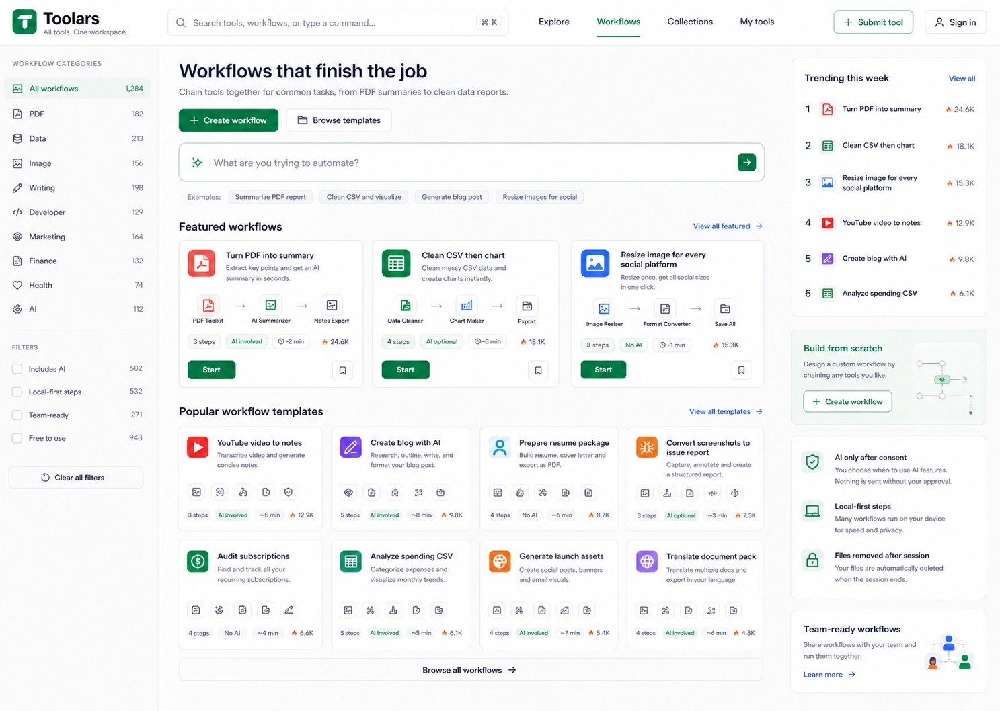

建议路由: `/workflows`

页面职责:

- 展示平台内可复用的多工具工作流。
- 教育用户 Toolars 不只是工具目录, 还可以串联多个工具完成任务。
- 支持按领域、是否包含 AI、本地步骤、团队可用性进行筛选。

核心模块:

- Workflows active 顶部导航。
- 左侧工作流分类和过滤。
- 主标题: `Workflows that finish the job`。
- 工作流任务搜索: `What are you trying to automate?`
- Featured workflows。
- Workflow template grid。
- Trending this week。
- Build from scratch。

开发建议:

- 使用 `WorkflowCard` 组件承载步骤数、AI 标识、预计耗时、热度和 Start 按钮。
- 工作流筛选可复用目录页的 filter state。
- 每个 workflow 数据建议包含 `steps[]`, `aiRequired`, `localSteps`, `estimatedMinutes`, `runCount`。

### 14.2 Collections 首页

文件: `06-toolars-collections-index-desktop.png`

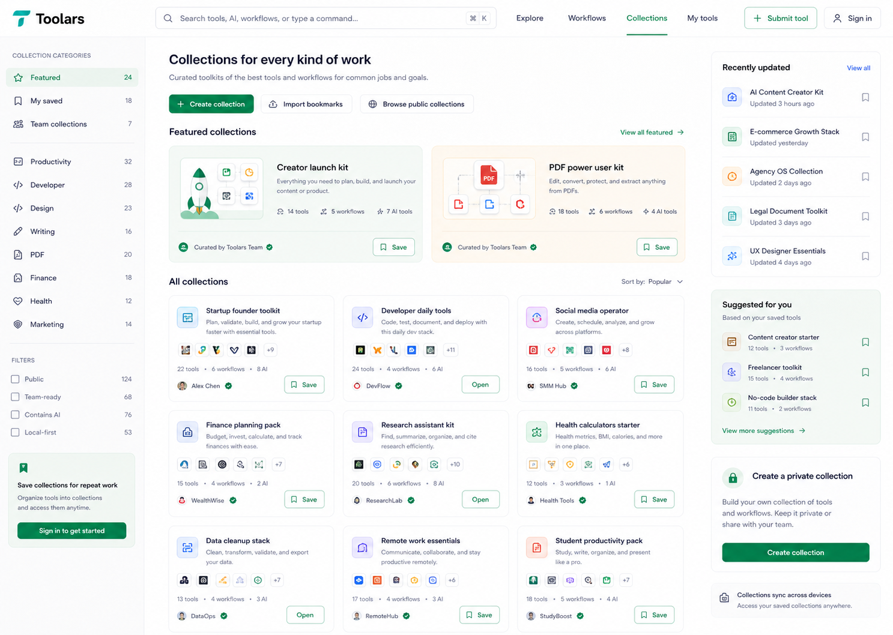

建议路由: `/collections`

页面职责:

- 展示官方精选、公开集合、团队集合和用户保存的集合。
- 支撑工具发现、运营策展和用户留存。

核心模块:

- Collection 分类侧栏。
- Featured collection hero cards。
- Collection grid。
- Recently updated。
- Suggested for you。
- Create private collection。

开发建议:

- `CollectionCard` 应和 `ToolCard` 明确区分: 集合强调工具数量、工作流数量、策展人、预览图标组。
- 集合可以包含 tools 和 workflows 两种资源。
- 登录前允许保存动作触发登录弹窗。

### 14.3 My Tools 工作台首页

文件: `07-toolars-my-tools-dashboard-desktop.png`

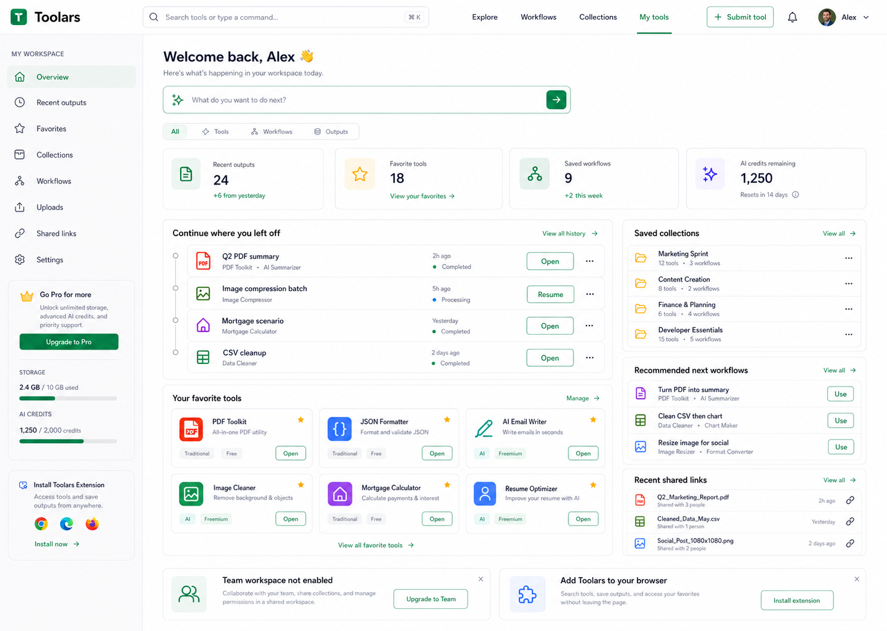

建议路由: `/my-tools`

页面职责:

- 登录用户的个人工作区。
- 聚合最近输出、收藏工具、保存集合、使用量和分享链接。

核心模块:

- 左侧 workspace 导航。
- Welcome quick command。
- KPI: Recent outputs、Favorite tools、Saved workflows、AI credits。
- Continue timeline。
- Favorites grid。
- Saved collections。
- Recommended next workflows。
- Usage/storage card。

开发建议:

- `RecentOutput` 数据模型应关联 `toolId`, `workflowId`, `outputType`, `status`, `createdAt`。
- Favorites 和 Collections 需要空态。
- AI credits 和 storage 属于 billing/usage 数据, 但可先用 mock。

### 14.4 Submit Tool 页面

文件: `08-toolars-submit-tool-desktop.png`

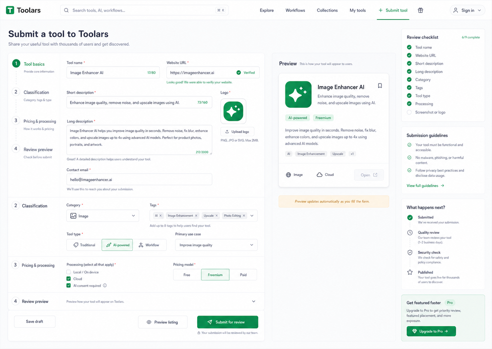

建议路由: `/submit`

页面职责:

- 让工具作者或用户提交新工具。
- 收集分类、类型、处理方式、价格、素材和联系方式。
- 提供预览和审核流程说明。

核心模块:

- 多步骤表单: Tool basics、Classification、Pricing & processing、Review preview。
- Tool type segmented control: Traditional / AI-powered / Workflow。
- Processing checkboxes: Local / Cloud / AI consent required。
- Live listing preview。
- Review checklist。
- Submission timeline。

开发建议:

- 表单验证必须包含 URL、描述长度、截图、AI disclosure。
- 提交后进入 `pending_review` 状态。
- 后台审核台使用相同的 submission 数据。

### 14.5 Pricing 页面

文件: `09-toolars-pricing-desktop.png`

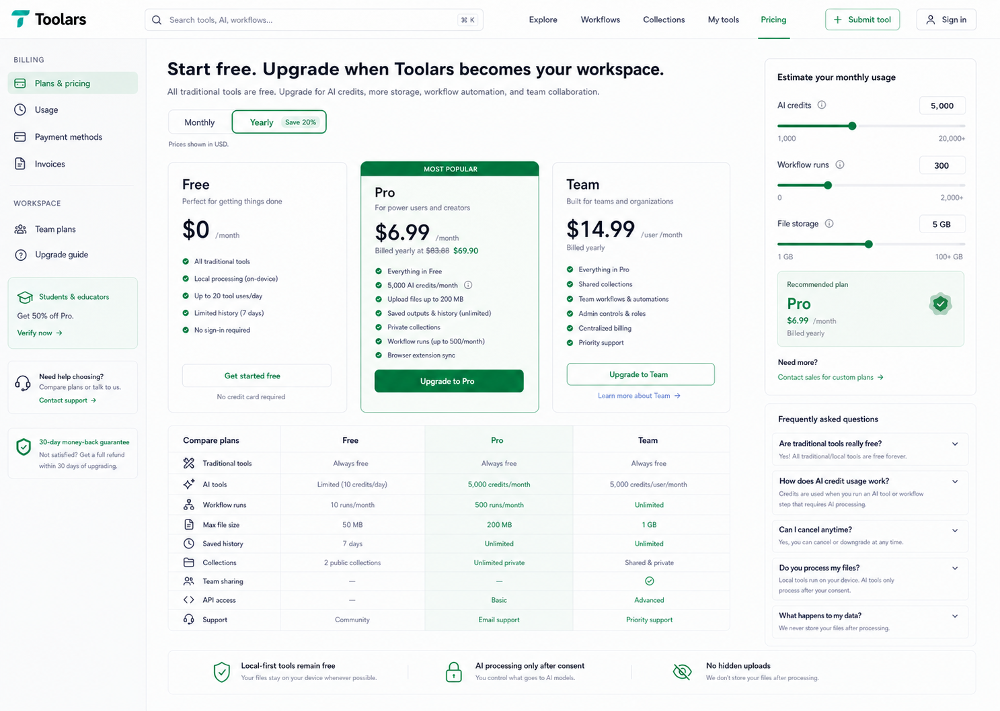

建议路由: `/pricing`

页面职责:

- 明确免费传统工具和 Pro/Team 增值能力。
- 将 AI credits、保存历史、工作流运行、团队共享作为主要付费点。

核心模块:

- Monthly / Yearly billing toggle。
- Free / Pro / Team pricing cards。
- Feature comparison table。
- Usage calculator。
- FAQ preview。
- Trust strip。

开发建议:

- Free 计划必须保持“本地传统工具免费”的品牌承诺。
- Pro 高亮即可, 不要过度营销。
- Billing 可先静态展示, 后续接 Stripe 或其他支付系统。

### 14.6 Workflow Builder 详情页

文件: `10-toolars-workflow-builder-desktop.png`

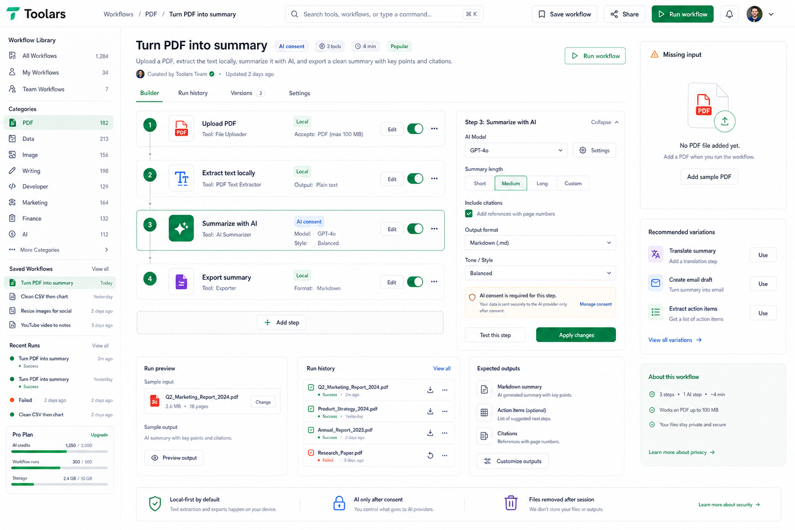

建议路由: `/workflows/:workflowSlug`

页面职责:

- 展示单个工作流的步骤、设置、运行预览和历史。
- 支持用户从模板运行或自定义工作流。

核心模块:

- Breadcrumb。
- Workflow title 和 badges。
- Step canvas: Upload PDF、Extract text locally、Summarize with AI、Export summary。
- Step settings panel。
- AI consent notice。
- Run preview。
- Run history。
- Recommended variations。

开发建议:

- `WorkflowStep` 建议包含 `toolId`, `mode`, `processing`, `settingsSchema`, `enabled`。
- `AI consent` 应按 step 控制, 不应全局默认发送。
- Builder 初版可只支持编辑已有模板, 不必支持完全自由拖拽。

### 14.7 Collection Detail 页面

文件: `11-toolars-collection-detail-desktop.png`

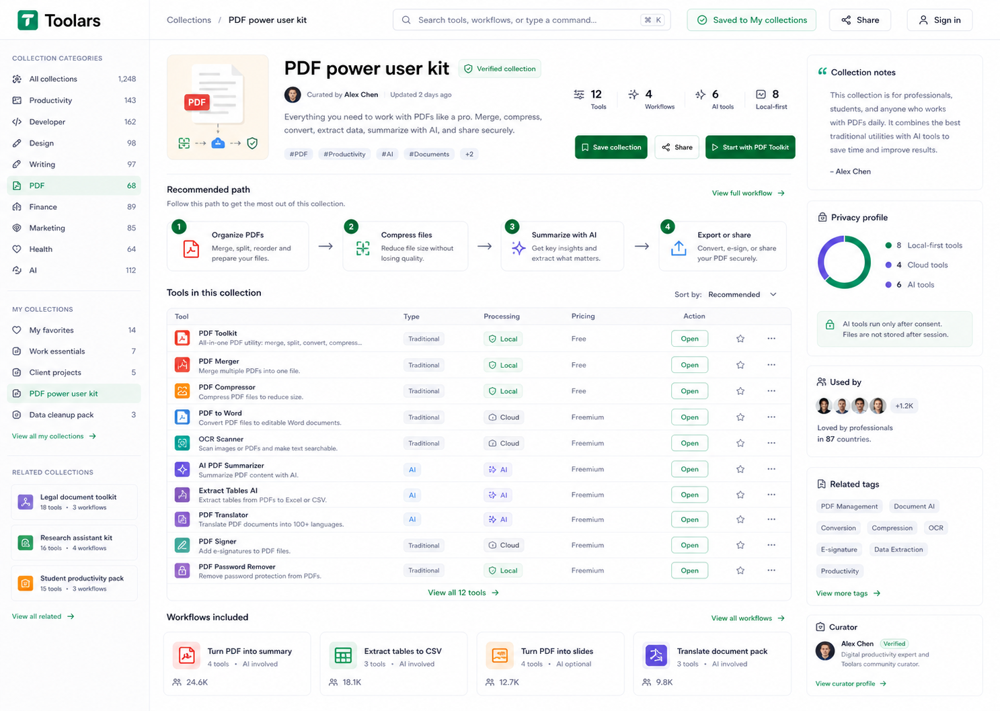

建议路由: `/collections/:collectionSlug`

页面职责:

- 展示集合的策展上下文、推荐使用路径、工具和工作流清单。
- 支持保存、分享、启动推荐工具。

核心模块:

- Collection header。
- Recommended path。
- Tools in this collection。
- Workflows included。
- Collection notes。
- Privacy profile。
- Related tags。

开发建议:

- 集合详情页应能服务 SEO 和分享。
- `Recommended path` 是集合页和普通目录页的差异化模块。

### 14.8 Tool Detail / Public Listing 页面

文件: `12-toolars-tool-detail-desktop.png`

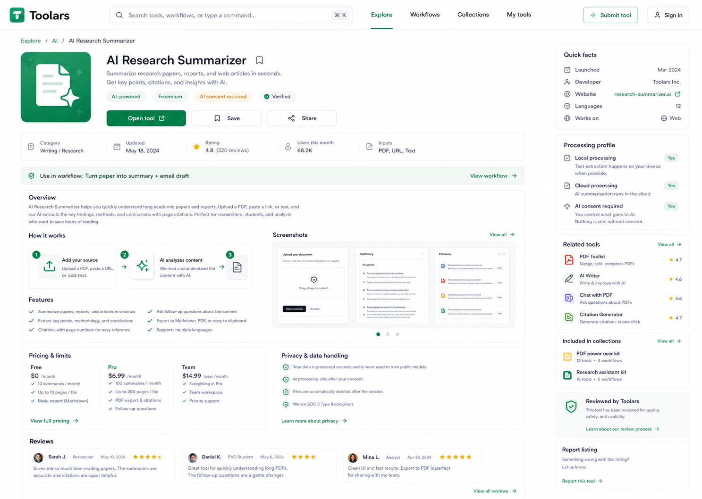

建议路由: `/tools/:toolSlug/about` 或 `/tools/:toolSlug`

页面职责:

- 工具的公开详情页, 支持 SEO、信任、评论和进入工作台。
- 不等同于工具实际操作页。

核心模块:

- Tool header with Open tool。
- Processing / pricing / verified badges。
- Metadata row。
- Overview。
- How it works。
- Features。
- Screenshots/preview。
- Pricing & limits。
- Privacy and data handling。
- Related tools。
- Included in collections。

开发建议:

- 若 `/tools/:slug` 已用于真实工具页, 可把详情页放到 `/explore/tools/:slug`。
- Tool detail 与 workspace 应共享 `toolRegistry` 数据。

### 14.9 Account Settings 页面

文件: `13-toolars-account-settings-desktop.png`

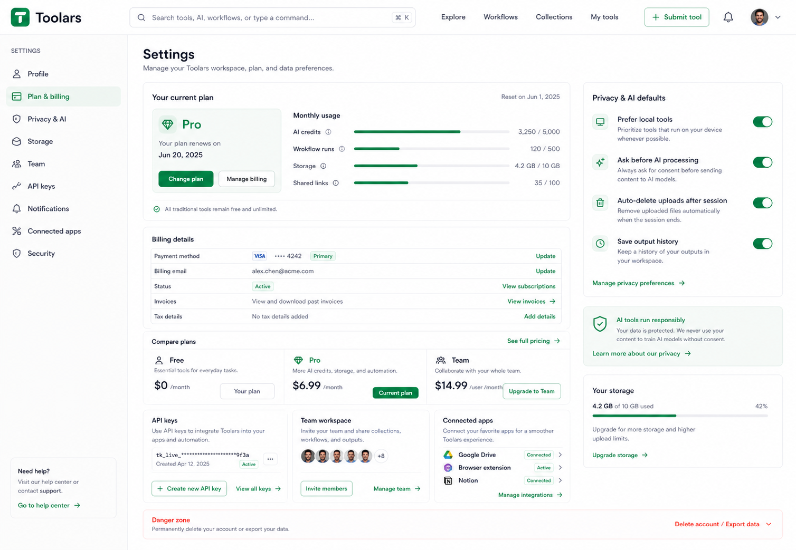

建议路由: `/settings` 和 `/settings/billing`

页面职责:

- 管理账号、计划、账单、隐私、AI 默认授权、存储、团队、API 和通知。

核心模块:

- Settings sidebar。
- Current plan。
- Usage meters。
- Billing details。
- Privacy defaults。
- API keys preview。
- Team invite card。
- Connected apps。
- Danger zone。

开发建议:

- Privacy & AI 应作为独立设置页, 但 billing 页面可露出关键 toggle。
- 默认开启 `Ask before AI processing`。
- `Auto-delete uploads after session` 应是强信任点。

### 14.10 Admin Review Console

文件: `14-toolars-admin-review-console-desktop.png`

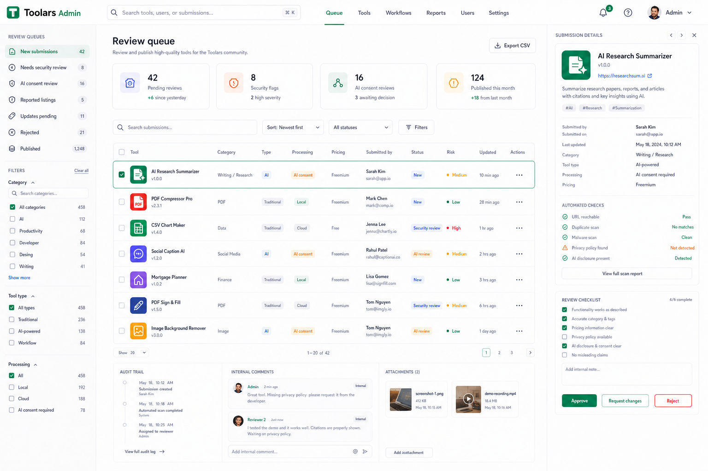

建议路由: `/admin/review`

页面职责:

- 内部审核提交工具。
- 支撑 Submit Tool 的后端闭环。

核心模块:

- Review queues。
- KPI row。
- Submission table。
- Selected submission detail panel。
- Automated checks。
- Reviewer notes。
- Approve / Request changes / Reject。
- Audit trail。

开发建议:

- 首版可隐藏入口, 但数据模型要预留 `reviewStatus`, `riskLevel`, `reviewNotes`, `checks[]`。
- AI 工具必须检查 AI disclosure 和 privacy policy。

## 15. 弹窗与状态规格

### 15.1 Core Modals Board

文件: `15-toolars-core-modals-board.png`

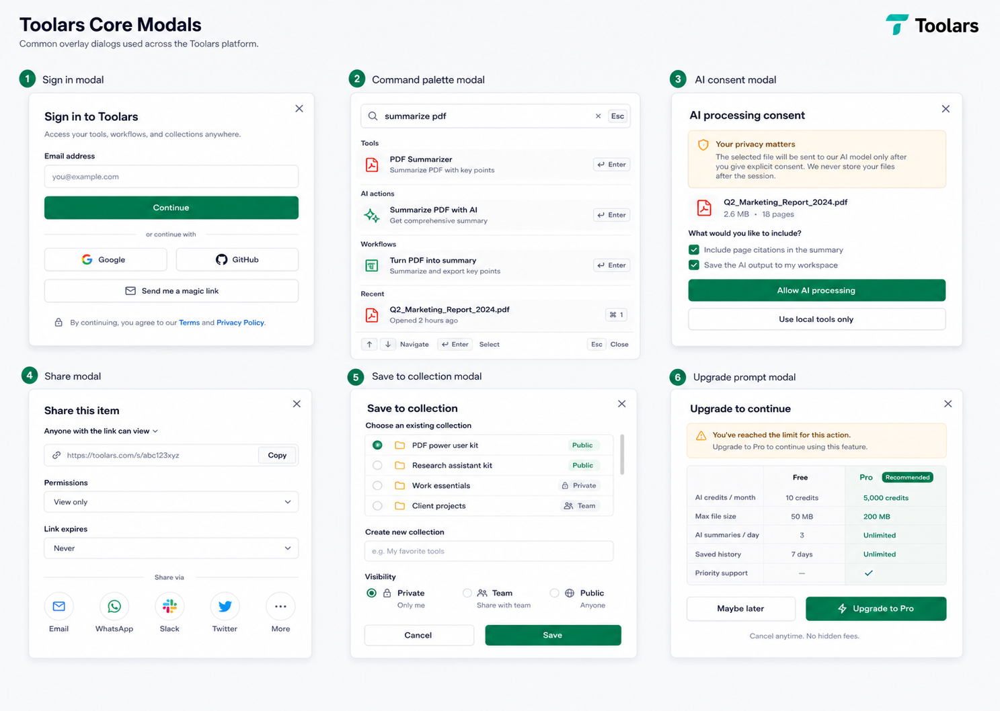

包含弹窗:

- Sign in modal。
- Command palette modal。
- AI consent modal。
- Share modal。
- Save to collection modal。
- Upgrade prompt modal。

实现建议:

- 所有弹窗都使用统一 `Dialog` 基础组件。
- 弹窗宽度建议 420-560px, 移动端全宽 bottom sheet。
- Primary action 只能有一个。
- AI consent 不应被普通确认弹窗复用, 需要独立视觉和文案。

### 15.2 States & Overlays Board

文件:

- `16-toolars-states-board.png`
- `16-toolars-states-board.html`

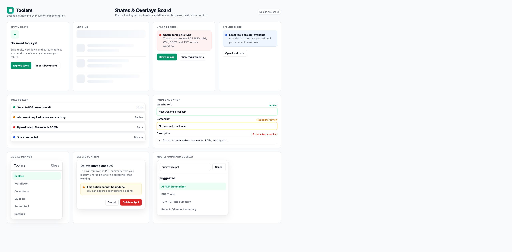

包含状态:

- Empty state。
- Loading skeleton。
- Upload error。
- Offline mode。
- Toast stack。
- Form validation。
- Mobile drawer。
- Delete confirmation。
- Mobile command overlay。

实现建议:

- `16-toolars-states-board.html` 可作为开发参考, 其中包含静态 DOM/CSS 结构。
- Toast 建议使用统一队列, 支持 action。
- Loading skeleton 需要和真实卡片布局尺寸一致, 避免跳动。
- Mobile command overlay 是移动端最重要的交互之一。

## 16. 路由地图

建议首版路由:

| 路由 | 页面 | 设计稿 |
|---|---|---|
| `/` | 首页 / Explore | `01-toolars-home-desktop.png`, `04-toolars-home-mobile.png` |
| `/explore/:category` | 分类目录 / 搜索结果 | `02-toolars-pdf-directory-desktop.png` |
| `/explore/ai-developer` | AI Developer Lab 目录 | `17-toolars-ai-developer-lab-directory-desktop.png`, `33-toolars-ai-developer-lab-mobile.png` |
| `/tools/:toolSlug` | 工具工作台 | `03-toolars-pdf-ai-workspace-desktop.png` |
| `/tools/:toolSlug/about` | 工具详情 / SEO 页 | `12-toolars-tool-detail-desktop.png` |
| `/workflows` | 工作流首页 | `05-toolars-workflows-index-desktop.png` |
| `/workflows/:workflowSlug` | 工作流详情/构建器 | `10-toolars-workflow-builder-desktop.png` |
| `/collections` | 集合首页 | `06-toolars-collections-index-desktop.png` |
| `/collections/:collectionSlug` | 集合详情 | `11-toolars-collection-detail-desktop.png` |
| `/my-tools` | 个人工作台首页 | `07-toolars-my-tools-dashboard-desktop.png` |
| `/submit` | 提交工具 | `08-toolars-submit-tool-desktop.png` |
| `/pricing` | 价格页 | `09-toolars-pricing-desktop.png` |
| `/settings` | 设置页 | `13-toolars-account-settings-desktop.png`, `40-toolars-account-settings-mobile.png` |
| `/settings/billing` | Billing and usage | `23-toolars-billing-settings-desktop.png`, `53-toolars-billing-settings-mobile.png` |
| `/admin/review` | 后台审核台 | `14-toolars-admin-review-console-desktop.png` |

全局弹窗:

| 组件 | 触发场景 | 设计稿 |
|---|---|---|
| `SignInDialog` | 登录、保存前、使用历史前 | `15-toolars-core-modals-board.png` |
| `CommandPalette` | 全局搜索、快捷键、移动搜索 | `15-toolars-core-modals-board.png`, `16-toolars-states-board.png` |
| `AIConsentDialog` | AI 处理前 | `15-toolars-core-modals-board.png` |
| `ShareDialog` | 分享工具、集合、输出 | `15-toolars-core-modals-board.png` |
| `SaveToCollectionDialog` | 收藏工具、保存输出 | `15-toolars-core-modals-board.png` |
| `UpgradeDialog` | AI credits、文件大小、团队能力限制 | `15-toolars-core-modals-board.png` |
| `DeleteConfirmDialog` | 删除输出、集合、API key | `16-toolars-states-board.png` |

### 16.1 Shell 架构约束

当前原型已经按高保真图校正为多 Shell 语境, 后续开发不得把所有页面都套成同一个工具目录侧栏。

| Shell variant | 适用页面 | 必须保留的架构 |
|---|---|---|
| `tools` | Explore、PDF 目录、AI Developer Lab、工具详情 | Categories + Tool type / Processing / Pricing / Platform filters。 |
| `workflows` | Workflows 首页、Workflow Builder | Workflow categories + workflow filters + run/template context。 |
| `collections` | Collections 首页和详情 | Collection categories + saved/public/team collection context。 |
| `workspace` | My Tools | 登录后个人工作台导航、最近输出、收藏、使用量。 |
| `billing` | Pricing、Billing settings | Plans & pricing、Usage、Payment methods、Invoices。 |
| `settings` | Account settings | Profile、Plan & billing、Privacy & AI、Storage、Team、API keys、Security。 |
| `admin` | Admin Review | Review queues、submission filters、admin header。 |
| `none` | Submit Tool、States Board、聚焦工作台 | 全宽任务页或状态板, 不显示目录侧栏。 |

Header 状态:

- 匿名探索态: `Explore / Workflows / Collections / My tools / + Submit tool / Sign in`。
- 登录工作台态: 保留主导航, 右侧显示通知和用户菜单。
- Pricing 态: 顶部可以追加 `Pricing` active 项, 但不要把 `Pro` 放入全局主导航。
- Admin 态: 使用独立 Admin header, 不混用用户侧导航。

路由职责:

- `/tools/:toolSlug` 是真实工具工作台, 例如 PDF Toolkit。
- `/tools/:toolSlug/about` 是公开详情 / SEO listing, 不承载工具操作主流程。
- AI 工具必须通过 `AIConsentDialog` 或等价 consent gate 后才能进入模型处理。

## 17. 数据模型建议

### Tool

```ts
type Tool = {
  id: string;
  slug: string;
  name: string;
  description: string;
  category: string;
  tags: string[];
  type: 'traditional' | 'ai' | 'workflow';
  processing: ('local' | 'cloud' | 'ai-consent')[];
  pricing: 'free' | 'freemium' | 'paid';
  verified: boolean;
  featured: boolean;
  inputs: string[];
  outputs: string[];
};
```

### Workflow

```ts
type Workflow = {
  id: string;
  slug: string;
  title: string;
  description: string;
  category: string;
  steps: WorkflowStep[];
  estimatedMinutes: number;
  aiRequired: boolean;
  localSteps: number;
  runCount: number;
};
```

### Collection

```ts
type Collection = {
  id: string;
  slug: string;
  title: string;
  description: string;
  curator: string;
  visibility: 'public' | 'private' | 'team';
  toolIds: string[];
  workflowIds: string[];
  tags: string[];
};
```

### Submission

```ts
type ToolSubmission = {
  id: string;
  toolDraft: Partial<Tool>;
  submitterEmail: string;
  reviewStatus: 'draft' | 'pending' | 'changes-requested' | 'approved' | 'rejected';
  riskLevel: 'low' | 'medium' | 'high';
  checks: ReviewCheck[];
  reviewerNotes: string[];
};
```

## 18. 开发拆分建议

第一批:

- Layout shell: Header、Sidebar、Command Search、Dialog 基础。
- Explore 首页。
- PDF 目录页。
- PDF Toolkit 工作台。
- Core modals: Sign in、Command palette、AI consent、Share。
- Aixtral Lab 工具族合并: AI Security、Developer Tools、LLM Cost、RAG/MCP/Agent、Prompt Engineering、Frontend & Design。

第二批:

- Workflows 首页和 Workflow Builder。
- Collections 首页和详情。
- My tools dashboard。
- Account settings。

第三批:

- Submit Tool。
- Admin Review Console。
- Pricing + Billing 接入。
- 状态板完整实现: empty、loading、toast、offline、mobile drawer。

## 19. Aixtral Lab 工具资产合并

来源项目:

`/Users/stanvl/Documents/dev/ai-repo/aixtral-lab`

合并原则:

- 不迁移现有代码实现, 先合并产品分类、工具清单、信息架构和原型内容。
- Toolars 作为未来统一品牌, VitalCalc 的健康/金融工具和 Aixtral Lab 的 AI/开发者工具都进入同一个 `tool registry`。
- Aixtral Lab 不再只是单独的 “AI developer tools platform”, 而是 Toolars 内的高价值工具族: `AI Developer Lab`。

### 19.1 资产盘点

从 `src/lib/tool-config.ts` 识别到 92 个工具:

| 分类 | 数量 | Toolars 归并分类 |
|---|---:|---|
| `developerTools` | 37 | Developer |
| `frontendDesign` | 15 | Design / Frontend |
| `textProductivity` | 14 | Productivity / Writing |
| `aiSecurity` | 10 | AI Security |
| `ragMcpAgent` | 6 | RAG / MCP / Agent |
| `llmCost` | 5 | LLM Cost |
| `promptEngineering` | 5 | Prompt Engineering |

### 19.2 需要在 Toolars 中显性展示的代表工具

第一批原型中必须出现的 Lab 工具:

- Token Counter
- JSON Repair
- Prompt Injection Scanner
- PII Scanner
- Hallucination Checker
- Schema Validator
- LLM Cost Calculator
- Model Comparator
- Context Window
- Token Budget Planner
- MCP Server Builder
- MCP Tester
- Agent Workflow Builder
- RAG Eval Bench
- Prompt Templates
- Function Call Builder
- Structured Output Formatter
- Vision Prompt Builder
- Synthetic Dataset Generator
- JSON Formatter / JSON Tree Viewer / JSON Path Tester / JSON Schema Builder
- Cron Builder / Cron Explainer
- Env Editor
- Meta Tag Generator
- CSS Gradient Generator
- CSS to Tailwind Converter
- Image Resizer
- QR Code Generator

### 19.3 信息架构调整

Toolars 分类从原来的全领域分类扩展为:

- AI
- AI Security
- Developer
- RAG / MCP / Agent
- LLM Cost
- Prompt Engineering
- Frontend & Design
- PDF
- Image
- Writing
- Finance
- Health
- Productivity
- Social
- Data

首页新增专区:

`AI Developer Lab`

作用:

- 承接 Aixtral Lab 原有搜索流量和开发者工具定位。
- 与 PDF、Image、Finance、Health 等大众工具形成互补。
- 成为 Toolars 付费转化更强的工具族, 尤其是 JSON Repair API、PII Scanner、Prompt Regression、MCP Tester、Agent Workflow Builder。

### 19.4 当前原型调整

当前原型已经从第一批 PDF 核心路径扩展到 AI Developer Lab、Lab 工具工作台、Lab 工具详情、Lab 工作流和 AI Developer Lab collection:

- `/toolars`
- `/toolars/explore/pdf`
- `/toolars/explore/ai-developer`
- `/toolars/tools/pdf-toolkit`
- `/toolars/tools/json-repair`
- `/toolars/tools/prompt-injection-scanner`
- `/toolars/tools/llm-cost-calculator`
- `/toolars/tools/mcp-server-builder`
- `/toolars/collections/ai-developer-lab`
- `/toolars/workflows/ai-prompt-hardening`
- `/toolars/workflows/llm-cost-review`
- `/toolars/workflows/mcp-tool-launch`

首页和全局命令面板必须持续合并 Aixtral Lab 工具:

- 首页 `Toolars Picks` 中包含 JSON Repair、Prompt Injection Scanner、LLM Cost Calculator、MCP Server Builder。
- 首页新增 `AI Developer Lab` 横向工具区。
- Command Palette 搜索 `json`, `prompt`, `mcp`, `token`, `cost` 时应出现对应工具。
- PDF 工作台的 Next steps 可以推荐 `JSON Repair` 和 `Token Counter` 作为跨域工具示例。
- AI Developer Lab 目录必须保留 Aixtral Lab 资产合并后的 22 个代表工具。
- 代表工作台必须覆盖结构化输出、安全扫描、成本估算、MCP 发布四种专业任务类型。

### 19.5 设计影响

Aixtral Lab 合并后, Toolars 不再只是 “通用工具 + AI 增强”, 而是三层产品:

1. 通用传统工具: PDF、Image、Finance、Health、Unit、Text。
2. AI 增强工具: Summarizer、Caption、Resume、Data Cleaner。
3. AI/Developer Lab: LLM 成本、安全、RAG、MCP、Agent、Prompt Engineering。

这会让 Toolars 具备更清晰的商业化路径:

- 大众免费工具负责流量。
- AI Developer Lab 负责专业用户和 Pro/API 转化。
- Workspace 和 Workflows 负责留存。

## 20. 高保真覆盖审计

截至 2026-06-12, `new-design` 已覆盖当前原型的一级页面、二级页面、代表工作台、代表详情页、核心弹窗、状态板和关键移动端形态。

正式高保真范围:

- 57 张编号 PNG: `01` 到 `57`。
- 1 个静态状态板参考 HTML: `16-toolars-states-board.html`。
- 路由覆盖矩阵: `Toolars-high-fidelity-coverage-review.md`。

本轮补齐内容:

- AI Developer Lab directory 和 collection: `17`, `18`, `33`, `34`。
- JSON Repair、Prompt Injection Scanner、LLM Cost Calculator、MCP Server Builder 工作台: `19-22`, `45-48`。
- Billing settings: `23`, `53`。
- AI Prompt Hardening、LLM Cost Review、MCP Tool Launch workflow: `24-26`, `54-56`。
- 四个 Lab 工具详情页和 PDF Toolkit 详情移动版: `27-30`, `49-52`, `57`。
- Workflows、Collections、My Tools、Settings、Pricing、Submit、Admin、States 的移动版: `35-44`。

仍不作为当前高保真缺口处理的内容:

- Aixtral Lab 92 个长尾工具不逐个手工出图, 走 Tool Card、Workspace、Tool Detail、Workflow 模板化覆盖。
- Team、API keys、audit log、invoice detail、provider routing 等企业后台深水区暂未进入当前 PRD 范围。
- 动作后的所有细分结果态主要由交互原型和 QA 截图验证, 不是每个状态都单独编号出静态稿。
