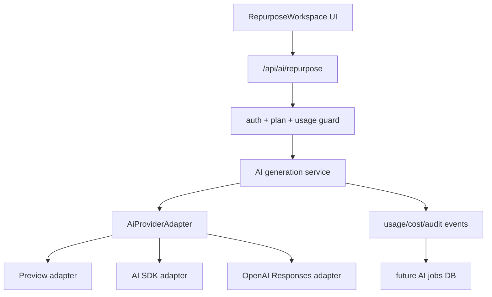

# AI Provider Adapter Design

Status: design-ready, not implemented  
Updated: 2026-06-06  
CDC change: `ai-provider-adapter-pass`

## 1. Purpose

This document defines the production AI provider adapter design for Toolars.
It prepares the current deterministic preview generator for future provider
integration without adding package dependencies, external API calls, provider
SDK imports, or API keys in this pass.

The design goal is simple: route handlers and UI should speak Toolars domain
language, while provider SDKs stay behind a testable server-only adapter.

## 2. Current State

Current AI implementation:

- `site/lib/ai/index.ts` defines request types, validation, model/tone/voice
  options, and deterministic preview job generation.
- `/api/ai/repurpose` validates preview account headers, plan gates, request
  payload, and returns a generated preview job.
- `RepurposeWorkspace` simulates streaming in the client after receiving a JSON
  response.
- `site/package.json` has no `ai`, OpenAI, or provider SDK dependency.

Production gaps:

- No provider-neutral adapter contract.
- No server-side streaming response path.
- No provider error normalization.
- No token/cost/latency metadata.
- No cancellation persistence.
- No usage counter write or AI job persistence yet.

## 3. Official Source Anchors

| Topic | Official source | Design consequence |
|---|---|---|
| AI SDK text generation | [AI SDK generating text](https://ai-sdk.dev/docs/ai-sdk-core/generating-text) | Use `generateText` for non-interactive/batch/fallback generation and `streamText` for interactive flows. |
| AI SDK streaming | [AI SDK `streamText`](https://ai-sdk.dev/docs/reference/ai-sdk-core/stream-text) | Production repurpose can stream text deltas from a model through an async stream. |
| AI SDK middleware | [AI SDK middleware](https://ai-sdk.dev/docs/ai-sdk-core/middleware) | Guardrails, logging, defaults, and provider-agnostic behavior can be wrapped around models. |
| OpenAI text generation | [OpenAI text generation](https://developers.openai.com/api/docs/guides/text) | Direct OpenAI adapter can use the Responses API for model text requests. |
| OpenAI streaming | [OpenAI streaming responses](https://developers.openai.com/api/docs/guides/streaming-responses) | Direct OpenAI adapter can map server-sent events into Toolars stream chunks. |
| OpenAI Responses API | [Responses API reference](https://platform.openai.com/docs/api-reference/responses/object) | Direct adapter can use Responses API fields such as stream, store, response IDs, and lifecycle state. |

Source-driven implementation rules:

- Every future provider import must cite the official docs in code comments or
  PR body.
- Do not introduce a provider package and route refactor in the same unreviewed
  change.
- Do not use model output parsing assumptions unless backed by tests.
- Do not log raw private source text by default.

## 4. Target Architecture



Boundary rules:

- UI imports `RepurposeRequest`, `RepurposeOutput`, and public option data only.
- Route handlers call Toolars services, not provider SDKs.
- Provider SDKs live under `site/lib/ai/providers/**` or equivalent
  server-only modules.
- Provider secrets are server-only environment variables.
- Preview provider remains available for tests and local demos.

## 5. Module Plan

Future implementation should split current `site/lib/ai/index.ts` into smaller
modules:

```text
site/lib/ai/
  index.ts              public exports
  types.ts              RepurposeRequest, RepurposeJob, RepurposeOutput
  validation.ts         request validation
  options.ts            tones, models, brand voices, platform exports
  service.ts            provider-neutral orchestration
  provider.ts           adapter interface and error/result types
  providers/
    preview.ts          deterministic provider for tests/local preview
    ai-sdk.ts           AI SDK implementation
    openai-responses.ts optional direct OpenAI implementation
  telemetry.ts          usage/cost/audit event shapes
```

`/api/ai/repurpose` target flow:

1. Validate account/session.
2. Validate request payload.
3. Enforce plan and usage before provider call.
4. Create or reserve an AI job record when DB exists.
5. Call `generateRepurposeJob()` service.
6. Stream or return provider-neutral output.
7. Record usage/cost/audit metadata.

## 6. Adapter Contract

The adapter contract should be implemented before real provider packages are
installed:

```ts
type AiProviderId = 'preview' | 'ai-sdk' | 'openai-responses';

type AiProviderErrorCode =
  | 'provider_unavailable'
  | 'provider_rate_limited'
  | 'provider_timeout'
  | 'provider_refusal'
  | 'invalid_provider_config'
  | 'usage_limit_reached';

interface AiGenerationInput {
  jobId: string;
  userId: string;
  workspaceId: string;
  sourceType: RepurposeSourceType;
  sourceValue: string;
  platforms: RepurposePlatform[];
  tone: RepurposeTone;
  brandVoice: {
    id: string;
    label: string;
    instructions: string;
  };
  model: string;
  abortSignal?: AbortSignal;
}

interface AiGenerationChunk {
  type:
    | 'job_started'
    | 'output_delta'
    | 'output_completed'
    | 'job_completed'
    | 'job_failed'
    | 'job_canceled';
  jobId: string;
  platformId?: RepurposePlatform;
  textDelta?: string;
  content?: string;
  errorCode?: AiProviderErrorCode;
}

interface AiGenerationUsage {
  inputTokens?: number;
  outputTokens?: number;
  totalTokens?: number;
  estimatedCostUsd?: number;
  latencyMs: number;
}

interface AiGenerationResult {
  jobId: string;
  status: RepurposeStatus;
  outputs: RepurposeOutput[];
  provider: AiProviderId;
  model: string;
  providerRequestId?: string;
  usage: AiGenerationUsage;
}

interface AiProviderAdapter {
  id: AiProviderId;
  generate(input: AiGenerationInput): Promise<AiGenerationResult>;
  stream(input: AiGenerationInput): AsyncIterable<AiGenerationChunk>;
}
```

## 7. Provider Strategy

### 7.1 Preview Provider

Purpose:

- keep deterministic tests
- support local product demos
- avoid external calls in unit and E2E tests

Rules:

- no network
- no API key
- stable output snapshots
- same contract as production providers

### 7.2 AI SDK Provider

Purpose:

- primary implementation target for production streaming
- provider/model management through AI SDK
- future middleware for guardrails, logging, defaults, and cost annotations

Use cases:

- `streamText` for user-facing repurpose generation
- `generateText` for non-streaming fallback, batch tools, and tests with fake
  model adapters

### 7.3 OpenAI Responses Provider

Purpose:

- direct OpenAI implementation when Toolars needs Responses API features,
  provider request IDs, server-sent event mapping, or behavior not exposed
  through AI SDK

Use cases:

- direct streaming event mapping
- direct response retrieval or metadata audit
- future structured output work

## 8. Streaming And Cancellation

Streaming lifecycle:

| Adapter chunk | UI/job state |
|---|---|
| `job_started` | `streaming` |
| `output_delta` | append text for a platform |
| `output_completed` | mark platform output complete |
| `job_completed` | mark job complete and persist usage |
| `job_failed` | show normalized error and persist failure metadata |
| `job_canceled` | preserve partial output and mark canceled |

Cancellation rules:

- UI should pass an `AbortSignal` through the service.
- Adapter should abort provider calls where supported.
- Canceled jobs should not decrement successful generation counters, but they
  may record cost if provider usage was already incurred.
- Partial output should be clearly marked and never presented as complete.

## 9. Error Normalization

Provider-specific errors should normalize to:

| Code | User-facing response | Server action |
|---|---|---|
| `provider_unavailable` | "Generation service is unavailable. Try again." | log provider/request ID |
| `provider_rate_limited` | "Generation is busy. Try again shortly." | record rate-limit event |
| `provider_timeout` | "Generation timed out. Retry." | abort and mark failed |
| `provider_refusal` | "The model could not generate this request safely." | record refusal metadata only |
| `invalid_provider_config` | generic failure | alert ops, no retry loop |
| `usage_limit_reached` | upgrade/manage plan copy | do not call provider |

Retries:

- retry only transient provider errors
- cap retry count per job
- do not retry safety refusals or invalid configuration
- account for possible cost on retry attempts

## 10. Usage, Cost, And Audit Events

Provider result metadata should support:

| Field | Purpose |
|---|---|
| `provider` | compare reliability/cost across providers |
| `model` | plan limits and quality analysis |
| `providerRequestId` | support/debug tracing |
| `inputTokens` / `outputTokens` | usage metering |
| `estimatedCostUsd` | cost reporting |
| `latencyMs` | performance monitoring |
| `platformCount` | plan gate and cost multiplier |

Events:

- `ai_generation_started`
- `ai_generation_completed`
- `ai_generation_failed`
- `ai_generation_canceled`

Privacy:

- store `source_hash` and `source_excerpt` by default
- do not log full private source content
- support explicit save/retention controls in a later persistence pass

## 11. Environment Variables

Future implementation should define:

```text
TOOLARS_AI_PROVIDER=preview|ai-sdk|openai-responses
TOOLARS_AI_DEFAULT_MODEL=<provider model id>
OPENAI_API_KEY=<server-only secret>
TOOLARS_AI_REQUEST_TIMEOUT_MS=30000
TOOLARS_AI_MAX_RETRIES=1
```

Rules:

- No provider secret may use `NEXT_PUBLIC_`.
- Provider env validation should fail fast in production when the selected
  provider is not configured.
- Test runs should default to preview/fake provider.

## 12. Implementation Sequence

Recommended future CDC changes:

1. `ai-provider-contract-pass`
   - add provider interface, preview provider, and tests
   - no external provider dependency
2. `ai-provider-config-pass`
   - add env validation and provider selection tests
3. `ai-sdk-provider-implementation-pass`
   - install AI SDK dependency
   - add AI SDK provider behind adapter
   - test with fake model/provider where possible
4. `ai-route-streaming-pass`
   - update `/api/ai/repurpose` to stream provider-neutral chunks
   - update UI to consume stream lifecycle
5. `ai-usage-telemetry-pass`
   - write usage/cost/audit events after Auth/DB usage counters exist
6. `ai-provider-security-audit`
   - audit secrets, prompt/content retention, abuse/rate limits, and provider
     failure behavior

## 13. Verification Gates

Design pass verification:

```bash
rg -n "AI SDK|OpenAI Responses|streamText|generateText|providerRequestId|OPENAI_API_KEY" docs/architecture/AI-PROVIDER-ADAPTER-DESIGN.md
rg -n "https://ai-sdk.dev/docs|https://developers.openai.com/api/docs|https://platform.openai.com/docs" docs/architecture/AI-PROVIDER-ADAPTER-DESIGN.md specs/changes/ai-provider-adapter-pass/design.md
cdc-workflow gate --mode standard --root .
cdc-workflow ship-preview --change ai-provider-adapter-pass --root .
```

Future implementation verification:

```bash
pnpm --dir site test -- repurpose
pnpm --dir site test:e2e -- ai-repurpose
pnpm --dir site lint
pnpm --dir site type-check
pnpm --dir site build
```

Import boundary checks:

```bash
! rg "@ai-sdk|openai|OPENAI_API_KEY" site/components site/app/tools site/lib/calculators
! rg "NEXT_PUBLIC_.*OPENAI|NEXT_PUBLIC_.*AI_PROVIDER" site
```

## 14. Open Decisions

| Decision | Default Recommendation |
|---|---|
| First provider implementation | AI SDK provider first; direct OpenAI Responses only if needed. |
| Streaming transport to UI | Use route handler stream/SSE in the implementation pass after adapter contract exists. |
| Structured output | Add later if platform-specific output schema becomes brittle. |
| Model catalog | Keep Toolars-facing model IDs stable and map them to provider model IDs server-side. |
| Retention | Store source hash/excerpt by default; full source retention is opt-in. |
