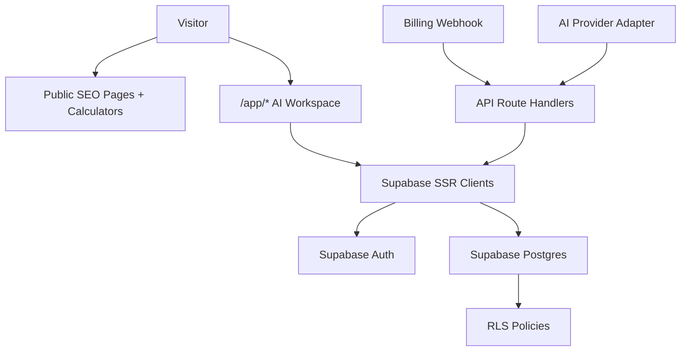

# Auth DB Production Design

Status: design-ready, not implemented  
Updated: 2026-06-06  
CDC change: `auth-db-production-design`

## 1. Purpose

This document defines the production Auth and Postgres design for Toolars. It
turns the current preview-only AI account surface into an implementation plan
for Supabase Auth, Supabase Postgres, Row Level Security, account-backed AI
data, subscriptions, usage, brand voices, and Pro calculator persistence.

This is intentionally design-only. It does not install Supabase packages, add
SQL migrations, or replace preview auth helpers.

## 2. Current State

Toolars currently has:

- Public calculator and discovery routes that are free/no-login.
- Preview AI app access through `preview` search params and preview request
  headers.
- A deterministic local AI repurpose route and preview plan gates.
- Billing signature parsing, but no subscription database mutation.
- Local/static AI history and local calculator save/compare behavior.

Production gaps:

- No real session cookie flow.
- No account profile or workspace table.
- No persisted subscription status.
- No usage metering persisted across requests.
- No account-backed AI jobs, outputs, brand voices, saved calculator results,
  or export jobs.
- No RLS policies because account tables do not exist yet.

## 3. Official Source Anchors

Implementation work that follows this design should stay source-driven:

| Topic | Official source | Design consequence |
|---|---|---|
| Next.js SSR Auth | [Supabase Next.js guide](https://supabase.com/docs/guides/getting-started/tutorials/with-nextjs) | Use `@supabase/ssr` style browser/server clients and a session-refresh proxy. |
| Server-side auth | [Supabase SSR overview](https://supabase.com/docs/guides/auth/server-side) | Store auth session in cookies for SSR, not browser local storage only. |
| User profile data | [Supabase user management](https://supabase.com/docs/guides/auth/managing-user-data) | Put app profile data in public tables referencing `auth.users(id)`. |
| RLS | [Supabase Row Level Security](https://supabase.com/docs/guides/database/postgres/row-level-security) | Enable RLS for exposed account tables and write owner/workspace policies. |
| Tables/keys | [Supabase tables](https://supabase.com/docs/guides/database/tables) | Use primary keys on every table; prefer `uuid` identifiers for user-owned rows. |

Important source-driven rules:

- Do not use raw `getSession().user` as the authorization authority. Supabase
  documents `getClaims`/`getUser` as the trusted path for identity validation
  in server protection flows.
- Do not expose service/secret keys in browser code.
- Do not query Supabase from public calculator pages for basic calculations.
- Enable RLS before exposing account tables through publishable-key clients.

## 4. Target Architecture



Public calculator route rule:

```text
/tools/[slug] -> registry + pure calculator engine + SEO helpers
              -> no Supabase client, no auth guard, no plan lookup for basic use
```

AI app route rule:

```text
/app/* and /api/ai/* -> server-validated user -> workspace/subscription/usage
```

## 5. Module Plan

Future implementation should add these modules:

```text
site/
  lib/
    supabase/
      client.ts        browser client from @supabase/ssr
      server.ts        server client for Server Components, Server Actions, Route Handlers
      proxy.ts         session refresh helper
    auth/
      index.ts         stable Toolars session facade
      guards.ts        requireUser, requireWorkspace, requirePlan helpers
    db/
      types.ts         generated Supabase database types
      schema.ts        app-facing row adapters
      errors.ts        normalized DB error helpers
  proxy.ts             Next.js request proxy/session refresh
  app/
    auth/confirm/route.ts
    login/actions.ts
    register/actions.ts
    app/*              protected AI pages
    api/ai/*           authenticated AI route handlers
    api/billing/*      server-only billing webhooks
supabase/
  migrations/
  seed.sql
```

Boundary rules:

- `site/lib/calculators/**` must not import `site/lib/supabase/**`,
  `site/lib/auth/**`, billing, or AI provider modules.
- `site/app/tools/**` may read public registry/SEO data but must not require a
  session to render or calculate.
- Server-only service clients may exist only in route handlers, server actions,
  webhook modules, or background jobs.
- Client components can use publishable-key clients only when RLS policies
  fully protect the data being queried.

## 6. Session Model

Production `ToolarsSession` should become a facade over Supabase identity:

```ts
interface ToolarsSession {
  userId: string;
  email: string | null;
  workspaceId: string;
  planId: 'free' | 'pro' | 'team';
  role: 'owner' | 'admin' | 'member';
  isAuthenticated: true;
}
```

Implementation notes:

- `getSessionFromSearchParams` remains test/dev preview-only and must stay
  production-disabled unless explicitly enabled for a local/staging harness.
- Production app routes should call a server-side guard such as `requireUser()`
  or `requireWorkspace()`.
- Route handlers that mutate account data should derive user/workspace/plan
  from Supabase plus the database, not from client-submitted plan fields.
- Free users can authenticate but should still be blocked from paid AI
  generation by plan/usage gates.

## 7. Database Schema Plan

### 7.1 Core Account Tables

| Table | Key Columns | Purpose |
|---|---|---|
| `profiles` | `id uuid primary key references auth.users(id) on delete cascade`, `email`, `display_name`, `avatar_url`, `created_at`, `updated_at` | App profile row for each Auth user. |
| `workspaces` | `id uuid primary key`, `owner_user_id uuid references auth.users(id)`, `name`, `slug`, `created_at`, `updated_at` | Personal/team workspace container. |
| `workspace_members` | `workspace_id`, `user_id`, `role`, `created_at` | Workspace membership and role checks. |

Profile creation:

- Use a minimal `handle_new_user()` trigger to create `profiles`.
- Keep the trigger low-risk because failed auth triggers can block signups.
- Create a personal workspace and owner membership either in a tested trigger or
  in a server-side post-signup action; prefer the implementation with stronger
  testability.

### 7.2 Billing And Usage Tables

| Table | Key Columns | Purpose |
|---|---|---|
| `subscriptions` | `id`, `workspace_id`, `provider`, `provider_customer_id`, `provider_subscription_id`, `plan_id`, `status`, `renews_at`, `cancels_at`, `updated_at` | Current billing state. |
| `subscription_events` | `id`, `provider`, `provider_event_id`, `event_type`, `payload`, `processed_at` | Webhook idempotency and replay audit. |
| `usage_counters` | `id`, `workspace_id`, `period_start`, `period_end`, `ai_generations_used`, `exports_used`, `batch_runs_used` | Metering against plan limits. |

Billing rules:

- Webhook writes are service-role-only.
- `provider_event_id` must be unique for idempotency.
- App routes read subscription and usage state through authenticated
  workspace-aware queries.

### 7.3 AI Workflow Tables

| Table | Key Columns | Purpose |
|---|---|---|
| `brand_voices` | `id`, `workspace_id`, `created_by`, `name`, `description`, `tone_rules`, `is_default`, `created_at`, `updated_at` | Reusable voice profiles. |
| `ai_jobs` | `id`, `workspace_id`, `created_by`, `source_type`, `source_hash`, `source_excerpt`, `tone`, `brand_voice_id`, `model`, `status`, `created_at`, `completed_at` | AI repurpose job metadata. |
| `ai_job_platforms` | `job_id`, `platform_id` | Selected output platforms. |
| `ai_outputs` | `id`, `job_id`, `platform_id`, `content`, `word_count`, `status`, `created_at` | Generated platform outputs. |

Privacy note:

- Store a `source_hash` and short `source_excerpt` by default.
- Avoid storing full private source content unless the user explicitly saves it.
- Add retention controls before public launch.

### 7.4 Pro Calculator Tables

| Table | Key Columns | Purpose |
|---|---|---|
| `saved_calculator_results` | `id`, `workspace_id`, `created_by`, `calculator_slug`, `input_json`, `result_json`, `label`, `created_at` | Cross-device saved results. |
| `calculator_comparisons` | `id`, `workspace_id`, `created_by`, `name`, `created_at` | Named comparison sets. |
| `calculator_comparison_items` | `comparison_id`, `saved_result_id`, `position` | Ordered saved results in a comparison. |
| `export_jobs` | `id`, `workspace_id`, `created_by`, `export_type`, `source_type`, `source_id`, `status`, `file_url`, `created_at`, `completed_at` | PDF/CSV advanced export workflow. |

Calculator rule:

- Anonymous local save/compare remains browser-local.
- Account-backed save/export is an explicit Pro action.
- Calculator engines remain pure TypeScript and receive no account state.

### 7.5 Audit Table

| Table | Key Columns | Purpose |
|---|---|---|
| `audit_events` | `id`, `workspace_id`, `actor_user_id`, `event_type`, `target_type`, `target_id`, `metadata`, `created_at` | Security, billing, and admin event trail. |

Audit default:

- Service/server write only.
- Product UI reads can be added later for team plans if needed.

## 8. RLS Policy Matrix

| Table | SELECT | INSERT | UPDATE | DELETE |
|---|---|---|---|---|
| `profiles` | own profile | trigger/server | own safe columns | service/admin only |
| `workspaces` | owner/member | authenticated user creates personal workspace | owner/admin | owner/admin with safeguards |
| `workspace_members` | workspace member | owner/admin/server | owner/admin/server | owner/admin/server |
| `subscriptions` | workspace member | service only | service only | service only |
| `subscription_events` | service/admin only | service only | service only | service only |
| `usage_counters` | workspace member | service/server | service/server | service/admin only |
| `brand_voices` | workspace member | workspace member within plan limit | creator/admin/member policy | owner/admin/creator |
| `ai_jobs` | workspace member | authenticated route handler | route handler/provider server | owner/admin |
| `ai_outputs` | workspace member through job | route handler/provider server | route handler/provider server | owner/admin |
| `saved_calculator_results` | owner/workspace member | authenticated user with Pro gate | owner/admin | owner/admin |
| `export_jobs` | workspace member | route handler with Pro gate | route handler/server | owner/admin |
| `audit_events` | service/admin default | service/server | service/server | service/admin only |

Policy shape:

```sql
-- Example shape only, not a migration.
using (
  auth.uid() is not null
  and exists (
    select 1
    from public.workspace_members wm
    where wm.workspace_id = <table>.workspace_id
      and wm.user_id = auth.uid()
  )
)
```

Implementation specs should include SQL tests for:

- unauthenticated access denied
- unrelated user denied
- workspace member allowed
- service webhook write allowed only server-side

## 9. Environment Variables

Required future variables:

```text
NEXT_PUBLIC_SUPABASE_URL
NEXT_PUBLIC_SUPABASE_PUBLISHABLE_KEY
SUPABASE_SECRET_KEY
SUPABASE_SERVICE_ROLE_KEY
TOOLARS_AUTH_PREVIEW_MODE
```

Rules:

- `NEXT_PUBLIC_*` values can appear in browser bundles.
- Secret/service keys must never be referenced from client components or public
  calculator modules.
- `TOOLARS_ENABLE_PREVIEW_AUTH` must remain disabled in production unless an
  explicit staging harness enables it.

## 10. Migration Sequence

Recommended implementation changes after this design:

1. `supabase-client-foundation-pass`
   - install Supabase packages
   - add source-linked client/server/proxy utilities
   - add env validation tests
2. `auth-session-guard-pass`
   - add server guards
   - protect `/app/*`
   - preserve preview fixtures for local tests
3. `account-schema-migration-pass`
   - add profiles/workspaces/workspace members migrations
   - add RLS and policy tests
4. `subscription-state-pass`
   - persist billing subscriptions and webhook idempotency
   - connect plan gates to subscription rows
5. `ai-persistence-pass`
   - persist AI jobs, outputs, brand voices, and usage counters
6. `pro-calculator-persistence-pass`
   - add account-backed saved results, comparisons, and export jobs
7. `auth-db-security-audit`
   - run deep security audit before production launch

## 11. Verification Gates

Every production implementation pass should run the smallest relevant subset
plus final full gates:

```bash
pnpm --dir site lint
pnpm --dir site type-check
pnpm --dir site test
pnpm --dir site test:e2e -- auth-billing
pnpm --dir site test:e2e -- calculators
pnpm --dir site build
cdc-workflow gate --mode standard --root .
cdc-workflow ship-preview --change <change-id> --root .
```

Before launch:

```bash
cdc-role-security-audit
```

Security audit scope:

- Supabase SSR session validation.
- RLS policy coverage.
- service/secret key leakage.
- billing webhook idempotency and replay resistance.
- AI prompt/input retention and abuse limits.
- Pro calculator saved/export data ownership.

## 12. Open Decisions

| Decision | Default Recommendation |
|---|---|
| Personal vs team workspace at signup | Always create one personal workspace; team upgrade later. |
| Full source content retention for AI jobs | Do not store by default; store hash/excerpt unless user explicitly saves. |
| `SUPABASE_SECRET_KEY` vs legacy `service_role` | Prefer current Supabase publishable/secret key model; confirm exact key names during implementation. |
| SQL test runner | Use Supabase local CLI or a lightweight Postgres/RLS test harness in the implementation pass. |
| Anonymous Supabase users | Not needed for basic calculators; keep anonymous calculator state local. |
