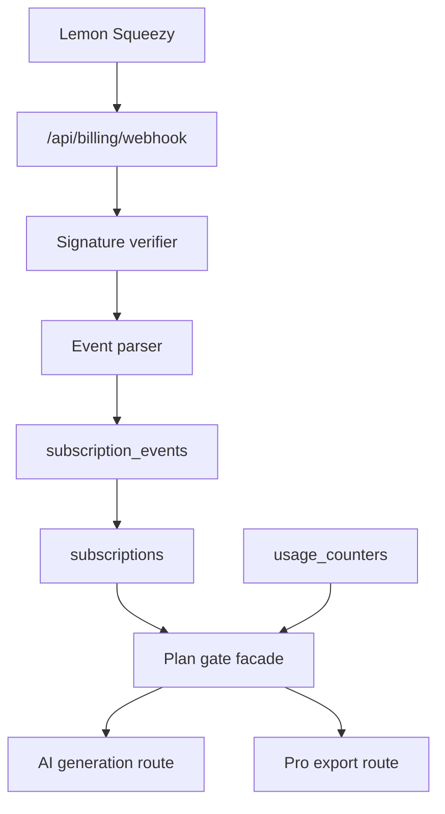

# Billing Subscription State Design

Status: design-ready, not implemented  
Updated: 2026-06-06  
CDC change: `billing-subscription-state-pass`

## 1. Purpose

This document defines how Toolars should turn Lemon Squeezy subscription events
into durable Toolars plan access. It prepares the future implementation of Pro
AI access, cross-device saves, PDF/CSV exports, and batch tools without adding
runtime billing mutations in this pass.

## 2. Current State

Current billing code:

- `site/lib/billing/index.ts` creates/verifies a preview HMAC signature.
- `parseBillingWebhookEvent()` accepts a simplified `subscription.updated`
  shape with `userId`, `planId`, and `status`.
- `/api/billing/webhook` verifies `toolars-signature` and `toolars-timestamp`
  headers, then returns an acknowledgement.
- Production fallback secret is disabled.

Production gaps:

- Lemon Squeezy uses `X-Signature`, not the current preview header names.
- Real events use Lemon Squeezy event names and resource payloads, not the
  simplified preview body.
- There is no `subscriptions` table.
- There is no `subscription_events` idempotency ledger.
- Plan gates still read static `PlanId` inputs rather than account billing
  state.
- No customer portal, checkout, variant mapping, or usage-record integration
  exists.

## 3. Official Source Anchors

| Topic | Official source | Design consequence |
|---|---|---|
| Webhook signing | [Signing Requests](https://docs.lemonsqueezy.com/help/webhooks/signing-requests) | Verify raw body with HMAC-SHA256 and Lemon Squeezy `X-Signature`. |
| Webhook request shape | [Webhook Requests](https://docs.lemonsqueezy.com/help/webhooks/webhook-requests) | Read `X-Event-Name`, event payload, retries, and `meta.custom_data`. |
| Event names | [Event Types](https://docs.lemonsqueezy.com/help/webhooks/event-types) | Subscribe to subscription lifecycle and payment events. |
| Subscription object | [Subscription Object](https://docs.lemonsqueezy.com/api/subscriptions/the-subscription-object) | Store raw provider status, IDs, renewal/end dates, and customer portal URLs. |
| Lifecycle | [Subscriptions](https://docs.lemonsqueezy.com/help/products/subscriptions) | Map active/trial/cancelled/expired statuses into Toolars access. |
| Test mode | [Simulate Webhook Events](https://docs.lemonsqueezy.com/help/webhooks/simulate-webhook-events) | Use Lemon Squeezy test-mode event simulation for staging verification. |
| Usage records | [Usage Record Object](https://docs.lemonsqueezy.com/api/usage-records/the-usage-record-object) | Keep Toolars internal usage counters separate unless usage-based billing is enabled. |

## 4. Target Architecture



Boundary rules:

- Public calculator pages and calculator engines never import billing state.
- Billing webhook writes run server-side only.
- Client components may read subscription summaries through authenticated app
  routes, never through provider secrets.
- Lemon Squeezy API keys and webhook secrets are server-only.

## 5. Event Intake

Future webhook flow:

1. Read raw request body exactly once.
2. Read Lemon Squeezy `X-Signature` and `X-Event-Name`.
3. Verify HMAC-SHA256 signature with the configured webhook secret.
4. Parse event payload and provider object ID.
5. Insert `subscription_events` row with unique provider event ID/hash.
6. If duplicate, return success without mutating subscription state.
7. Reconcile `subscriptions` from the event payload.
8. Emit internal audit event.

Retry behavior:

- Lemon Squeezy may retry failed webhook requests.
- Toolars should return `200` for duplicate already-processed events.
- Toolars should return non-2xx only when the event was not accepted.

## 6. Data Model

### 6.1 `subscriptions`

Purpose: current billing truth per workspace.

Recommended columns:

```text
id uuid primary key
workspace_id uuid not null references public.workspaces(id)
provider text not null default 'lemon_squeezy'
provider_customer_id text
provider_subscription_id text not null
provider_variant_id text
provider_product_id text
plan_id text not null
provider_status text not null
access_state text not null
renews_at timestamptz
ends_at timestamptz
trial_ends_at timestamptz
customer_portal_url text
update_payment_method_url text
last_provider_event_id text
created_at timestamptz not null default now()
updated_at timestamptz not null default now()
```

Constraints:

- unique `(provider, provider_subscription_id)`
- one active subscription per workspace and provider unless a later migration
  explicitly supports multiple concurrent paid products

### 6.2 `subscription_events`

Purpose: provider event idempotency and audit.

Recommended columns:

```text
id uuid primary key
provider text not null default 'lemon_squeezy'
provider_event_id text not null
event_name text not null
provider_object_type text
provider_object_id text
workspace_id uuid references public.workspaces(id)
payload_hash text not null
payload_json jsonb not null
processing_status text not null
processed_at timestamptz
error_message text
created_at timestamptz not null default now()
```

Constraints:

- unique `(provider, provider_event_id)`

### 6.3 `usage_counters`

Purpose: Toolars plan usage metering.

Recommended columns:

```text
id uuid primary key
workspace_id uuid not null references public.workspaces(id)
period_start date not null
period_end date not null
ai_generations_used integer not null default 0
exports_used integer not null default 0
batch_runs_used integer not null default 0
updated_at timestamptz not null default now()
```

Usage counters remain Toolars-owned even if Lemon Squeezy usage records are
added later for usage-based billing.

## 7. Provider Event Map

| Event | Input source | Toolars mutation |
|---|---|---|
| `subscription_created` | subscription object | create or attach subscription row |
| `subscription_updated` | subscription object | reconcile provider status, variant, dates, portal URLs |
| `subscription_cancelled` | subscription object | set raw status and preserve access until `ends_at` when applicable |
| `subscription_resumed` | subscription object | restore paid access if status is valid |
| `subscription_expired` | subscription object | set access to free |
| `subscription_paused` | subscription object | apply pause policy |
| `subscription_unpaused` | subscription object | re-evaluate paid access |
| `subscription_plan_changed` | subscription object | update variant-to-plan mapping |
| `subscription_payment_success` | payment/subscription context | record payment success and reconcile current state |
| `subscription_payment_failed` | payment/subscription context | mark past-due risk |
| `subscription_payment_recovered` | payment/subscription context | clear past-due risk after provider status recovers |

## 8. Status And Access Mapping

| Lemon Squeezy status | Stored `access_state` | Toolars behavior |
|---|---|---|
| `on_trial` | `paid` | allow mapped plan until trial end |
| `active` | `paid` | allow mapped plan |
| `paused` | `paused` | default block paid AI unless product policy says service continues |
| `past_due` | `grace` | allow short grace with billing warning |
| `unpaid` | `free` | fall back to free unless an explicit grace policy is approved |
| `cancelled` | `paid_until_end` | allow paid access until `ends_at` |
| `expired` | `free` | free access only |

Access evaluation should return:

```ts
interface BillingAccessState {
  workspaceId: string;
  planId: 'free' | 'pro' | 'team';
  source: 'default_free' | 'subscription' | 'trial' | 'grace';
  status: string;
  renewsAt?: string;
  endsAt?: string;
  customerPortalUrl?: string;
}
```

## 9. Variant Mapping

Toolars should not trust client-submitted plan IDs from checkout return pages.
Variant-to-plan mapping should live server-side:

```text
LEMONSQUEEZY_PRO_MONTHLY_VARIANT_ID -> pro
LEMONSQUEEZY_PRO_YEARLY_VARIANT_ID  -> pro
LEMONSQUEEZY_TEAM_MONTHLY_VARIANT_ID -> team
LEMONSQUEEZY_TEAM_YEARLY_VARIANT_ID  -> team
```

If an unknown variant arrives:

- store the event
- mark processing as failed/requires review
- do not grant paid access automatically

## 10. Webhook Security

Requirements:

- verify against raw request body
- use Lemon Squeezy `X-Signature`
- use timing-safe comparison
- reject missing/invalid signatures
- never use the development fallback secret in production
- never expose API/webhook secrets to client bundles

Replay/idempotency:

- event ID uniqueness is required
- duplicate events return success without mutation
- event payload hash is stored for audit
- manual replays should be identifiable

## 11. Implementation Sequence

Recommended future CDC changes:

1. `billing-provider-types-pass`
   - add Lemon Squeezy event/status TypeScript models
   - add parser tests using official event names
2. `billing-webhook-signature-pass`
   - switch route to Lemon Squeezy `X-Signature`
   - preserve preview test helper if needed
3. `billing-subscription-schema-pass`
   - add `subscriptions` and `subscription_events` migrations
   - add idempotency tests
4. `billing-status-access-pass`
   - implement provider status to Toolars plan access mapping
   - connect plan gates to subscription rows
5. `billing-checkout-portal-pass`
   - add checkout/customer portal handoff
6. `billing-security-audit`
   - audit secrets, replay, idempotency, plan escalation, and calculator boundary

## 12. Verification Gates

Design pass checks:

```bash
rg -n "X-Signature|subscription_events|provider_event_id|subscription_created|subscription_updated|expired|past_due" docs/architecture/BILLING-SUBSCRIPTION-STATE-DESIGN.md
rg -n "https://docs.lemonsqueezy.com" docs/architecture/BILLING-SUBSCRIPTION-STATE-DESIGN.md specs/changes/billing-subscription-state-pass/design.md
cdc-workflow gate --mode standard --root .
cdc-workflow ship-preview --change billing-subscription-state-pass --root .
```

Future implementation checks:

```bash
pnpm --dir site test -- billing
pnpm --dir site test:e2e -- auth-billing
pnpm --dir site lint
pnpm --dir site type-check
pnpm --dir site build
```

Import/security checks:

```bash
! rg "LEMONSQUEEZY|BILLING_WEBHOOK_SECRET" site/components site/app/tools site/lib/calculators
! rg "NEXT_PUBLIC_.*LEMON|NEXT_PUBLIC_.*BILLING" site
```

## 13. Open Decisions

| Decision | Default recommendation |
|---|---|
| Past-due grace length | preserve short grace only while provider status is `past_due`; block at `unpaid` |
| Paused subscription access | block paid AI by default until product policy approves otherwise |
| Usage-based billing | keep internal Toolars usage counters first; add Lemon Squeezy usage records only when pricing requires it |
| Multiple paid products | one active subscription per workspace/provider for v1 |
| Checkout custom data | include `workspace_id` and user/account identifiers server-side; do not trust client-returned plan IDs |
