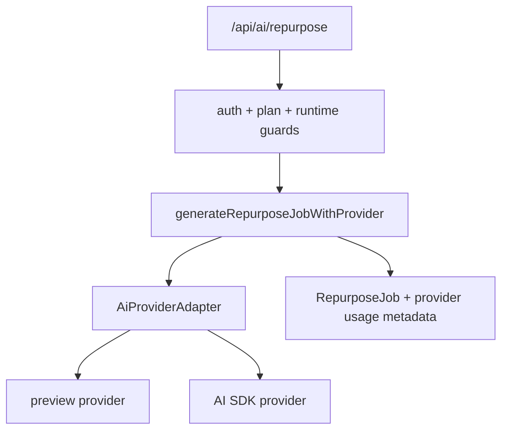

# Design: ai-provider-adapter-implementation

## Overall Architecture



## Source Notes

- AI SDK 6.x documents `generateText` from `ai` for non-interactive text
  generation and returns text plus usage/finish metadata.
- AI SDK 6.x documents `streamText` from `ai` for interactive streaming; this
  pass keeps JSON response transport and leaves UI streaming transport for a
  later pass.
- Vercel AI Gateway documents plain string model IDs for AI SDK calls and lists
  AI SDK as the recommended provider-agnostic entry point.

Sources:

- https://ai-sdk.dev/docs/reference/ai-sdk-core/generate-text
- https://ai-sdk.dev/docs/reference/ai-sdk-core/stream-text
- https://vercel.com/docs/ai-gateway/sdks-and-apis
- https://vercel.com/docs/ai-gateway/models-and-providers

## ADR-1: Add Contract And AI SDK Wrapper In One Narrow Pass

**Context**: The earlier `ai-provider-adapter-pass` was design-only and
recommended a provider-neutral contract before provider SDK usage. W2 now needs
implementation progress toward real AI calls.

**Decision**: This pass adds the adapter contract, preview provider, config,
AI SDK wrapper, and route service integration. Tests use fake executors; no
real provider API call runs in CI/local verification.

**Consequences**: Toolars has a real production seam while keeping provider
secrets and network calls outside tests.

## ADR-2: Keep Route Transport As JSON For This Pass

**Context**: The current client simulates streaming after the route returns a
job. Replacing the transport with SSE/streaming would touch UI state,
Playwright flows, and cancellation semantics at the same time as provider
integration.

**Decision**: Keep `/api/ai/repurpose` returning JSON, but return provider
metadata and route through the adapter service. A later
`ai-route-streaming-pass` can switch transport to server streaming.

**Consequences**: The provider seam lands with low UI risk.

## ADR-3: Server-Only AI SDK Import Boundary

**Context**: Provider dependencies and API keys must not enter public
calculator pages or client bundles.

**Decision**: Import `generateText` from `ai` only inside
`site/lib/ai/providers/ai-sdk.ts`. Client components and route handlers call
Toolars services instead.

**Consequences**: Import-boundary tests can verify the provider SDK does not
leak outward.

## Module Plan

Add:

```text
site/lib/ai/provider.ts
site/lib/ai/provider-config.ts
site/lib/ai/service.ts
site/lib/ai/providers/preview.ts
site/lib/ai/providers/ai-sdk.ts
site/lib/ai/provider-boundary.ts
```

Update:

- `site/lib/ai/index.ts`: export the new provider/service contract.
- `site/app/api/ai/repurpose/route.ts`: call `generateRepurposeJobWithProvider`.
- `site/package.json`: add `ai`.

## Error Model

Normalized codes:

- `provider_unavailable`
- `provider_rate_limited`
- `provider_timeout`
- `provider_refusal`
- `invalid_provider_config`

All user-facing messages are safe and must not include prompts, API keys,
headers, or raw provider payloads.

## Deployment And Rollback

- Default provider is `preview`, so deployments without AI provider env remain
  deterministic and closed to real provider spend.
- Setting `TOOLARS_AI_PROVIDER=ai-sdk` requires
  `TOOLARS_AI_DEFAULT_MODEL`.
- Rollback can switch `TOOLARS_AI_PROVIDER=preview` or revert this branch.

## Verification

- Unit tests for preview provider, AI SDK fake executor, config, error
  normalization, and import boundaries.
- Existing route/unit/E2E tests continue to pass.
- `pnpm --dir site build` still generates 104 routes.
