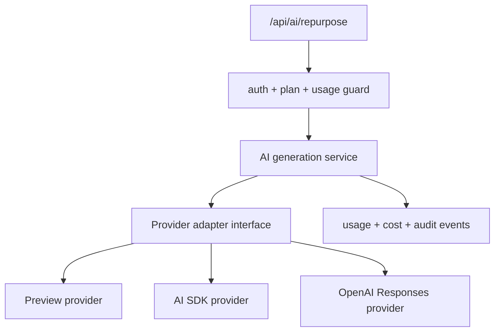

# Design: ai-provider-adapter-pass

## Overall Architecture

This pass defines the production AI provider adapter boundary. It does not add
provider dependencies or replace the preview generator.



## Source Notes

Official sources used for this design:

- AI SDK Core generation and streaming:
  https://ai-sdk.dev/docs/ai-sdk-core/generating-text
- AI SDK `streamText` reference:
  https://ai-sdk.dev/docs/reference/ai-sdk-core/stream-text
- AI SDK language model middleware:
  https://ai-sdk.dev/docs/ai-sdk-core/middleware
- OpenAI text generation guide:
  https://developers.openai.com/api/docs/guides/text
- OpenAI streaming responses guide:
  https://developers.openai.com/api/docs/guides/streaming-responses
- OpenAI Responses API reference:
  https://platform.openai.com/docs/api-reference/responses/object

## ADR-1: Use A Provider-Neutral Adapter First

**Context**: Toolars currently has deterministic preview generation in
`site/lib/ai`. Directly importing provider SDKs into route handlers would make
auth, billing, persistence, and UI tests harder to isolate.

**Decision**: Future implementation should introduce a provider-neutral
`AiProviderAdapter` interface and keep provider SDK usage behind that boundary.

**Consequences**: The preview provider can remain deterministic for tests while
OpenAI or AI SDK providers are added incrementally.

## ADR-2: Prefer AI SDK For Primary Streaming Integration

**Context**: AI SDK Core documents `generateText` and `streamText` as the core
text generation functions and provides middleware for provider-agnostic
guardrails, logging, and behavior changes.

**Decision**: The first production adapter should target AI SDK `streamText`
for interactive repurpose generation, with `generateText` as a non-streaming
path for tests, batch jobs, and fallback flows.

**Consequences**: Toolars can keep provider-specific model selection outside
the route handler and later add middleware for logging, guardrails, caching, or
cost annotations.

## ADR-3: Keep Direct OpenAI Responses API As A Supported Adapter Option

**Context**: OpenAI documents the Responses API as the recommended direct model
request API for text generation. It supports streaming with server-sent events
and exposes lifecycle/streaming events.

**Decision**: The adapter design should allow either AI SDK or a direct OpenAI
Responses provider. The implementation should start with one provider, but the
contract must not block the other.

**Consequences**: Toolars can use AI SDK for provider management while retaining
a direct OpenAI path for advanced Responses API behavior, request IDs, or
streaming event handling.

## ADR-4: Store Usage Metadata, Not Raw Private Source Content By Default

**Context**: Repurpose inputs may include private drafts, business content, or
URLs that users do not expect Toolars to retain permanently.

**Decision**: The adapter result should return usage metadata, latency,
provider request IDs, model, status, and short output data. Raw source content
should not be stored by default; use a hash/excerpt unless a user explicitly
saves a job.

**Consequences**: Future AI persistence and cost reports are useful without
expanding privacy risk.

## Proposed Adapter Contract

```ts
type AiProviderId = 'preview' | 'ai-sdk' | 'openai-responses';

interface AiGenerationInput {
  jobId: string;
  userId: string;
  workspaceId: string;
  sourceType: 'url' | 'text';
  sourceValue: string;
  platforms: string[];
  tone: string;
  brandVoice: {
    id: string;
    label: string;
    instructions: string;
  };
  model: string;
  abortSignal?: AbortSignal;
}

interface AiGenerationChunk {
  type: 'job_started' | 'output_delta' | 'output_completed' | 'job_completed' | 'job_failed';
  jobId: string;
  platformId?: string;
  textDelta?: string;
  content?: string;
  errorCode?: AiProviderErrorCode;
}

interface AiGenerationResult {
  jobId: string;
  status: 'completed' | 'canceled' | 'failed';
  outputs: RepurposeOutput[];
  provider: AiProviderId;
  model: string;
  providerRequestId?: string;
  usage: {
    inputTokens?: number;
    outputTokens?: number;
    totalTokens?: number;
    estimatedCostUsd?: number;
    latencyMs: number;
  };
}

interface AiProviderAdapter {
  id: AiProviderId;
  generate(input: AiGenerationInput): Promise<AiGenerationResult>;
  stream(input: AiGenerationInput): AsyncIterable<AiGenerationChunk>;
}
```

## Error Model

Normalize provider errors into:

| Code | User behavior | Server behavior |
|---|---|---|
| `provider_unavailable` | Show retry action | log provider/status/request ID |
| `provider_rate_limited` | Show wait/try later message | record rate-limit event |
| `provider_timeout` | Show retry action | cancel/abort request and mark job failed |
| `provider_refusal` | Show safe refusal message | persist refusal metadata only |
| `invalid_provider_config` | Hide from user behind generic failure | alert ops; do not retry |
| `usage_limit_reached` | Show upgrade/manage plan path | no provider call should happen |

## Streaming Plan

Route behavior for future implementation:

1. Validate request and plan/usage before provider call.
2. Create or reserve an AI job row.
3. Start provider stream with abort support.
4. Map provider text deltas to `AiGenerationChunk`.
5. Persist completed outputs and token/cost usage.
6. Mark job `completed`, `failed`, or `canceled`.

OpenAI direct streaming note:

- OpenAI Responses streaming emits server-sent events and common text-stream
  lifecycle events such as creation, text deltas, completion, and errors.
- Partial streamed output is harder to moderate than a complete non-streamed
  response, so guardrail strategy must be part of implementation review.

## Telemetry And Cost

Provider calls should emit server-side events:

| Event | Required fields |
|---|---|
| `ai_generation_started` | `jobId`, `workspaceId`, `model`, `platformCount` |
| `ai_generation_completed` | `jobId`, `provider`, `model`, `latencyMs`, `tokenUsage`, `estimatedCostUsd` |
| `ai_generation_failed` | `jobId`, `provider`, `errorCode`, `providerRequestId` |
| `ai_generation_canceled` | `jobId`, `provider`, `latencyMs` |

Do not log raw source text by default.

## Migration Plan

1. Add `site/lib/ai/provider.ts` with the adapter types and preview provider.
2. Add tests for deterministic preview provider, error normalization, and
   streaming chunk lifecycle.
3. Add provider selection config with env validation.
4. Install AI SDK/OpenAI dependencies in a dedicated implementation pass.
5. Add AI SDK provider implementation behind the adapter.
6. Add direct OpenAI Responses provider only if needed for advanced behavior.
7. Update `/api/ai/repurpose` to call the provider-neutral service.
8. Add usage/cost event hooks once Auth/DB usage counters are implemented.
9. Run security audit before production provider keys are enabled.

## Verification Plan

Future implementation should verify:

```bash
pnpm --dir site test -- repurpose
pnpm --dir site test:e2e -- ai-repurpose
pnpm --dir site lint
pnpm --dir site type-check
pnpm --dir site build
cdc-workflow gate --mode standard --root .
cdc-workflow ship-preview --change <change-id> --root .
```

Additional checks:

- no provider SDK import in client components
- no `OPENAI_API_KEY` or provider secret in public env names
- fake provider tests do not require network
- cancellation updates job state
- usage/cost metadata is available before decrementing plan counters

## Risks And Mitigations

| Risk | Probability | Impact | Mitigation |
|---|---|---|---|
| Provider SDK leaks into UI | M | H | Adapter boundary plus import grep tests. |
| Streaming partial output bypasses moderation | M | H | Add guardrail review and safe refusal handling before launch. |
| Cost spikes from retries | M | H | Retry budget, per-plan limits, usage counters before provider call. |
| API key exposure | L | H | Server-only env vars and security audit. |
| Provider lock-in | M | M | Keep OpenAI/AI SDK adapters behind the same contract. |
