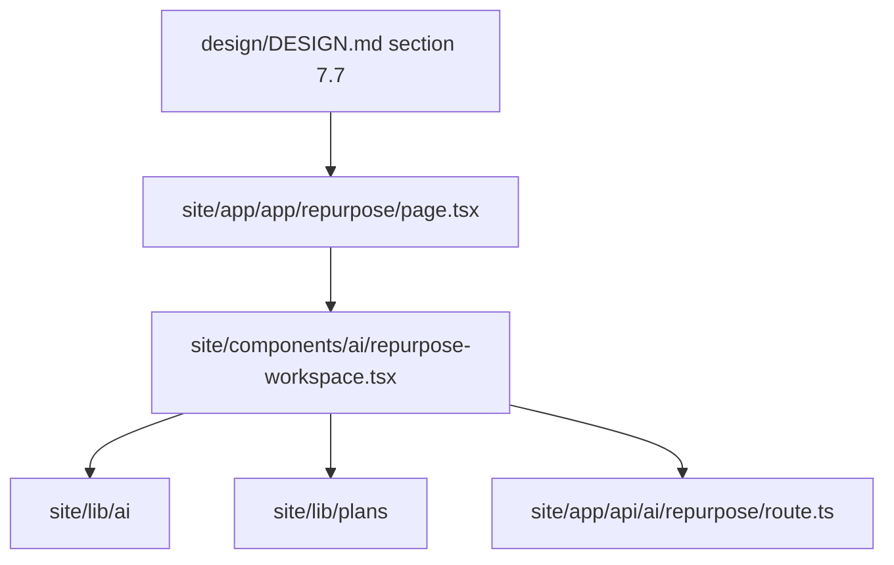

# Design: ai-repurpose-dashboard-pass

## Overall Approach

This change upgrades the existing AI Content Repurposer route without touching
auth, billing, API, or generation logic. The design work stays inside the
existing App Router page and shared AI workspace component.

## ADR-1: Keep AI SaaS Separate From Public Calculator Components

**Context**: The architecture rules require account, billing, AI provider, and
database concerns to stay outside public calculator components.

**Decision**: Refine only the AI route and AI workspace component. Do not import
AI state into calculator pages or shared public discovery components.

**Consequences**: Paid AI UX can improve without risking free calculator
crawlability or anonymous usage.

## ADR-2: Preserve Existing Preview Auth And Plan Gates

**Context**: The current preview system already verifies anonymous gating, free
plan blocks, and Pro preview access.

**Decision**: Reuse `getSessionFromSearchParams`, `UsagePlanCard`, and
`evaluateAiGenerationAccess`. The pass changes presentation and visible
contracts only.

**Consequences**: Existing auth/billing tests remain meaningful, and the change
has no external side effects.

## ADR-3: Put History And Saved Output Nearby As Preview Context

**Context**: `design/DESIGN.md` asks for history and saved outputs nearby, but
v1 does not yet have database-backed persistence.

**Decision**: Add a nearby preview section that communicates saved/history
context without pretending cloud sync exists.

**Consequences**: The page matches expected SaaS IA while leaving real
persistence for a later spec.

## Data Model Changes

No persisted data model changes.

## API Changes

No API changes.

## Deployment And Rollback

- Deployment: normal Next.js site deployment.
- Rollback: revert this change; no migrations or external systems involved.

## Observability

- Component tests assert the AI workspace UI contract.
- E2E tests assert the preview workflow, streaming state, and nearby usage/history
  sections.
- Browser visual QA checks desktop and mobile layouts.

## Risks And Mitigations

| Risk | Probability | Impact | Mitigation |
|---|---|---|---|
| Breaking existing streaming/cancel flow | M | H | Add tests before implementation and rerun E2E. |
| Confusing preview history with real sync | M | M | Use explicit local/preview language. |
| Creating a marketing page instead of app workspace | M | M | Keep controls and outputs as first-class page content. |
| Adding plan logic in UI only | L | M | Continue using existing plan gate helper. |
