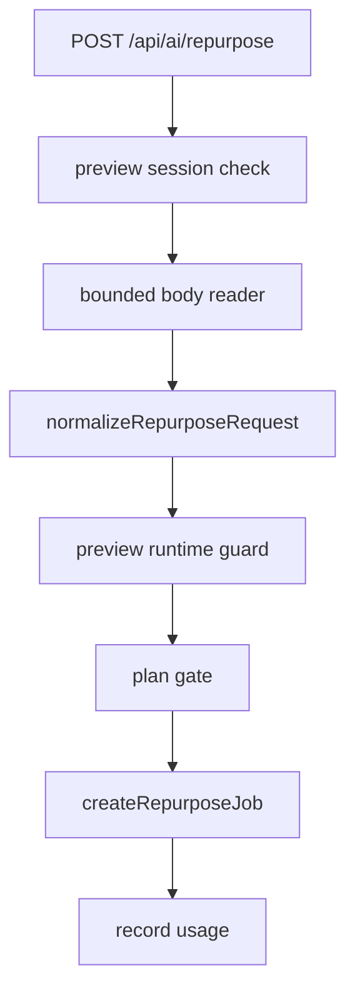

# Design: ai-runtime-security-pass

## Approach

Add small, testable helpers under `site/lib/ai` and keep route-specific behavior
in `site/app/api/ai/repurpose/route.ts`.

The pass does not claim production-grade persistence. It creates a safer seam so
future Supabase usage counters and provider adapters can replace the in-memory
preview state without changing the route contract again.

## Constants

Recommended initial limits:

```text
MAX_REPURPOSE_REQUEST_BYTES = 12_000
MAX_REPURPOSE_SOURCE_CHARACTERS = 6_000
AI_PREVIEW_RATE_LIMIT = 5 requests per 60 seconds per preview user
```

These limits are intentionally conservative for preview. Future production
values should be environment-configurable and backed by persistent stores.

## Data Flow



## Boundary Decisions

- Treat request JSON as `unknown` until normalized.
- Return `413` for oversized bodies.
- Return `400` for malformed supported fields and long sources.
- De-duplicate platforms while preserving first occurrence order.
- Count usage by successful request, not by generated output count.
- Track preview usage in memory only; real production usage is a later DB pass.

## Verification Plan

```bash
pnpm --dir site test -- ai
pnpm --dir site test -- app/api/ai/repurpose
pnpm --dir site test:e2e -- auth-billing
pnpm --dir site lint
pnpm --dir site type-check
pnpm --dir site build
cdc-workflow gate --mode standard --root .
cdc-workflow ship-preview --change ai-runtime-security-pass --root .
```

