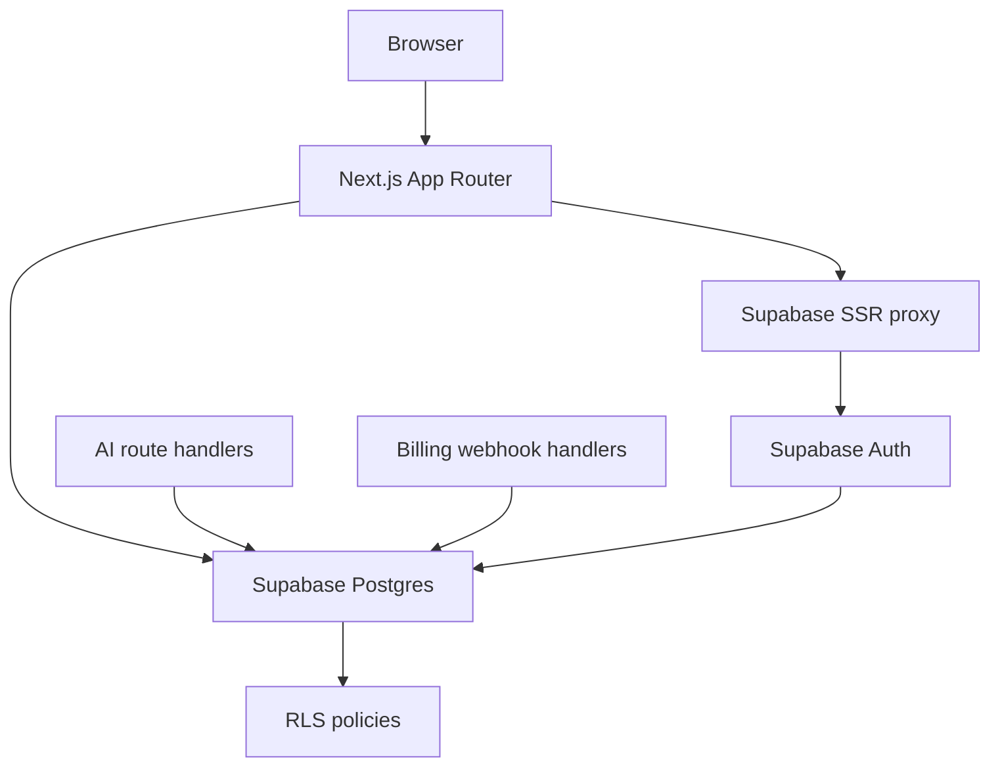

# Design: auth-db-production-design

## Overall Architecture

This change records the production Auth and database design. It does not add
runtime dependencies, SQL migrations, or route code.



## Source Notes

Official sources used for this design:

- Supabase Next.js SSR guide:
  https://supabase.com/docs/guides/getting-started/tutorials/with-nextjs
- Supabase server-side auth overview:
  https://supabase.com/docs/guides/auth/server-side
- Supabase Row Level Security:
  https://supabase.com/docs/guides/database/postgres/row-level-security
- Supabase user data/profile guidance:
  https://supabase.com/docs/guides/auth/managing-user-data
- Supabase tables and primary keys:
  https://supabase.com/docs/guides/database/tables

## ADR-1: Use Supabase Auth + Postgres As The Production Account Boundary

**Context**: `.cdc/ARCHITECTURE.md` already records Supabase Auth/Postgres as
the approved Auth/DB choice. Current code only has preview sessions.

**Decision**: Future implementation should use Supabase Auth for account
identity and Supabase Postgres for account-owned data, with Next.js App Router
server components/route handlers reading server-validated session state.

**Consequences**: Public calculator pages remain session-independent. AI app
routes, brand voices, history, usage, saved results, and subscription state can
share one account model.

## ADR-2: Prefer Supabase SSR Cookie Sessions For Next.js App Router

**Context**: Supabase documents `@supabase/ssr` for SSR frameworks, including
Next.js cookie-based session handling. Their Next.js guide distinguishes client
component clients from server component/route handler clients and warns not to
trust raw session user objects for authorization.

**Decision**: Future code should add `site/lib/supabase/client.ts`,
`site/lib/supabase/server.ts`, and a root `proxy.ts`/session updater following
the official Supabase SSR pattern. App route protection should validate identity
server-side using `getClaims` or `getUser`, not `getSession` user payloads for
authorization decisions.

**Consequences**: Auth-dependent data fetches become dynamic and cookie-aware.
Public SEO routes must not import the Supabase server client unless they truly
need account state.

## ADR-3: Create Public Profile Rows Referencing `auth.users`

**Context**: Supabase does not expose the Auth schema through its generated API
and recommends creating user tables in the public schema when application code
needs user data.

**Decision**: Create `profiles.id` as a primary key and foreign key to
`auth.users(id) on delete cascade`. Use an auth trigger to create profile rows,
but keep the trigger minimal and thoroughly tested because failed triggers can
block signups.

**Consequences**: Application profile data is queryable under RLS without
directly depending on unstable Auth schema internals.

## ADR-4: RLS Is Required For Exposed Account Tables

**Context**: Supabase requires RLS for tables in exposed schemas to protect
browser/API access. Service keys bypass RLS and must never be exposed to users.

**Decision**: Every public-schema account table in this design must enable RLS.
Policies should use explicit authenticated checks such as
`auth.uid() is not null and auth.uid() = user_id`, or workspace membership
checks for shared workspace data. Service-role writes are limited to server-only
webhooks and admin reconciliation jobs.

**Consequences**: Client-side code can use publishable keys with RLS. Billing
and provider callbacks stay server-only.

## Data Model

The first production migration should create these tables. Names are proposed
and can be refined in the implementation spec.

| Table | Purpose | Owner Boundary |
|---|---|---|
| `profiles` | Public app profile fields for each Auth user | `id = auth.uid()` |
| `workspaces` | Personal/team workspace container | owner plus members |
| `workspace_members` | User membership and role per workspace | workspace membership |
| `subscriptions` | Current plan, provider customer/subscription IDs, status | workspace/admin write |
| `usage_counters` | Monthly AI generations, exports, batch usage | workspace read; server write |
| `brand_voices` | User/workspace saved brand voice profiles | workspace membership |
| `ai_jobs` | AI repurpose job metadata and lifecycle status | workspace membership |
| `ai_outputs` | Generated platform outputs for an AI job | workspace via job |
| `saved_calculator_results` | Account-backed Pro calculator saved results | user/workspace owner |
| `export_jobs` | PDF/CSV export requests and status | workspace membership |
| `audit_events` | Security/billing/admin event trail | server write; owner limited read if needed |

Recommended shared columns:

- `id uuid primary key`
- `created_at timestamptz not null default now()`
- `updated_at timestamptz not null default now()`
- `user_id uuid references auth.users(id) on delete cascade` where ownership is
  direct-user scoped
- `workspace_id uuid references public.workspaces(id) on delete cascade` where
  ownership is workspace scoped

## RLS Policy Plan

| Table | Select | Insert/Update/Delete |
|---|---|---|
| `profiles` | user can read own profile | user can update safe profile columns |
| `workspaces` | owner/member can read | owner/admin can update |
| `workspace_members` | members can read workspace membership | owner/admin or service role writes |
| `subscriptions` | workspace members can read current plan | service role only writes |
| `usage_counters` | workspace members can read | service role/route handler writes |
| `brand_voices` | workspace members can read | creator/member can write within plan limits |
| `ai_jobs` | workspace members can read | route handler creates/updates for authenticated user |
| `ai_outputs` | workspace members can read through job ownership | route handler/provider callback writes |
| `saved_calculator_results` | owner/workspace members can read | owner can create/delete; Pro gate enforced server-side |
| `export_jobs` | workspace members can read | route handler creates/updates |
| `audit_events` | admin/service read by default | service role only writes |

## Module Map For Future Implementation

```text
site/
  lib/
    supabase/
      client.ts        browser client from @supabase/ssr
      server.ts        server component/route handler client
      proxy.ts         session refresh helper
    auth/
      index.ts         public session facade; preview fallback only in tests/dev
      guards.ts        route/API guard helpers
    db/
      types.ts         generated database types
      schema.ts        app-level row shape adapters
  proxy.ts             Next.js proxy for Supabase SSR cookie refresh
  app/
    auth/confirm/route.ts
    login/actions.ts
    app/*              protected AI app routes
    api/*              authenticated route handlers and server-only webhooks
supabase/
  migrations/
  seed.sql
```

## Migration Plan

1. Add dependencies and source-backed Supabase client utilities.
2. Add env validation for:
   - `NEXT_PUBLIC_SUPABASE_URL`
   - `NEXT_PUBLIC_SUPABASE_PUBLISHABLE_KEY`
   - server-only Supabase secret/service key for webhooks and admin jobs
3. Add migrations for `profiles`, `workspaces`, and `workspace_members`.
4. Add RLS policies and tests for direct-user and workspace ownership.
5. Add subscription and usage tables, then wire billing webhook idempotency.
6. Replace preview page sessions in `/app/*` with server-validated sessions.
7. Persist AI jobs/outputs and brand voices behind plan gates.
8. Add account-backed saved calculator results and export jobs as Pro features.
9. Run security audit before enabling production auth/billing in public envs.

## Verification Plan

Future implementation passes should include:

- Unit tests for session facade, env validation, and plan/account mapping.
- SQL/RLS tests for table ownership policies.
- Route handler tests for authenticated AI generation and unauthenticated
  rejection.
- E2E tests for login, protected AI routes, free calculator no-login flow,
  subscription-gated AI generation, and saved Pro calculator results.
- `cdc-role-security-audit` before release.

## Risks And Mitigations

| Risk | Probability | Impact | Mitigation |
|---|---|---|---|
| Public calculators accidentally import session state | M | H | Keep calculator pages and engines outside `lib/supabase` and auth guards. |
| RLS gaps expose AI history or saved results | M | H | Enable RLS on every exposed account table and test ownership policies. |
| Service key leaks to browser bundle | L | H | Server-only env names, lint/test checks, no service client in components. |
| Signup trigger blocks account creation | M | M | Keep profile trigger minimal and test migration rollback. |
| Preview auth bypass remains enabled in production | L | H | Preserve current production-disable guard and add production auth tests. |
