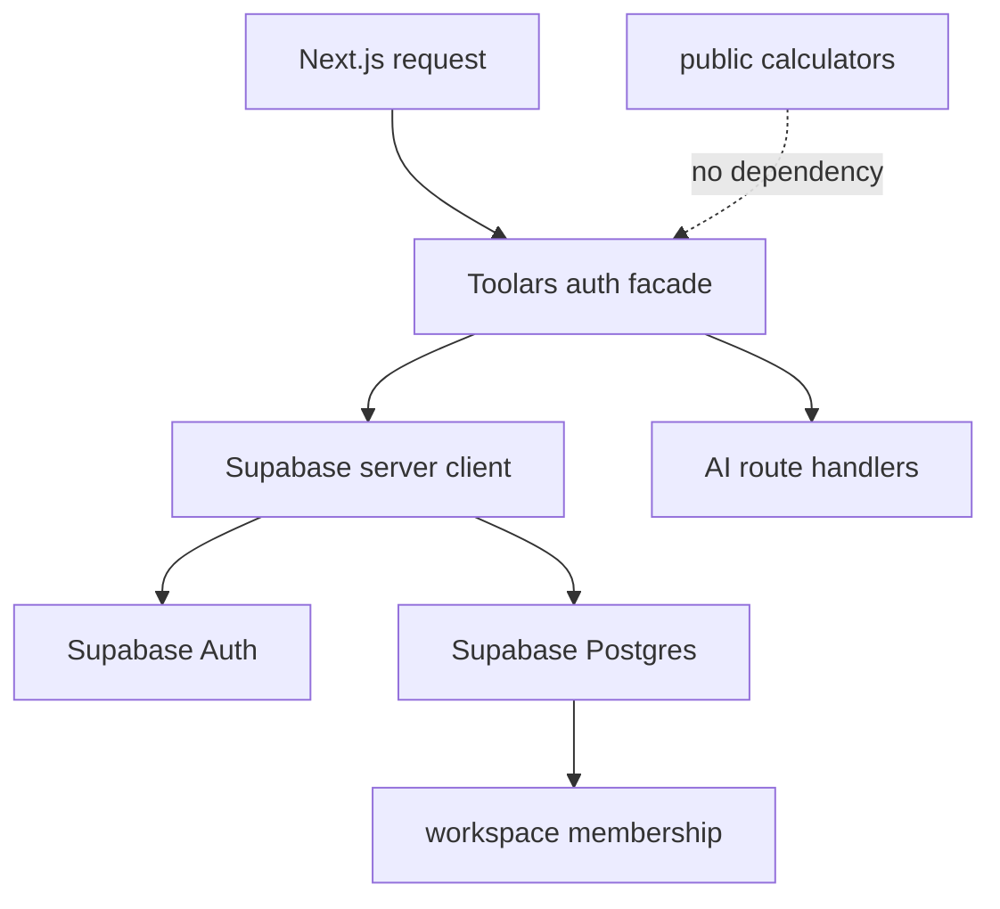

# Design: auth-db-production-implementation

## Overall Architecture



## ADR-1: Implement Foundation, Not Every Backend Feature

**Context**: W2 needs Auth, DB, AI provider, billing, usage metering, and Pro
persistence. Implementing all of that in one PR would make review and rollback
fragile.

**Decision**: This pass implements Supabase env/client helpers, a production
session resolver, account/workspace SQL foundation, and dependency isolation
tests. Billing DB adapter, AI provider adapter, usage counters, AI persistence,
and Pro calculator persistence remain separate specs.

**Consequences**: The project gets real backend seams without forcing every
preview surface to become production-complete in one change.

## ADR-2: Keep Public Supabase Env Separate From Service Env

**Context**: Supabase public URL and publishable key may be bundled for browser
clients. Service role keys bypass RLS and must never be browser-reachable.

**Decision**: Add separate helpers for public env and service env. Browser and
server session clients can read only public env. Service clients require
`SUPABASE_SERVICE_ROLE_KEY` and live in server-only modules.

**Consequences**: Tests can prove service keys are excluded from public client
configuration and public calculator code cannot accidentally import service
clients.

## ADR-3: Resolve Toolars Sessions Through Workspace Membership

**Context**: Supabase identity alone is not enough for Toolars plan and role
checks. AI and billing features are workspace-scoped.

**Decision**: Add a production resolver that accepts a Supabase auth client and
a workspace loader. It maps a validated user to `ToolarsSession` only when a
workspace membership exists.

**Consequences**: AI routes can later switch from preview sessions to
workspace-aware sessions without taking a direct dependency on Supabase SDK
details.

## ADR-4: Test SQL/RLS Statically Until Local Supabase Harness Lands

**Context**: The repo does not yet have Supabase CLI/local Postgres test
infrastructure.

**Decision**: This pass adds SQL migrations and static tests that verify core
DDL, triggers, RLS enablement, and policy anchors. A future
`auth-db-security-audit` or `supabase-local-rls-test-harness` pass can add
executable Postgres/RLS tests.

**Consequences**: The migration has reviewable production DDL now, while the
heavier DB harness remains an explicit follow-up.

## Data Model

First migration:

| Table | Purpose |
|---|---|
| `profiles` | app profile row keyed to `auth.users(id)` |
| `workspaces` | personal/team workspace container |
| `workspace_members` | membership and role for session resolution |

Planned follow-ups:

- `subscriptions`, `subscription_events`: billing DB adapter.
- `usage_counters`: usage metering pass.
- `ai_jobs`, `ai_outputs`, `brand_voices`: AI persistence pass.
- `saved_calculator_results`, `export_jobs`: Pro calculator persistence pass.

## API And Module Changes

Add:

```text
site/lib/supabase/
  env.ts
  client.ts
  server.ts
  service.ts
site/lib/auth/supabase-session.ts
site/lib/db/account.ts
supabase/migrations/<timestamp>_auth_workspace_foundation.sql
```

Update:

- `site/lib/auth/index.ts`: keep preview helpers; allow async production
  session resolution for route handlers.
- `site/app/api/ai/repurpose/route.ts`: await session resolution.

## Deployment And Rollback

- Deploying code without Supabase env keeps production auth closed because no
  production resolver can create a session.
- SQL migration is additive. Rollback is dropping the trigger/function, then
  account tables in reverse dependency order before any follow-up data writes
  depend on them.

## Observability

- Existing security event logging continues to record AI auth failures.
- No raw Supabase tokens, cookies, service keys, or PII should be logged.

## Risks And Mitigations

| Risk | Probability | Impact | Mitigation |
|---|---|---|---|
| Service key leaks into client bundle | L | H | Server-only module and tests that public env excludes service key |
| Public calculators start depending on auth | M | H | Static dependency isolation test |
| Workspace trigger blocks signup | M | M | Keep trigger small and migration reviewable |
| Static SQL tests miss RLS behavior | M | M | Mark executable local Supabase/RLS harness as follow-up |
