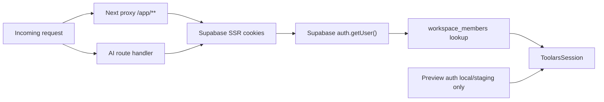

# Design: auth-session-cookie-handoff

## Overall Architecture

## Main Decisions

### ADR-1: Use verified `auth.getUser()` for authorization identity

**Context**: Supabase SSR can expose both cookie-derived sessions and verified
users. Cookie session data is not enough for authorization.

**Decision**: Use `auth.getUser()` when constructing `ToolarsSession`.

**Consequences**: Protected requests make a Supabase Auth verification call.
This is acceptable for SaaS account boundaries and matches the existing
`resolveToolarsSessionFromSupabase()` contract.

### ADR-2: Resolve workspace membership server-side

**Context**: `ToolarsSession` needs `workspaceId`, `role`, and `planId`.
Preview headers can spoof these values and must not be trusted in production.

**Decision**: Add a Supabase-backed membership loader that reads
`workspace_members` by verified `user_id` and returns the first valid
membership. Future multi-workspace switching can add an explicit selected
workspace cookie or URL state in a separate spec.

**Consequences**: v1 auth handoff supports a user's default/first workspace.
The boundary is safe and testable, while workspace switching remains out of
scope.

### ADR-3: Keep preview auth as a separate local/staging branch

**Context**: Preview auth is necessary for fast draft review and existing e2e
tests, but it must not become a production identity source.

**Decision**: Keep `createPreviewSession()` and preview request handling only
when `isPreviewAuthAllowed()` returns true. Production always ignores preview
headers/query/cookies.

**Consequences**: Existing preview workflows remain available locally. Production
auth becomes fail-closed unless Supabase public and service env are configured.

### ADR-4: Inject auth dependencies for tests

**Context**: Route handlers and proxy code must be testable without a live
Supabase project.

**Decision**: Introduce small resolver/client factories that can be overridden
in tests. Production defaults create Supabase SSR/server clients from request
cookies.

**Consequences**: Red/Green tests can cover production-cookie behavior without
network calls or secrets. Runtime code stays scoped to auth modules.

## Data Model Changes

No schema change is required. This change uses existing tables:

- `public.workspace_members`
- `public.workspaces`
- `auth.users` through Supabase Auth

## API Changes

- `getSessionFromRequest(request, options?)` gains optional auth dependency
  injection for tests.
- `proxy(request, options?)` may become async if Supabase verification is
  required.
- `createAiRepurposeHandler(options)` may accept a session resolver override for
  route tests.

No public API endpoint shape changes are expected.

## Deployment, Rollout, Rollback

- Roll out behind existing production env gates.
- Production protected AI paths require:
  - `NEXT_PUBLIC_SUPABASE_URL`
  - `NEXT_PUBLIC_SUPABASE_PUBLISHABLE_KEY`
  - `SUPABASE_SERVICE_ROLE_KEY`
- Rollback restores fail-closed behavior for AI SaaS by reverting this branch.
- Public calculators are unaffected.

## Observability

- Continue structured security events for missing sessions in API routes.
- Add metadata-free denied events only; do not log auth cookies or tokens.
- Keep current audit report updated when H1 is closed or downgraded.

## Risks And Mitigations

| Risk | Probability | Impact | Mitigation |
|---|---|---|---|
| Supabase cookie refresh loses Set-Cookie headers | Medium | High | Use `getAll`/`setAll` cookie methods and test response cookie writes. |
| Preview auth accidentally works in production | Low | High | Add explicit production tests for preview headers/query denial. |
| Service-role membership lookup leaks into calculator code | Low | High | Run calculator isolation grep and keep auth imports outside public calculators. |
| Multi-workspace users need switching | Medium | Medium | Default to first membership; defer explicit workspace switching to a separate spec. |
| Missing Supabase env breaks local preview | Medium | Low | Keep preview repository/session path for non-production only. |
