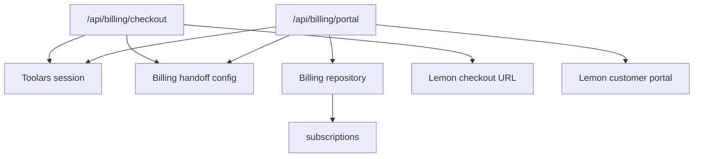

# Design: billing-checkout-portal-handoff

## Overall Architecture



## Source Notes

- Lemon Squeezy Taking Payments:
  https://docs.lemonsqueezy.com/guides/developer-guide/taking-payments
- Lemon Squeezy Create Checkout API:
  https://docs.lemonsqueezy.com/api/checkouts/create-checkout
- Lemon Squeezy Customer Portal:
  https://docs.lemonsqueezy.com/guides/developer-guide/customer-portal

## ADR-1: Use Configured Checkout URLs Before API-Created Checkouts

**Context**: The current billing stack has webhook ingestion and durable
subscriptions, but no outbound provider client or API key boundary.

**Decision**: Use configured provider checkout URLs for Pro/Team plans and
decorate them with Toolars workspace context.

**Consequences**: Upgrade handoff works without introducing a provider SDK or
API client. Dynamic checkout creation can be added later as a separate change.

## ADR-2: Use Signed Portal URL When Present

**Context**: Lemon Squeezy subscription objects expose signed
`customer_portal` URLs, and Toolars already stores that field from webhooks.

**Decision**: The portal route looks for the current workspace's subscription
and redirects to its signed `customerPortalUrl`. If none exists, it falls back
to a configured unsigned store billing URL.

**Consequences**: Existing subscribers get the best portal experience, while
new/free users still have a safe fallback when configured.

## ADR-3: Fail Closed On Invalid Provider URLs

**Context**: Billing routes redirect users outside Toolars. Unsafe URL parsing
would create open redirect or malformed provider handoff risk.

**Decision**: Accept only absolute `https:` URLs for checkout and portal
targets.

**Consequences**: Local tests use HTTPS fixture URLs; misconfigured production
env fails with safe status codes.

## Environment

```text
TOOLARS_LEMONSQUEEZY_PRO_CHECKOUT_URL
TOOLARS_LEMONSQUEEZY_TEAM_CHECKOUT_URL
TOOLARS_LEMONSQUEEZY_PORTAL_URL
```

## API Changes

Add:

```text
POST /api/billing/checkout
GET /api/billing/portal
```

`POST /api/billing/checkout` accepts:

```json
{ "planId": "pro" }
```

The route returns `303 Location: <provider checkout url>`.

`GET /api/billing/portal` returns `303 Location: <provider portal url>`.

## Deployment And Rollback

- Routes are additive.
- Without checkout env vars, checkout fails closed with `503`.
- Without subscription portal data or fallback URL, portal fails closed with
  `404`.
- Rollback by removing Upgrade/Manage links from UI and disabling route use.

## Observability

- Missing session, missing config, and invalid provider URL events are logged as
  structured billing security events.
- Events include safe metadata only: plan, user ID, and whether fallback was
  used.

## Risks And Mitigations

| Risk | Probability | Impact | Mitigation |
|---|---|---|---|
| Open redirect through env | M | H | Require absolute HTTPS URL |
| Checkout not attributed to workspace | M | H | Append `checkout[custom][workspace_id]` |
| Signed portal URL expires | M | M | Fallback to unsigned store portal URL |
| Staging auth not rehearsed | M | H | Risk remains recorded until credentials exist |
