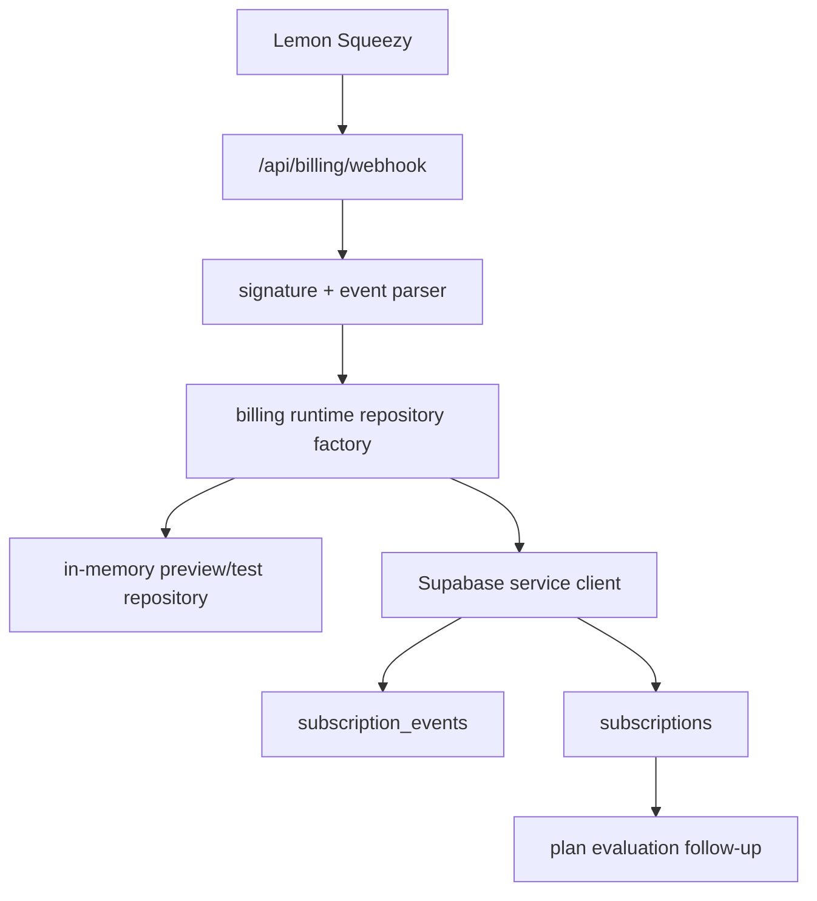

# Design: billing-subscription-db-adapter

## Overall Architecture



## Source Notes

- Supabase JavaScript upsert/select behavior:
  https://supabase.com/docs/reference/javascript/upsert
- Supabase Row Level Security and service keys:
  https://supabase.com/docs/guides/database/postgres/row-level-security
- Lemon Squeezy webhook signing:
  https://docs.lemonsqueezy.com/help/webhooks/signing-requests
- Lemon Squeezy webhook requests:
  https://docs.lemonsqueezy.com/help/webhooks/webhook-requests
- Lemon Squeezy subscription events:
  https://docs.lemonsqueezy.com/help/webhooks/event-types

## ADR-1: Implement A Repository Adapter Before Plan Gates

**Context**: Plan gates need a durable source of truth, but billing storage and
usage metering are separable review risks.

**Decision**: This pass implements durable subscription/event storage only. It
does not mutate AI usage counters or enforce monthly limits.

**Consequences**: Later plan gates can use this adapter without reworking the
webhook parser.

## ADR-2: Use Service Client For Webhook Writes

**Context**: Webhooks are provider-to-server calls and are not tied to a signed
in user session. Supabase service keys can bypass RLS for administrative tasks
and must never be exposed to browsers.

**Decision**: The adapter lives in a `server-only` module and accepts a
Supabase-like client for tests. Runtime creation uses
`createToolarsSupabaseServiceClient()`.

**Consequences**: Webhook writes remain server-only and testable without real
Supabase calls.

## ADR-3: Keep Preview Repository As Explicit Fallback

**Context**: The project still supports preview and deterministic tests before
production Supabase env exists.

**Decision**: `processBillingWebhookRuntimeEvent` accepts an optional
repository. A runtime factory creates the Supabase adapter only when service
env exists; otherwise non-production falls back to the in-memory repository.
Production without service env fails closed through the existing secret/env
release gates.

**Consequences**: Tests remain local; production can be flipped to durable DB by
configuring Supabase env.

## Data Model

Add migration:

```text
supabase/migrations/20260607123000_billing_subscription_state.sql
```

Tables:

| Table | Purpose |
|---|---|
| `subscription_events` | Idempotent provider event log keyed by provider/provider_event_id |
| `subscriptions` | Current subscription state keyed by provider/provider_subscription_id |

Both tables enable RLS. Browser roles receive no mutation policies in this
pass; webhook writes go through the service-role server path.

## API And Module Changes

Add:

```text
site/lib/billing/supabase.ts
site/lib/billing/runtime.ts
site/lib/db/__tests__/billing-migration.test.ts
site/lib/billing/__tests__/supabase.test.ts
```

Update:

```text
site/lib/billing/index.ts
site/app/api/billing/webhook/route.ts
site/app/api/billing/webhook/route.test.ts
```

## Deployment And Rollback

- Migration is additive.
- Rollback code by switching runtime factory back to in-memory repository.
- Rollback SQL by dropping `subscriptions` then `subscription_events` before
  usage-metering tables depend on them.

## Observability

- Existing security events remain for missing secret, invalid signature,
  unsupported event, and event processing failure.
- Do not log raw webhook bodies, signatures, customer email, service keys, or
  provider payload JSON in app logs.

## Risks And Mitigations

| Risk | Probability | Impact | Mitigation |
|---|---|---|---|
| Duplicate event race | M | H | DB unique constraint and duplicate handling path |
| Service key leak | L | H | `server-only` adapter plus dependency isolation tests |
| Route tests call Supabase | M | M | Injectable repository factory and fake client tests |
| Browser cannot inspect billing state yet | L | M | Expose read model in later usage/plan-gate pass |
