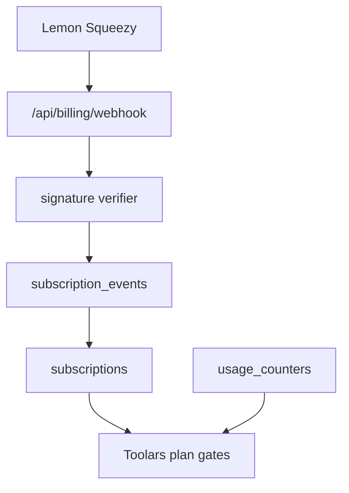

# Design: billing-subscription-state-pass

## Overall Architecture

This pass defines billing subscription-state architecture only. It does not
change runtime code.



## Source Notes

Official sources used for this design:

- Lemon Squeezy webhook signing:
  https://docs.lemonsqueezy.com/help/webhooks/signing-requests
- Lemon Squeezy webhook requests:
  https://docs.lemonsqueezy.com/help/webhooks/webhook-requests
- Lemon Squeezy event types:
  https://docs.lemonsqueezy.com/help/webhooks/event-types
- Lemon Squeezy subscription object:
  https://docs.lemonsqueezy.com/api/subscriptions/the-subscription-object
- Lemon Squeezy subscription products/lifecycle:
  https://docs.lemonsqueezy.com/help/products/subscriptions
- Lemon Squeezy simulate webhooks:
  https://docs.lemonsqueezy.com/help/webhooks/simulate-webhook-events
- Lemon Squeezy usage records:
  https://docs.lemonsqueezy.com/api/usage-records/the-usage-record-object

## ADR-1: Treat `subscription_updated` As A Reconciliation Event

**Context**: Lemon Squeezy documents `subscription_updated` as a broad event
that keeps applications up to date across subscription changes.

**Decision**: Future implementation should subscribe to lifecycle events for
specific transitions, but also process `subscription_updated` as a catch-all
reconciliation event.

**Consequences**: The subscription table can converge on provider truth even if
a more specific event is missed.

## ADR-2: Store Provider Events Before Mutating Subscription State

**Context**: Lemon Squeezy webhook requests can be retried or manually resent.

**Decision**: Insert a `subscription_events` row keyed by provider event ID
before mutating `subscriptions`. Duplicate event IDs should short-circuit.

**Consequences**: Webhook handling is idempotent and support can inspect event
history.

## ADR-3: Separate Provider Status From Toolars Plan Access

**Context**: Lemon Squeezy statuses include active, trial, paused, past due,
unpaid, cancelled, and expired states. Some statuses may retain access during a
grace period.

**Decision**: Store the raw provider status and compute Toolars access through a
small mapping layer.

**Consequences**: Support and billing truth remain visible while product gates
stay simple: free/pro/team plus usage limits.

## Data Model

| Table | Purpose | Key fields |
|---|---|---|
| `subscriptions` | current workspace billing state | `workspace_id`, `provider`, `provider_customer_id`, `provider_subscription_id`, `provider_variant_id`, `plan_id`, `provider_status`, `access_state`, `renews_at`, `ends_at`, `trial_ends_at`, `customer_portal_url`, `updated_at` |
| `subscription_events` | idempotent provider event log | `provider`, `provider_event_id`, `event_name`, `provider_object_id`, `workspace_id`, `payload_hash`, `payload_json`, `processed_at`, `processing_status` |
| `usage_counters` | monthly Toolars usage gates | `workspace_id`, `period_start`, `period_end`, `ai_generations_used`, `exports_used`, `batch_runs_used` |

Provider event ID must be unique per provider.

## Event Map

| Lemon Squeezy event | Toolars action |
|---|---|
| `subscription_created` | create or attach subscription row |
| `subscription_updated` | reconcile status, variant, renewal, portal URLs |
| `subscription_cancelled` | mark cancelled but preserve access until `ends_at` when applicable |
| `subscription_resumed` | restore active access if provider status allows |
| `subscription_expired` | set access to free |
| `subscription_paused` / `subscription_unpaused` | map pause state and access behavior |
| `subscription_payment_success` | record renewal success and reconcile subscription |
| `subscription_payment_failed` | mark past-due risk and preserve/grace access per policy |
| `subscription_payment_recovered` | restore active access |
| `subscription_plan_changed` | update variant-to-plan mapping |

## Status Mapping

| Provider status | Toolars access recommendation |
|---|---|
| `on_trial` | paid plan access until trial end |
| `active` | paid plan access |
| `paused` | configurable; default preserve access only if provider marks valid service |
| `past_due` | grace access with warning until dunning outcome |
| `unpaid` | free access unless policy grants short grace |
| `cancelled` | paid access until `ends_at` |
| `expired` | free access |

## Implementation Sequence

1. Add provider event/status TypeScript models and tests.
2. Add `subscription_events` and `subscriptions` migrations with unique provider
   event IDs.
3. Add webhook parser for Lemon Squeezy event shape and `X-Signature`.
4. Add idempotency handling before subscription mutation.
5. Add status-to-plan access mapper.
6. Connect plan gates to subscription rows.
7. Add customer portal/checkout handoff in a separate UI pass.
8. Run security audit before production billing launch.

## Verification Plan

Future implementation gates:

```bash
pnpm --dir site test -- billing
pnpm --dir site test:e2e -- auth-billing
pnpm --dir site lint
pnpm --dir site type-check
pnpm --dir site build
cdc-workflow gate --mode standard --root .
cdc-workflow ship-preview --change <change-id> --root .
```

Security checks:

- no Lemon Squeezy API key in browser bundles
- webhook signature uses raw request body
- duplicate provider event is idempotent
- expired/unpaid states cannot use paid AI generation
- free calculators never depend on billing state

## Risks And Mitigations

| Risk | Probability | Impact | Mitigation |
|---|---|---|---|
| Duplicate webhooks double-mutating access | M | H | Unique `provider_event_id` and idempotency first. |
| Provider status misunderstood | M | H | Store raw status and keep mapping source-linked. |
| Paid customer blocked during grace period | M | H | Explicit `cancelled`/`past_due` access policy. |
| Webhook secret exposed | L | H | Server-only env and audit before launch. |
| Calculator UX accidentally gated | L | H | Keep billing imports out of public calculator path. |
