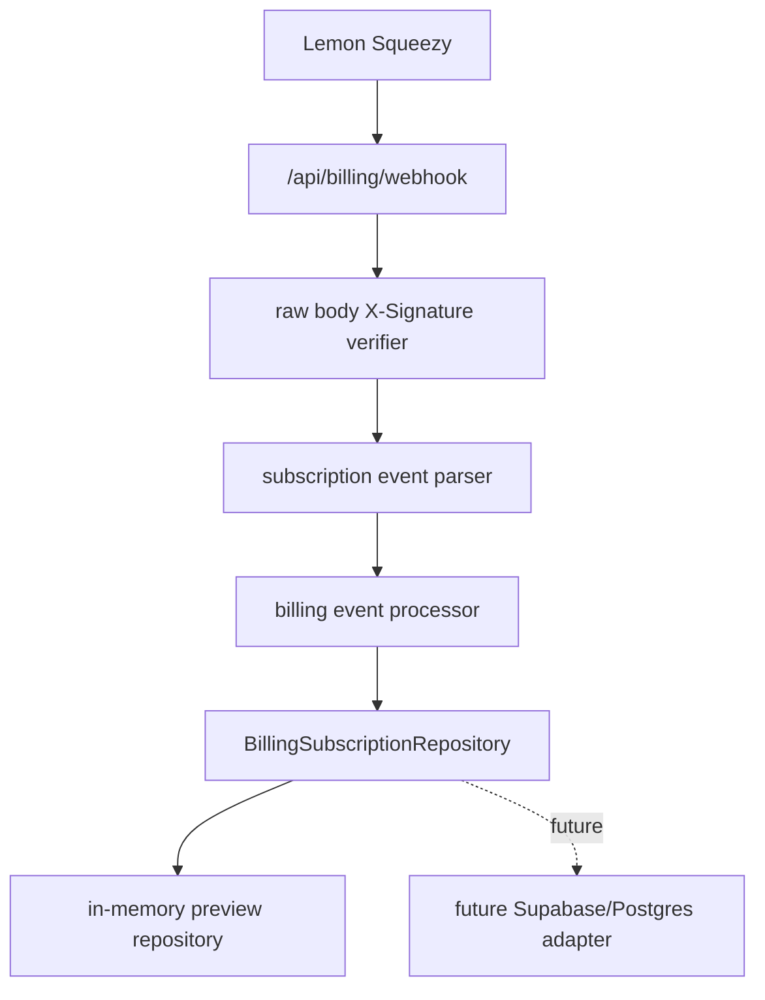

# Design: billing-webhook-production-pass

## Overall Architecture

This pass turns the preview webhook route into a Lemon Squeezy-shaped intake
service while keeping persistence behind a repository interface. The current
runtime uses an in-memory repository so tests can verify idempotency and state
mutation before the Supabase/Postgres adapter lands.

## Source Notes

Official Lemon Squeezy docs checked on 2026-06-06:

- Signing Requests: `X-Signature` contains an HMAC-SHA256 hex digest of the raw
  payload.
- Webhook Requests: requests include `Content-Type`, `X-Event-Name`, and
  `X-Signature`; successful capture should return `200`.
- Event Types: `subscription_updated` keeps apps current and is emitted across
  subscription lifecycle changes.
- Subscription Object: subscription payloads include `variant_id`, `status`,
  `renews_at`, `ends_at`, `trial_ends_at`, and customer portal URLs.

## ADR-1: Replace Preview Headers With Lemon Headers

**Context**: The current route accepts `toolars-signature` and
`toolars-timestamp`, which do not match Lemon Squeezy.

**Decision**: The route will require `X-Signature` and `X-Event-Name`.

**Consequences**: Existing preview signature tests must be rewritten around
provider-shaped requests.

## ADR-2: Store Event Before Subscription Mutation

**Context**: Lemon Squeezy retries non-200 webhooks and can resend events.

**Decision**: The processor first asks the repository to record a provider event
by unique provider event ID. If it is already present, the processor returns a
duplicate success and skips subscription mutation.

**Consequences**: Idempotency is testable today and maps directly to a future
unique `(provider, provider_event_id)` database constraint.

## ADR-3: Variant Mapping Is Server-Owned

**Context**: Checkout return pages and clients must not grant plan access by
submitting a plan ID.

**Decision**: The parser maps provider `variant_id` values to `PlanId` through
server-side environment variables and optional test mappings.

**Consequences**: Unknown variants record a failed event and do not grant paid
access.

## Data Model

Runtime TypeScript records mirror the future tables from
`docs/architecture/BILLING-SUBSCRIPTION-STATE-DESIGN.md`:

- `BillingProviderEventRecord`: provider event ledger row.
- `BillingSubscriptionRecord`: current provider subscription state.
- `BillingAccessState`: computed Toolars access state.

## API Changes

- `POST /api/billing/webhook` reads raw request body once.
- Required headers: `X-Signature`, `X-Event-Name`.
- Success response includes `received`, `eventId`, `eventName`, `duplicate`,
  `planId`, and `accessState`.
- Invalid signature returns `401`.
- Unsupported payload or unknown variant returns `400`.

## Deployment And Rollback

- Deployment: no schema migration in this pass.
- Rollback: revert this branch; no external provider state is mutated.
- Production note: this pass reduces route-level H3 risk but does not replace
  the required Supabase/Postgres durable adapter.

## Observability

- Do not log raw payload, customer email, provider secrets, or signatures.
- Future app logging can emit event ID, event name, provider subscription ID,
  processing status, and workspace ID.

## Risks And Mitigations

| Risk | Probability | Impact | Mitigation |
|---|---|---|---|
| In-memory idempotency mistaken for durable production DB | M | H | Scope and PR notes explicitly call out DB adapter follow-up. |
| Unknown variant grants paid access | M | H | Unknown variants return failed processing and no mutation. |
| Signature verification over parsed JSON | L | H | Verifier takes raw request text and compares timing-safely. |
| Public calculators import billing state | L | H | Keep all new code under `site/lib/billing` and route only. |
