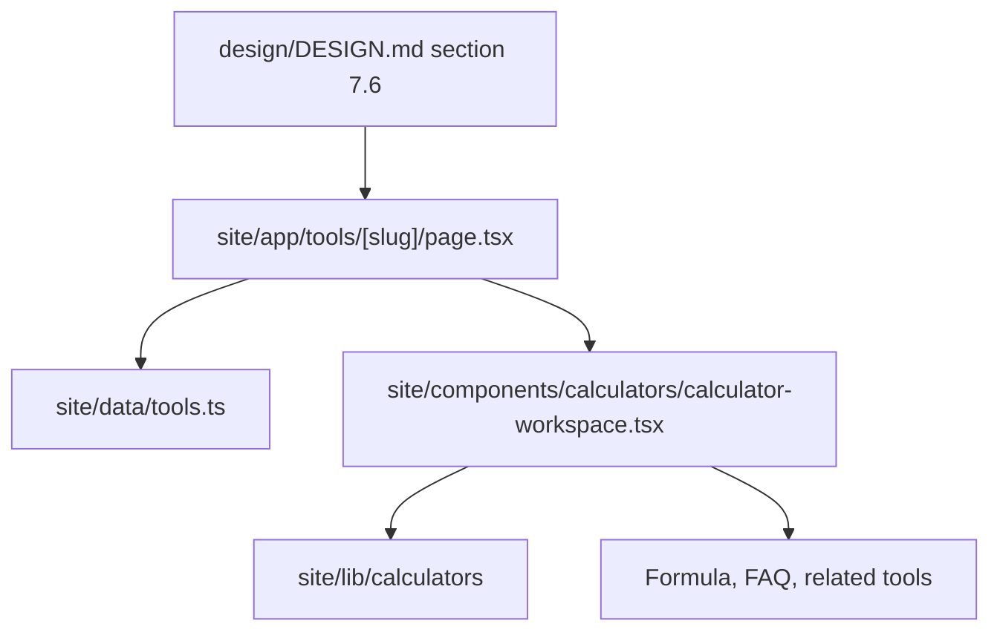

# Design: calculator-detail-design-pass

## Overall Approach

This change tightens the existing public calculator detail route and shared
calculator workspace against `design/DESIGN.md` section 7.6. It keeps calculator
logic pure and registry-driven while improving the rendered information
architecture.

## ADR-1: Improve The Shared Calculator Template First

**Context**: All 73 calculator pages should share the same commercial UX
baseline.

**Decision**: Refine the shared route/workspace template instead of designing a
single calculator page as a bespoke one-off.

**Consequences**: The change scales across the calculator inventory and keeps
future bespoke overrides small.

## ADR-2: Keep Public Calculator Content Crawlable

**Context**: Calculator pages need SEO and GEO-friendly sections: plain-English
formula, FAQ, related tools, and structured content.

**Decision**: Keep the important text and navigation server-rendered through the
App Router route and static registry data. Client behavior may enhance
calculation controls, but must not hide core explanatory content behind account
state.

**Consequences**: Public pages remain usable without login and indexable by
search engines and answer engines.

## ADR-3: Monetization Must Not Interrupt The Calculation Loop

**Context**: `design/DESIGN.md` says ad slots must not interrupt the form or
result.

**Decision**: Place ad/pro placeholders after the primary form/result workspace
and interpretive sections, not between inputs and result.

**Consequences**: Revenue surfaces can be added later without degrading the core
calculator task.

## Data Model Changes

No persisted data model changes.

Existing tool/calculator registry metadata should drive title, category,
description, related tools, and calculator-specific labels.

## API Changes

No public API changes.

## Deployment And Rollback

- Deployment: normal Next.js site deployment.
- Rollback: revert this change; no migrations or remote side effects.

## Observability

- Unit/component tests assert the visible calculator template contract.
- E2E tests verify at least one calculator detail route remains usable.
- Browser visual QA confirms desktop/mobile layout against the design rules.

## Risks And Mitigations

| Risk | Probability | Impact | Mitigation |
|---|---|---|---|
| Overfitting copy or layout to one calculator | M | M | Keep changes registry/template-driven. |
| Breaking calculator form interactions | M | H | Add failing tests before implementation. |
| Reducing crawlability with client-only sections | L | H | Render explanatory sections in route/template. |
| Adding distracting ads too early | M | M | Use low-emphasis placeholder after core task sections. |
