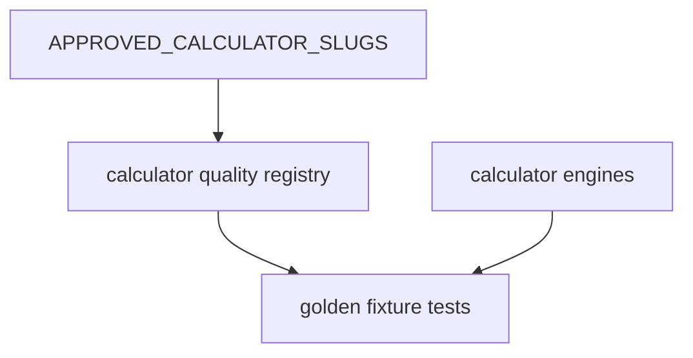

# Design: calculator-golden-fixtures-pass

## Overall Architecture

This change adds a small quality layer inside `site/lib/calculators/`:

The quality registry is data-only. It must not import React components, browser
storage, route modules, AI code, billing code, or auth code.

## ADR-1: Keep Golden Fixtures Beside Calculator Engines

**Context**: Golden cases verify formula behavior, not page layout. Keeping them
beside the pure calculator engine makes the source of truth easy to review and
keeps UI changes separate from formula confidence.

**Decision**: Add `site/lib/calculators/quality.ts` for classifications,
fixtures, and helper lookups.

**Consequences**: Tests can assert every high-risk calculator has enough golden
coverage without coupling to React or Next.js routes.

## ADR-2: Source URLs Are Required For High-Risk Golden Cases

**Context**: Health and finance calculators need more trust than simple
arithmetic tools. A number-only assertion is hard to audit later.

**Decision**: Every high-risk golden case in this pass stores a source name,
URL, and short source note.

**Consequences**: Reviewers can trace why a threshold or expected value exists.
This does not make the calculator medical, legal, tax, lending, or investment
advice.

## ADR-3: Fix Defects Exposed By Golden Tests, Not Adjacent Formula Families

**Context**: W1 must improve confidence without turning into a broad formula
rewrite.

**Decision**: If the new golden cases reveal an incorrect threshold or unsafe
success state, fix that exact calculator and add regression coverage. Leave
uncovered formulas to later W1 passes.

**Consequences**: The pass remains reviewable while still allowing real defects
to be corrected when the tests expose them.

## Data Model Changes

Add TypeScript types for:

- `CalculatorRiskLevel`: `high`, `medium`, or `low`.
- `CalculatorFormulaDomain`: `health`, `finance`, or `utility`.
- `CalculatorQualityProfile`: slug, risk, domain, rationale.
- `CalculatorGoldenCase`: slug, name, source, inputs, expected outputs.

## API Changes

No public API or route changes.

Internal helper exports:

- `CALCULATOR_QUALITY_PROFILES`
- `HIGH_RISK_CALCULATOR_SLUGS`
- `CALCULATOR_GOLDEN_CASES`
- `getCalculatorQualityProfile(slug)`
- `getGoldenCasesForCalculator(slug)`

## Rollout And Rollback

This is a test/data/formula-hardening pass. Rollback is a normal git revert.
No production deployment flag is required.

## Observability

No runtime events are added. Verification is via Vitest, E2E smoke, build, and
CDC evidence ledger rows.

## Risks And Mitigations

| Risk | Probability | Impact | Mitigation |
|---|---|---|---|
| Source-backed labels differ from current UI copy | M | M | Golden cases test engine values only; UI wording can be refined separately. |
| Fixture data becomes too large | M | M | Start with high-risk representative set and keep each case compact. |
| Medical/finance implication is overstated | M | H | Source notes and PR copy must describe estimates/screening only. |
| Edge fix changes existing expected output | L | M | Add focused regression tests and run full calculator/unit gates. |
