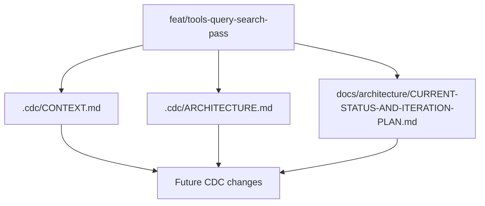

# Design: context-refresh-and-integration-pass

## Overall Architecture

## ADR-1: Treat This As Documentation-Only

**Context**: The current request is to execute the review recommendation, not to change user-facing behavior.  
**Decision**: Update project context and planning artifacts only.  
**Consequences**: TDD is not applicable; verification relies on docs consistency checks plus the existing site test/build gates.

## ADR-2: Make Preview Boundaries Explicit

**Context**: AI/auth/billing pages are useful and testable, but several systems are preview/mocked rather than production-integrated.  
**Decision**: Document those boundaries directly in CDC context and the iteration plan.  
**Consequences**: Future planning can avoid mistaking preview surfaces for production backend completion.

## ADR-3: Keep Branch Stack Integration Separate From Main Merge

**Context**: The current branch contains the latest stacked feature work, while `main` is behind.  
**Decision**: Document integration readiness and create a follow-up path, but do not merge to `main` in this pass.  
**Consequences**: Review and merge remain explicit remote actions.

## Data Model Changes

No data model changes.

## API Changes

No API changes.

## Deployment / Rollback

This is documentation-only. Rollback is reverting this change set.

## Observability

- CDC evidence ledger records verification commands.
- `cdc-workflow gate` and `ship-preview` confirm the updated context remains usable.

## Risks And Mitigations

| Risk | Probability | Impact | Mitigation |
|---|---|---|---|
| Context overclaims production readiness | M | H | Explicitly mark preview/mock boundaries. |
| Plan becomes too broad to execute | M | M | Use W0-W3 waves with concrete deliverables. |
| Future agents follow stale docs | H | H | Refresh `.cdc/CONTEXT.md` and `.cdc/ARCHITECTURE.md` in this pass. |
