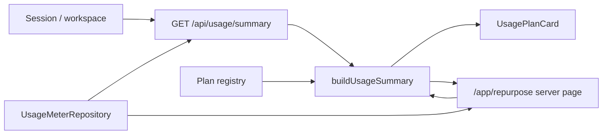

# Design: customer-usage-summary-read-model

## 整体架构

`usage-summary` sits above the existing plan registry and usage repository:



The summary builder is a pure TypeScript function. API and page code only orchestrate session resolution, period selection, and repository reads.

## 主要决策（ADR 简版）

### ADR-1: Use a Pure Read Model

**上下文**: AI generation, export, and batch gates already evaluate plan limits against raw usage snapshots. UI needs the same numbers without duplicating arithmetic.

**决策**: Add `buildUsageSummary()` under `site/lib/usage/summary.ts` and keep it independent from React, Next.js, database clients, and browser APIs.

**后果**: Unit tests can cover quota arithmetic cheaply, and future dashboard components can reuse the same read model.

### ADR-2: Expose a Read-Only Summary API

**上下文**: Future client dashboards and settings pages need a stable usage endpoint.

**决策**: Add `GET /api/usage/summary` with dependency injection for tests. It reads the current monthly period and never calls increment methods.

**后果**: The API can be tested without Supabase and will reuse the runtime repository in production.

### ADR-3: Server-Render Current Usage on App Pages

**上下文**: `/app/repurpose` is already a server-rendered app page and should show accurate usage on first paint.

**决策**: Read usage snapshot on the server for authenticated sessions and pass `UsageSummary` into `UsagePlanCard`.

**后果**: Users see usage without client loading state. Production requires the existing usage repository env gate.

## 数据模型变更

No database schema changes. The summary derives from:

- `PlanDefinition.monthlyAiGenerations`
- `PlanDefinition.monthlyExports`
- `PlanDefinition.monthlyBatchRuns`
- `UsageSnapshot.aiGenerationsUsed`
- `UsageSnapshot.exportsUsed`
- `UsageSnapshot.batchRunsUsed`

## API 变更

### `GET /api/usage/summary`

Response:

```json
{
  "usage": {
    "planId": "pro",
    "planName": "Pro",
    "period": {
      "periodStart": "2026-06-01",
      "periodEnd": "2026-07-01"
    },
    "limits": {
      "aiGenerations": 1000,
      "exports": 200,
      "batchRuns": 100
    },
    "used": {
      "aiGenerations": 17,
      "exports": 3,
      "batchRuns": 2
    },
    "remaining": {
      "aiGenerations": 983,
      "exports": 197,
      "batchRuns": 98
    }
  }
}
```

## 部署 / 灰度 / 回滚策略

- Deploy behind existing session and usage repository paths.
- Rollback by reverting this feature branch; no data migration required.
- If production usage env is missing, existing runtime repository release gate still fails closed.

## 可观测性

- Reuse existing security event logger for missing-session API attempts.
- No new metrics in this pass.
- Future subscription dashboard can add product analytics events once privacy policy copy is finalized.

## 风险与缓解

| 风险 | 概率 | 影响 | 缓解 |
|---|---|---|---|
| UI and gate quota math drift | M | M | Centralize arithmetic in `buildUsageSummary()` |
| API accidentally mutates usage | L | H | Test repository increments throw if called |
| Public calculator imports regress | L | H | Run calculator isolation test with focused suite |
