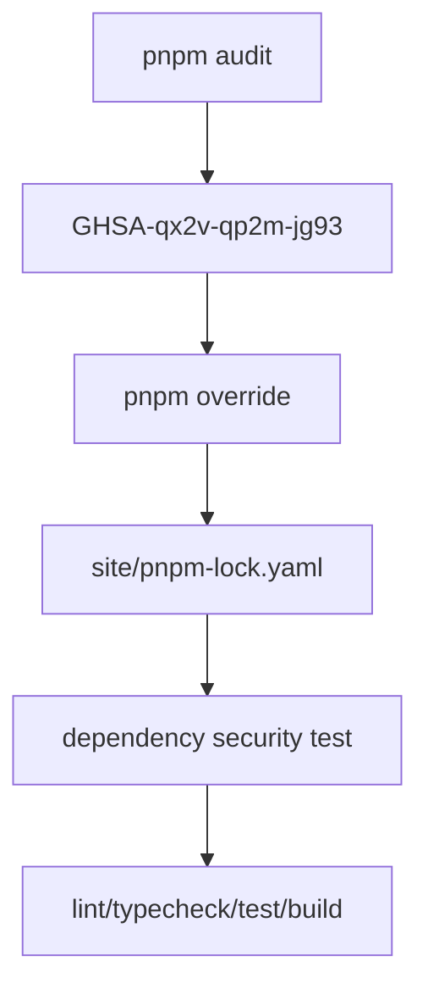

# Design: dependency-audit-remediation-pass

## Overall Architecture

## Source Notes

- GitHub Security Advisory `GHSA-qx2v-qp2m-jg93`:
  https://github.com/postcss/postcss/security/advisories/GHSA-qx2v-qp2m-jg93
- pnpm audit command:
  https://pnpm.io/cli/audit
- pnpm 11 overrides setting:
  https://pnpm.io/settings#overrides

## ADR-1: Use pnpm Override Instead Of Broad Framework Upgrade

**Context**: The audit finding is `postcss <8.5.10`. The vulnerable path is
`next > postcss@8.4.31`. `pnpm view next@16.2.7 dependencies` confirms the
latest Next patch still declares `postcss: 8.4.31`.

**Decision**: Use pnpm's supported override mechanism to force PostCSS to a
patched version. Keep broader framework upgrades out of this pass.

**Consequences**: The remediation is small, reviewable, and reversible when
Next ships a patched dependency.

## ADR-2: Put pnpm 11 Overrides In `pnpm-workspace.yaml`

**Context**: pnpm 11 documents overrides under project settings in
`pnpm-workspace.yaml` and states overrides apply at the root of the project.

**Decision**: Add a minimal workspace config under `site/pnpm-workspace.yaml`
with a source-linked PostCSS override.

**Consequences**: The override is in the documented pnpm 11 location, and
future installs should keep the lockfile patched.

## Data Model Changes

None.

## API Changes

None.

## Deployment And Rollback

- Deployment impact is dependency resolution only.
- Rollback by removing the PostCSS override and reinstalling if upstream Next
  ships a patched dependency or if the override causes build regressions.

## Observability

- Record audit before/after commands in CDC evidence.
- PR body should include the advisory and the audit command used.

## Risks And Mitigations

| Risk | Probability | Impact | Mitigation |
|---|---|---|---|
| Override breaks Next build tooling | M | H | Run full `next build` and unit tests |
| Override is ignored by pnpm 11 | M | H | Use `pnpm-workspace.yaml` per pnpm 11 docs and assert lockfile result |
| Broad latest upgrades create churn | M | M | Limit change to PostCSS advisory remediation |
