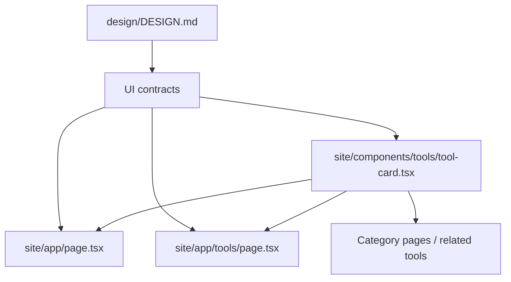

# Design: design-conformance-pass

## Overall Approach

This is a small design-conformance pass on the existing Next.js App Router
implementation under `site/`. It preserves the current registry, calculator
engines, SEO routes, auth preview logic, and billing preview logic.

## ADR-1: Upgrade Shared Card Affordances Before Page-Specific Decoration

**Context**: Tool cards appear across home, directory, category, AI, and related
tool surfaces.

**Decision**: Improve `ToolCard` first with required metadata and actions rather
than duplicating card UI page by page.

**Consequences**: A small shared change improves multiple pages. Tests must avoid
requiring browser-only state for favorite actions in this pass.

## ADR-2: Keep Visual Design Token-Based

**Context**: `design/DESIGN.md` prohibits ad hoc color usage and asks for
border-first hierarchy.

**Decision**: Use existing Tailwind theme tokens and avoid new raw hex values in
components.

**Consequences**: The pass remains compatible with future token refinements and
does not fork the design language.

## ADR-3: Evidence Comes From Tests Plus Browser Inspection

**Context**: Visual quality requires seeing rendered pages, while CDC requires
repeatable verification.

**Decision**: Add component/page tests for visible contracts, then use Playwright
and in-app browser screenshots for representative visual QA.

**Consequences**: The change can be reviewed mechanically while still catching
layout problems.

## Data Model Changes

No persisted data model changes.

Tool metadata can be derived from existing `ToolDefinition` fields.

## API Changes

No public API changes.

## Deployment And Rollback

- Deployment: normal Next.js site deployment.
- Rollback: revert this change; no migrations or external side effects.

## Observability

- Existing E2E tests cover page rendering and interaction flows.
- Browser visual audit should record representative routes in closeout notes.

## Risks And Mitigations

| Risk | Probability | Impact | Mitigation |
|---|---|---|---|
| Over-polishing one page while ignoring reusable primitives | M | M | Prioritize `ToolCard` shared primitive. |
| Breaking SEO crawlability with client-only UI | L | H | Keep public page content server-rendered. |
| Creating marketing-heavy hero sections | M | M | Test for dashboard labels and use dense utility layout. |
| Favorite button nested inside link invalidates interaction | M | M | Keep favorite control outside the primary link area. |
