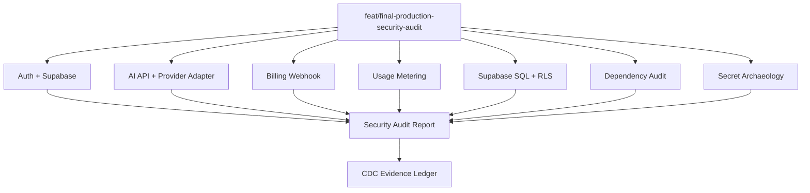

# Design: final-production-security-audit

## Overall Architecture

This is a release-audit pass over the current W2 top stack. It does not add a
new runtime subsystem unless an audit finding requires a narrow, test-backed
fix. The primary output is a markdown report under `docs/security/`, supported
by CDC evidence ledger rows.

## Decisions

### ADR-1: Produce A Release Report Before More Backend Features

**Context**: The current W2 stack has many security-sensitive seams, but real
production deployment is still pending.  
**Decision**: Perform a consolidated top-stack audit now, before adding AI
history, checkout/portal, or export persistence.  
**Consequences**: Reviewers get one go/no-go artifact. Some findings may become
new CDC changes instead of being fixed in this pass.

### ADR-2: Treat Preview Paths As Release Risks, Not Production Features

**Context**: Preview auth and deterministic AI providers are useful for local
review but dangerous if enabled in production.  
**Decision**: Audit preview paths for fail-closed production behavior and
document accepted risk only when guarded by environment checks.  
**Consequences**: Any preview path that can run in production without explicit
opt-in becomes a blocking finding.

### ADR-3: Keep Security Logs Non-Sensitive

**Context**: AI and billing failures need auditability without leaking raw
payloads, secrets, or user content.  
**Decision**: Inspect logging helpers and callers for normalized metadata only.  
**Consequences**: Findings should include file/line anchors when logs include
payloads, headers, API keys, or PII.

## Data Model Changes

No planned data model changes. SQL migrations are audit input only:

- `supabase/migrations/20260606152000_auth_workspace_foundation.sql`
- `supabase/migrations/20260607123000_billing_subscription_state.sql`
- `supabase/migrations/20260607133000_usage_counters.sql`

## API Changes

No planned API changes. The audit reviews:

- `site/app/api/ai/repurpose/route.ts`
- `site/app/api/billing/webhook/route.ts`
- `site/proxy.ts`

## Deployment, Rollback, And Release

- This branch is a draft review artifact.
- No production deploy is triggered by this pass.
- If a blocking production-code fix is added, rollback is reverting this
  branch before PR #17 is advanced.

## Observability

- Audit command results are recorded in `.cdc/state/evidence.jsonl`.
- The report records which security events are emitted and where logging gaps
  remain.

## Risks And Mitigations

| Risk | Probability | Impact | Mitigation |
|---|---|---|---|
| Audit misses cross-module issue | Medium | High | Review auth, AI, billing, SQL, deps, and secrets as one data-flow map. |
| False positive blocks progress | Medium | Medium | Classify severity and accepted-risk explicitly. |
| Audit report goes stale | Medium | Medium | Tie report to branch/commit/PR #17 and record timestamp. |
| Local proxy affects verification | Medium | Low | Keep Playwright localhost `NO_PROXY` handling from previous pass. |
