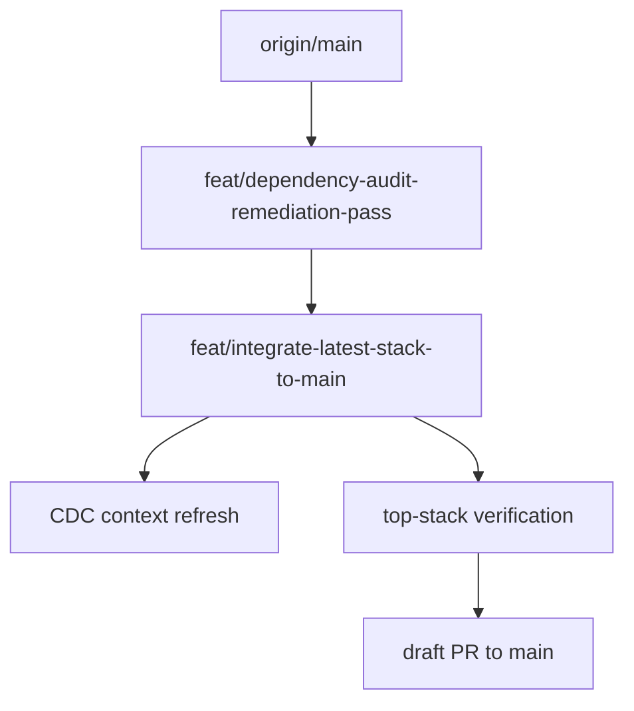

# Design: integrate-latest-stack-to-main

## Overall Architecture

## ADR-1: Use A Top-Stack Integration PR Instead Of Direct Merge

**Context**: The project has a long draft PR stack from #1 through #16. Directly
merging the top branch would bypass human review and make rollback harder.

**Decision**: Create a new integration branch from the current top-stack branch,
refresh context, verify it, and open a draft PR to `main`.

**Consequences**: Reviewers get one complete `main` comparison while the stacked
PRs remain available for granular review.

## ADR-2: Integration Branch Is Governance-Only

**Context**: The current top stack already contains feature work. Adding more
feature changes in the integration branch would make review harder.

**Decision**: Limit this change to CDC spec/context/status documentation and
verification evidence.

**Consequences**: Any implementation bugs discovered during verification should
be fixed in follow-up targeted specs or in the relevant stacked feature branch.

## Data Model Changes

None in this integration pass.

## API Changes

None in this integration pass.

## Deployment And Rollback

- The draft PR is review-only and does not deploy by itself.
- Rollback is closing the integration PR or moving its base/head after review.

## Observability

- Record verification commands in `.cdc/state/evidence.jsonl`.
- Record a closeout row when the integration PR is created and verified.

## Risks And Mitigations

| Risk | Probability | Impact | Mitigation |
|---|---|---|---|
| Huge diff overwhelms review | H | M | Keep stacked PRs open for granular review and integration PR as top-stack overview |
| Stale CDC facts mislead follow-up agents | M | H | Refresh `.cdc/CONTEXT.md` and `.cdc/ARCHITECTURE.md` |
| Integration hides unresolved release blockers | M | H | Keep preview/production boundaries explicit in status docs and PR body |
