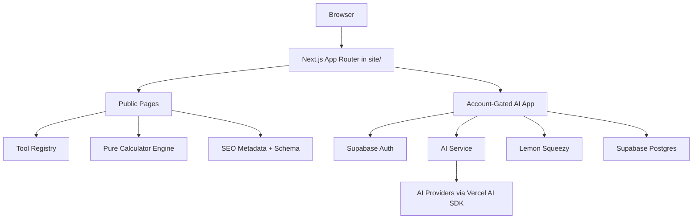

# Design: merge-toolars-platform

## 1. Overall Architecture

toolars will be implemented as a unified Next.js App Router product in `site/`.
The public calculator platform and the account-gated AI SaaS platform share one
design system, tool registry, navigation system, and SEO/content foundation.

## 2. ADRs

### ADR-1: Use Next.js App Router

**Context**: Source projects use different structures. The merged product needs
public SEO pages, AI streaming, route handlers, and app dashboards.

**Decision**: Use Next.js App Router as the unified product framework.

**Consequences**: Calculator content must be ported from Astro into registry
and template-based Next.js routes. AI app routes can share the same framework
and design system.

### ADR-2: Use `site/` As Application Root

**Context**: The repo also contains design, docs, CDC, and spec artifacts.

**Decision**: All production application code must live under `site/`.

**Consequences**: Root remains clean and documentation/design separation stays
obvious.

### ADR-3: Registry-Driven Tool Platform

**Context**: v1 includes 73 calculators plus AI tools. Hard-coding each page's
directory/list/search metadata would cause drift.

**Decision**: Use a central Tool Registry and Calculator Definition registry.

**Consequences**: Search, category pages, related tools, metadata, and page
generation can share one source of truth.

### ADR-4: Pure Calculator Engine

**Context**: Calculators require trust and correctness.

**Decision**: Formula logic must be pure TypeScript modules tested independently
from UI.

**Consequences**: UI can evolve without changing formulas; tests can cover
logic precisely.

### ADR-5: Progressive Account Boundary

**Context**: Public calculators should acquire SEO traffic and provide instant
value; AI and durable account features are monetization levers.

**Decision**: Basic calculators are anonymous/free. AI, sync, Pro exports, and
batch tools are account/subscription-gated.

**Consequences**: Public pages must not depend on auth to render or calculate.

## 3. Data Model

Initial data domains:

- Tool registry: static typed metadata.
- Calculator definitions: static typed metadata plus pure calculation keys.
- Local state: recent tools, favorites, anonymous saved results, compare list.
- Account data: users, workspaces, subscriptions, brand voices, AI jobs,
  outputs, usage, API keys, account-synced saved results.

## 4. API Changes

Initial route handlers:

- `POST /api/ai/repurpose`
- `POST /api/ai/repurpose/:id/cancel`
- `GET /api/models`
- `POST /api/exports/pdf`
- `POST /api/exports/csv`
- `POST /api/billing/webhook`
- `GET /api/search`

Basic calculator calculations should run client-side or in pure shared modules
without requiring API calls.

## 5. Rollout

Implementation phases:

1. Repo and Next.js foundation.
2. Design system and layout.
3. Tool registry and search.
4. Public pages.
5. Calculator engine and templates.
6. AI SaaS app.
7. Billing/account/pro features.
8. SEO/content/i18n readiness.
9. QA, security review, ship preview.

The v1 release should not be considered complete until all 73 calculators and
all AI SaaS pages are present.

## 6. Observability

Track:

- Search open/query/no-result/click.
- Calculator open/calculate/validation error/save/export.
- AI generation start/stream/cancel/complete/fail.
- Subscription and plan limit events.
- API latency and errors.

Avoid logging raw private calculator inputs or full AI source content unless the
user explicitly saves content to account history.

## 7. Risks And Mitigations

| Risk | Impact | Mitigation |
|---|---|---|
| 73 calculators become 73 bespoke UI implementations | High maintenance | Shared template plus typed overrides. |
| Calculator correctness regressions | Loss of trust | Pure formula tests and example fixtures. |
| AI/account concerns leak into public calculator paths | SEO/performance/user friction | Dependency rules and route separation. |
| Design drift from generated images | Inconsistent UX | Use `design/DESIGN.md` as source of truth. |
| Phase-one English copy blocks future i18n | Rework | Locale-aware registry and metadata helpers from the start. |

