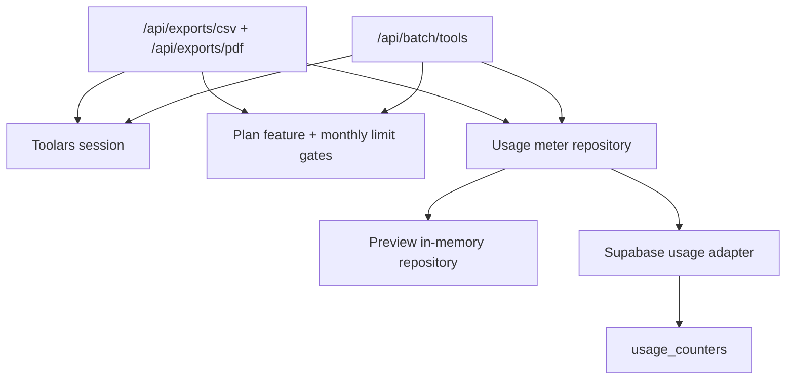

# Design: pro-export-batch-usage-gates

## Overall Architecture



## ADR-1: Use Existing Workspace Usage Counters

**Context**: `usage_counters` already includes `exports_used` and
`batch_runs_used`, but only AI generation increments are wired.

**Decision**: Extend the existing usage repository with `incrementExports()` and
`incrementBatchRuns()` instead of creating separate tables.

**Consequences**: All Pro metering stays workspace-month scoped and aligned
with subscription state.

## ADR-2: Add Minimal API Routes Before Full UI Wiring

**Context**: Product copy already advertises Pro exports and batch tools, but
there are no server-owned endpoints for UI actions to call.

**Decision**: Add route handlers for CSV export, PDF export, and batch tools
with injectable dependencies for tests. The routes return deterministic payloads
for now and do not attempt full file persistence.

**Consequences**: Future UI can call stable endpoints while richer file
generation and history remain separate changes.

## ADR-3: Keep Staging Auth Rehearsal As A Recorded Risk

**Context**: Real Supabase staging URL and test account are unavailable.

**Decision**: Proceed with feature development after the project owner
explicitly approved skipping the rehearsal. Preserve the rehearsal as a release
gate before production deployment.

**Consequences**: Unit and route tests cover behavior locally, but production
confidence still needs a real staging auth pass later.

## Data Model

Update the existing additive migration:

```text
supabase/migrations/20260607133000_usage_counters.sql
```

The table already has:

- `exports_used`
- `batch_runs_used`

Add RPC helpers:

- `public.increment_export_usage`
- `public.increment_batch_run_usage`

Both functions upsert the monthly row and return the same counter columns as
the existing AI RPC.

## API Changes

Add:

```text
site/app/api/exports/csv/route.ts
site/app/api/exports/pdf/route.ts
site/app/api/batch/tools/route.ts
```

Each route:

1. Resolves a Toolars session.
2. Reads current monthly usage for `session.workspaceId`.
3. Evaluates plan access and monthly limit.
4. Returns `401` for missing session, `402` for plan/limit denial.
5. Increments usage only after the route has accepted the request.

## Deployment And Rollback

- SQL changes are additive.
- Preview/local runtime uses the in-memory repository.
- Production still requires Supabase env through the existing usage runtime.
- Rollback by removing route exposure and leaving additive SQL in place.

## Observability

- Plan denials emit structured security events without raw export payloads or
  batch input contents.
- Usage write failures fail closed before returning success.

## Risks And Mitigations

| Risk | Probability | Impact | Mitigation |
|---|---|---|---|
| Staging auth not rehearsed | M | H | Recorded owner-approved skip; keep rehearsal as release gate |
| Export route returns success before metering | M | H | Increment usage before returning the payload |
| Public calculators import premium modules | L | H | Run public calculator isolation test |
| File-generation expectations exceed placeholder payload | M | M | Route response names payload as deterministic preview export |
