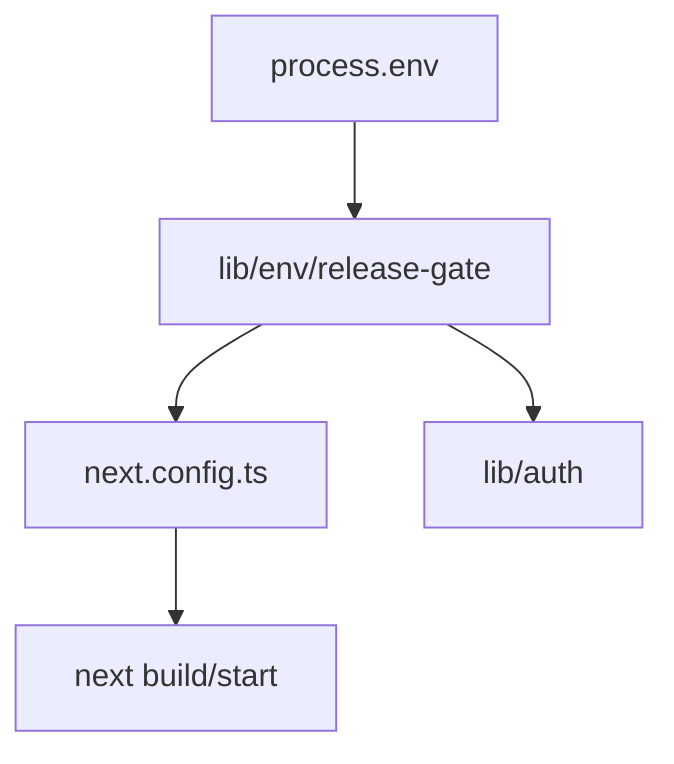

# Design: production-env-release-gate

## Overall Architecture

## ADR-1: Enforce At Config Load And Auth Helper

**Context**: A production build can be misconfigured before route code runs.
Auth helpers are also imported by route handlers and server pages.

**Decision**: Add a small env gate module used by both `next.config.ts` and
`site/lib/auth`.

**Consequences**: Build/start fails early on invalid production env, and auth
helpers still fail closed if imported in a production runtime.

## ADR-2: Local Preview Is Enabled By Default Unless Explicitly Disabled

**Context**: Current local development and E2E tests rely on preview auth.

**Decision**: Non-production preview auth remains enabled by default, but
`TOOLARS_ENABLE_PREVIEW_AUTH=false` disables it explicitly.

**Consequences**: Tests and local demos keep working while production behavior
becomes strict.

## API Changes

- Add `site/lib/env/release-gate.ts`:
  - `isProductionEnvironment(env)`
  - `isPreviewAuthAllowed(env)`
  - `validateToolarsProductionEnv(env)`
  - `assertToolarsProductionEnv(env)`
- Update `site/lib/auth/index.ts` to use `isPreviewAuthAllowed()`.
- Update `site/next.config.ts` to call `assertToolarsProductionEnv()`.

## Deployment And Rollback

- Deployment: no database or external side effects.
- Rollback: revert this change if it blocks an internal preview deployment, but
  production must not ship with preview auth enabled.

## Risks And Mitigations

| Risk | Probability | Impact | Mitigation |
|---|---|---|---|
| Local preview tests break | M | M | Keep non-production preview enabled by default. |
| Env gate is bypassed by route imports | L | H | Auth helper also fails closed in production. |
| Error message is unclear | L | M | Test exact H4-oriented error string. |
