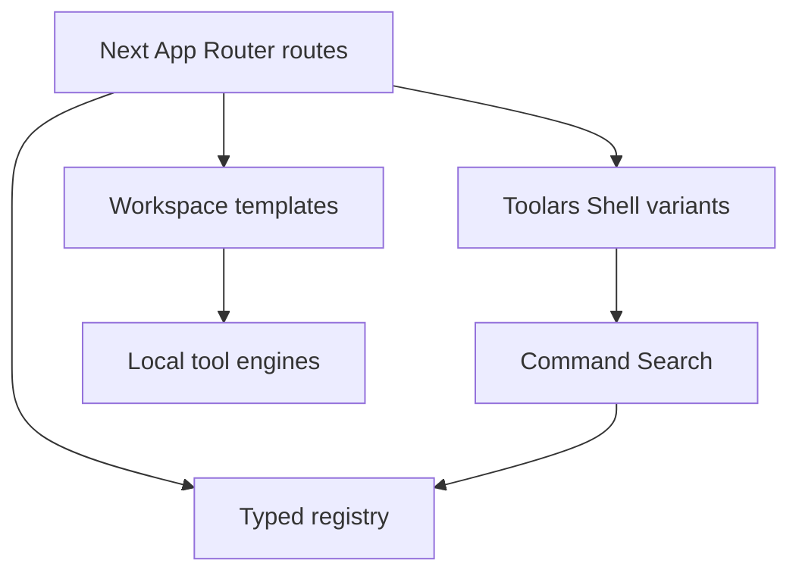

# Design: rebuild-toolars-platform

## 整体架构

## ADR-1: Use `sites/toolars` As New App Root

**上下文**: 用户明确说明当前目录中 `sites` 承载网站相关代码。旧 tracked `site/` 当前处于删除状态。
**决策**: 新开发落在 `sites/toolars/`，不恢复旧 `site/`。
**后果**: 后续 CDC 文档和 CI 需要以 `sites/toolars` 为工作目录。

## ADR-2: Rebuild UI From New Design, Reuse Logic Only

**上下文**: VitalCalc 是 Astro，Aixtral Lab 是 Next.js，两个旧 UI 与新高保真设计不一致。
**决策**: 源项目只作为 inventory、pure logic、tests、SEO/content 参考；生产 UI 重写。
**后果**: 第一批代码量略高，但避免长期视觉漂移和框架混杂。

## ADR-3: Start With JSON Repair

**上下文**: JSON Repair 是设计稿中完整覆盖的 AI Developer Lab 代表工具，且可本地运行，不依赖账号、支付、AI provider 或文件上传。
**决策**: 作为第一条 TDD Green path。
**后果**: 能快速验证 registry、Command Search、workspace layout 和 local processing trust model。

## ADR-4: Treat Upload As A Local Overlay Contract Before Storage

**上下文**: PDF Toolkit 和未来文件型工作流需要上传入口，但 Phase 4 尚未接真实文件对象、病毒扫描、保留策略或云存储。
**决策**: 先实现键盘可达的本地 upload overlay：明确文件仍留在设备上、展示 size limit 和 queued-local 状态、关闭后恢复焦点，并保持其文案与 AI consent dialog 分离。
**后果**: 后续接 File API、扫描和存储时可以沿用同一 overlay lifecycle，不会把“选择文件”和“发送给 AI provider”混成一个隐式授权。

## ADR-5: Start AI Provider Routing With A Local Auditable Contract

**上下文**: Phase 4 需要 AI provider routing 和 consent audit，但真实 provider、账号、服务端 audit store 与执行边界尚未落地。
**决策**: 先为 PDF Summary `summarize-with-ai` 建立稳定 route object，并把 consent approval 写入 versioned localStorage audit log；Privacy & AI 负责渲染本地 audit 摘要，客户端 hydration 后再读取 storage。
**后果**: UI、测试和浏览器 QA 可以验证 provider label、route id、content scope 与 retention copy；后续迁移到服务端 audit persistence 时保留同名字段和 route contract。

## ADR-6: Add A Server Ledger Contract Before Durable Audit Storage

**上下文**: PDF Summary 已有本地 consent audit log，但 Phase 4 需要服务端 ledger、run metadata 和 provider execution 边界。
**决策**: 新增 `/api/ai/consent-audit` App Router route 和模块级 server ledger，记录 event + run metadata；run metadata 只包含 route、workflow、step、model family、retention、content byte count、run id 和 status，不发送源文件或 extracted text body。
**后果**: 测试、UI 和 Browser QA 能先验证服务端 contract；后续替换为数据库/队列时沿用同一 response/body schema。

## ADR-7: Promote PDF Upload To A Real Local File Lifecycle

**上下文**: PDF Toolkit 已有 upload overlay，但尚未连接 File API、scan、retention 或 delete 状态。
**决策**: 在浏览器端把 `File` 映射为 local upload item：stable id、size bytes/MB、estimated pages、scan-passed/rejected、session retention、delete status；只允许 scan-passed 且 active 的 PDF 进入 runnable queue。
**后果**: 文件选择、scan rejection、session retention 和 delete 状态可以在本地闭环；AI consent 仍是单独入口，后续真实扫描/存储服务可替换当前启发式 scan 层。

## ADR-8: Scope Server AI Audit By Workspace Before Auth

**上下文**: `/api/ai/consent-audit` 已能记录 server run metadata 和 deletion audit，但 module-memory ledger 无法跨进程保留，也无法为后续 account/workspace 权限建边界。
**决策**: 将 server ledger 改为 JSON-backed store，默认写入 `.next/cache/toolars-ai-consent-audit-ledger.json`，并通过 `x-toolars-workspace-id` 解析 workspace scope；当前仍是本地持久化边界，不替代后续数据库。
**后果**: API contract 现在可验证跨 workspace 隔离、workspace scoped delete 和 build-safe Node runtime；后续接 auth / DB 时可保留 `workspaceId`、events、runs、deletions 和 version 字段。

## ADR-9: Use Anonymous Workspace Identity Before Auth

**上下文**: server audit ledger 已按 workspace scope 隔离，但客户端尚未有真实登录或 workspace membership，若不发送 header，所有浏览器都会落入默认 anonymous scope。
**决策**: 在浏览器端创建 versioned `toolars.workspace-identity:v1` localStorage 记录，生成稳定 `toolars_ws_*` id，并在 PDF Summary audit POST 与 Privacy & AI GET/DELETE 请求里发送 `x-toolars-workspace-id`。
**后果**: 匿名用户也能获得稳定 workspace-scoped audit 行为；后续接 auth 时可将该 id 迁移/绑定到真实 account workspace，而 API header contract 不需要重写。

## ADR-10: Bind Anonymous Workspace Ledger To Future Account Scope

**上下文**: 匿名 workspace identity 已经能驱动 server audit isolation，但未来登录后不能丢失登录前的 AI run metadata 和 deletion audit history。
**决策**: 在本地 identity 上允许可选 `accountBinding`，audit headers 绑定后同时发送 `x-toolars-account-id`；server ledger 支持 `PATCH /api/ai/consent-audit` 将当前 workspace 绑定到 account，并允许 account header 聚合已绑定 workspace 的 ledger。
**后果**: 后续真实 auth provider 可以复用同一迁移点，把 anonymous workspace history 挂到账号/团队数据库；当前 JSON store 仍只是本地开发持久化边界。

## ADR-11: Add PDF Upload Temp Object Store Before Full Storage

**上下文**: PDF Toolkit 已有真实 File API 和本地 scan lifecycle，但 PDF Summary 还无法接收来自 Toolkit 的 server-side file handoff。
**决策**: 新增 JSON-backed PDF temp object store 和 `/api/pdf/uploads` Node route：POST 接 `FormData` 文件和同序 filename metadata，server scan worker 记录 metadata/hash/object key/handoff token；GET 返回 workspace-scoped ready handoffs；DELETE 标记 temp object deleted。
**后果**: 文件上传从本地 overlay 进入可测试的服务端 scan/retention/handoff contract；后续替换为对象存储、病毒扫描队列和 retention job 时可沿用 upload id、object key、handoff token 与 delete status。

## ADR-12: Sign PDF Handoff URLs And Audit Retention Cleanup

**上下文**: PDF temp object store 已能生成 handoff token，但裸 token 不适合作为未来对象存储访问边界，过期对象也需要可审计的清理记录。
**决策**: 为 ready temp object 生成 HMAC signed handoff URL，签名覆盖 workspace id、handoff token、object key 和 expiry；`GET /api/pdf/uploads?handoffToken=...&signature=...` 只在签名匹配且对象未过期时返回 metadata；`DELETE /api/pdf/uploads?sweep=expired` 将过期对象标记 deleted 并写入 deletion audit。
**后果**: 现在的 JSON store 已经具备后续接 signed object URLs / scan queue / retention job 的安全边界形状；真实生产密钥可通过 `TOOLARS_UPLOAD_HANDOFF_SECRET` 替换本地默认 secret。

## ADR-13: Add Signed Object Access URLs And Storage Retry State

**上下文**: signed handoff URL 已能保护 metadata resolve，但未来 PDF worker / object storage handoff 还需要单独的 object-access URL 形状；同时浏览器上传 overlay 遇到 server temp store 不可用时，用户需要可恢复状态而不是重新选择文件。
**决策**: `PdfUploadServerRecord` 同时生成 `signedObjectUrl`，签名覆盖 workspace id、object key 和 expiry，并在读取旧 JSON temp store 记录时补签；`PdfUploadItem` 增加 storage state/label，PDF Toolkit upload overlay 在 server registration 失败时显示 `Storage handoff failed` 并允许用同一批 File API objects 重试 handoff。
**后果**: object storage / scan worker 尚未真正读取文件内容，但 API contract 已经分离 metadata handoff 与 object access；失败重试 UI 也为后续临时对象存储、扫描队列、断点/重试状态留出了稳定模型。

## ADR-14: Resolve Signed Object URLs To Local Temp PDF Bytes

**上下文**: signed object URL 已经作为 contract 返回，但 PDF worker / workflow handoff 仍无法通过该边界读取临时 PDF bytes。
**决策**: 在本地 productionization slice 中，将 ready PDF bytes 写入 `.next/cache` 下的 temp content store，并新增 `GET /api/pdf/uploads/object`；该 route 校验 workspace id、object key、expiry 和 HMAC signature 后，以 `application/pdf` 和 `Cache-Control: no-store` 返回 bytes。
**后果**: Toolars 现在有可测试的 metadata handoff + object read 双边界；下一步可把本地 content store 替换为加密对象存储、scan queue、content extraction worker 和 scheduled retention cleanup。

## ADR-15: Clean Temp PDF Content And Audit Object Reads

**上下文**: 本地 temp content store 已能服务 signed object reads，但若删除/过期只改 metadata，会留下可被同 object key 误读的旧 bytes；同时 object reads 需要可追溯的访问记录。
**决策**: user delete 和 expired sweep 同步删除 local temp content file；`GET /api/pdf/uploads/object` 在 granted / rejected 两种结果下都写入 workspace-scoped object access audit；`GET /api/pdf/uploads` 随 handoff ledger 返回这些 audit entries。
**后果**: 本地 object read 边界具备最小 retention cleanup 和审计能力；后续迁移到对象存储时需要把同一 deletion / read audit 语义搬到 bucket object lifecycle、scan worker 和数据库 ledger。

## 数据模型变更

第一批使用静态 TypeScript registry。后续可迁移为数据库表或 CMS，但字段名保持稳定。

Phase 4 首个 AI slice 增加两个本地模型：

- `AiProviderRoute`: workflow slug、step id、provider route id、provider label、model family、content scope、fallback route、retention days、consent requirement。
- `AiConsentAuditLog`: versioned localStorage audit log，记录 workflow、step、provider route、content summary 和 approval timestamp。
- `AiConsentRunMetadata`: server-side run metadata，记录 run id、workflow、step、provider route、model family、retention days、content bytes、createdAt 和 consent-approved status。
- `ServerConsentAuditLedger`: JSON-backed server audit ledger，按 workspace id 保存 events、runs、deletion audit entries 和 version。
- `ServerConsentAccountBinding`: account binding metadata，记录 account id、可选 email、boundAt、source 和 workspace id，用于 future auth migration。
- `ToolarsWorkspaceIdentity`: versioned anonymous localStorage identity，记录 workspace id、createdAt、source、version 和可选 accountBinding，用于 audit API workspace/account headers。
- `PdfUploadItem`: browser File API upload item，记录 upload id、file name、size bytes/MB、estimated pages、scan status/label、retention label、delete status、storage status/label、handoff token、signed handoff/object URLs 和 local/server source metadata。
- `PdfUploadServerRecord`: JSON-backed temporary PDF object metadata，记录 workspace id、upload id、file name/size、object key、scan worker/status/label、retention label、expiresAt、handoff target/token、signed handoff URL、signed object URL 和 delete status。
- `PdfUploadTempContentStore`: local `.next/cache` temp content store，按 object key 保存 ready PDF bytes，用于 signed object route 读取；user delete / expired sweep 会同步删除 content file，这是对象存储替换前的本地开发边界。
- `PdfUploadDeletionAuditEntry`: PDF temp object deletion audit，记录 delete reason、delete status、deletedAt、workspace id、upload id、file name、object key 和 handoff token。
- `PdfUploadObjectAccessAuditEntry`: PDF object read audit，记录 access status、accessedAt、workspace id、object key、可选 upload/file metadata 和 rejection reason。

## API 变更

第一批无 API。大多数处理仍在浏览器或本地纯函数中完成。当前 Phase 4 新增 internal APIs：

- `GET/POST/DELETE/PATCH /api/ai/consent-audit`：server-side audit ledger contract；使用本地 JSON-backed store、客户端发送的 `x-toolars-workspace-id` anonymous workspace scope，以及可选 `x-toolars-account-id` future account scope。`PATCH` 用于把匿名 workspace ledger 绑定到 future account。
- `GET/POST/DELETE /api/pdf/uploads`：server-side PDF temp object / handoff contract；`POST` 接收 File API `FormData` metadata 和 ready PDF bytes，写入 scan worker 结果、signed handoff URL、signed object URL 和本地 temp content；`GET ?handoff=pdf-summary` 返回当前 workspace ready handoffs、deletion audit 和 object access audit；`GET ?handoffToken=...&signature=...` resolve signed handoff 并回传 object-access metadata；`DELETE` 标记临时对象 deleted 并删除 temp content；`DELETE ?sweep=expired` 执行 retention sweep、删除 expired temp content 并返回 deletion audit。
- `GET /api/pdf/uploads/object`：signed object-access route；校验 workspace header、object key、expiry 和 signature 后返回 temporary PDF bytes，并记录 granted object access audit；tampered / expired / wrong workspace / missing content 返回 forbidden，并记录 rejected object access audit。

后续 Phase 4 再将这些 JSON stores 替换为账号/工作区数据库、对象存储、扫描队列、server-side provider execution 与 backed run metadata。

## 部署 / 回滚策略

第一批不部署。可运行性以 `pnpm build` 和本地 dev server 验证。若新站失败，旧源项目不受影响。

## 可观测性

- 测试覆盖 registry、command search、JSON Repair。
- 页面通过 data attributes 暴露核心区域，供后续 Playwright 使用。
- Command Center、upload overlay、AI consent dialog 和 Privacy & AI audit visibility 均有组件测试与 browser DOM/focus/console QA。
- AI/provider 已开始添加本地 consent audit log、workspace/account-scoped server ledger、run metadata 和 deletion audit；后续接真实 provider 时把同一 event schema 写入账号/工作区级数据库 ledger。
- PDF upload 已开始添加 server temp object scan/handoff metadata、signed handoff URL、signed object URL、本地 temp content read route、temp content cleanup、object access audit、storage failure retry state 和 retention deletion audit；后续接对象存储和扫描队列时复用 upload id、object key、handoff token、signature、expiry、storage status、read audit 和 delete status。

## 风险与缓解

| 风险 | 概率 | 影响 | 缓解 |
|---|---|---|---|
| Registry 字段过窄 | M | H | 从设计模型和两个源项目一起定义 |
| UI 与高保真偏离 | M | H | 首批页面映射到具体 PNG 并做浏览器截图 QA |
| TDD 被脚手架吞掉 | M | M | 先写测试并确认 Red，再写 production code |
| 旧代码路径混乱 | H | M | 新站只使用 `sites/toolars` |
