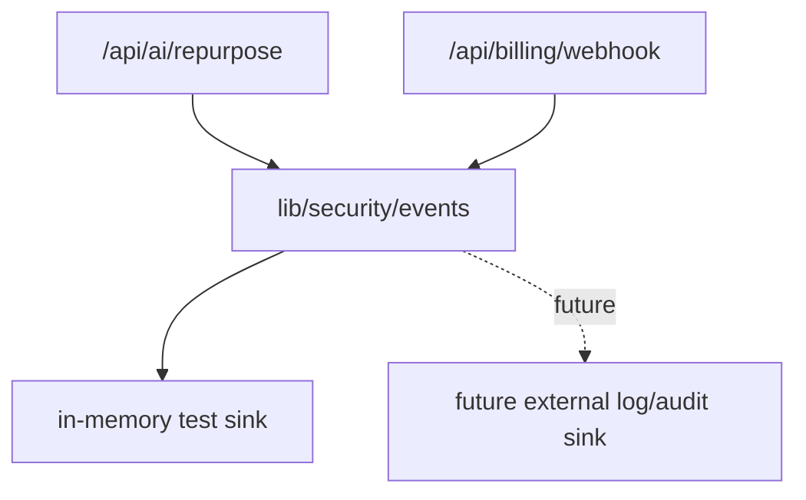

# Design: security-event-logging-pass

## Overall Architecture

## ADR-1: Use An Allowlisted Security Event Contract

**Context**: Security logging can accidentally leak AI source text, provider
payloads, signatures, secrets, or user PII.

**Decision**: Add a small `site/lib/security/events.ts` module with explicit
event categories, names, and metadata sanitization. Routes pass only safe
metadata.

**Consequences**: Tests can assert that sensitive values do not appear in the
event snapshot. A later external sink can reuse the same event contract.

## ADR-2: In-Memory Sink For Current Runtime

**Context**: Toolars does not yet have durable observability or database audit
tables.

**Decision**: Store events in an in-memory sink for route tests and emit a
sanitized `console.warn` JSON record server-side.

**Consequences**: M3 route-level visibility is improved now, while persistent
audit storage remains a future W3 observability pass.

## Event Contract

Fields:

- `id`
- `createdAt`
- `requestId`
- `route`
- `category`: `ai` or `billing`
- `action`
- `outcome`: `denied`, `invalid`, `rate_limited`, or `failed`
- `status`
- `metadata`

Allowed metadata examples:

- AI: `planId`, `selectedPlatformCount`, `userId`, `errorCount`,
  `bodyLimitBytes`
- Billing: `eventName`, `providerObjectId`, `planId`, `accessState`

Forbidden values:

- AI source text or URL
- raw request body
- billing webhook payload
- signatures
- provider secrets
- customer email

## Deployment And Rollback

- Deployment: no database or external service dependency.
- Rollback: revert this branch; route responses remain unchanged.

## Risks And Mitigations

| Risk | Probability | Impact | Mitigation |
|---|---|---|---|
| Sensitive data leaks into logs | M | H | Allowlisted metadata and tests with sentinel sensitive values. |
| Logging changes route responses | L | M | Route tests keep response expectations unchanged. |
| In-memory sink mistaken for durable audit | M | M | Document future external sink and persistent audit as out of scope. |
