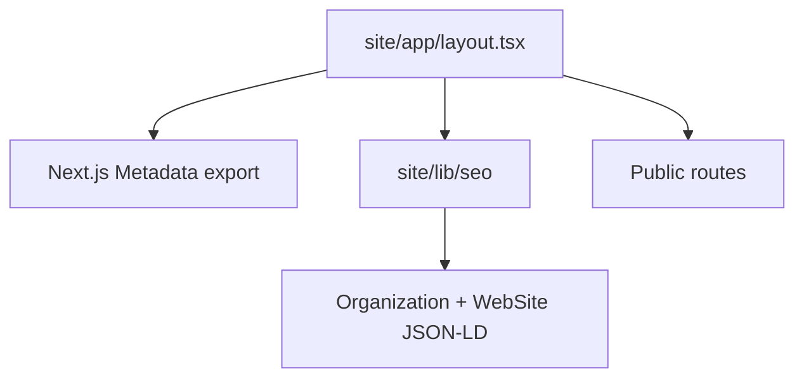

# Design: site-graph-metadata-pass

## Overall Architecture

The change extends the existing `site/lib/seo` helper layer and consumes it from the App Router root layout.

## ADR-1: Keep Site Graph Helpers In `lib/seo`

**Context**: Existing SEO helpers already build route metadata, sitemap entries, robots policy, llms.txt, and page-level JSON-LD.  
**Decision**: Add `buildOrganizationSchema` and `buildWebSiteSchema` to `site/lib/seo/index.ts`.  
**Consequences**: Site graph logic remains typed, testable, and independent from React.

## ADR-2: Render JSON-LD In Root Layout

**Context**: Organization and WebSite schema should be inherited by all public pages without route duplication.  
**Decision**: Render the two JSON-LD scripts in `site/app/layout.tsx` using the existing `serializeJsonLd` helper.  
**Consequences**: App-only pages also include site graph metadata; they remain disallowed in robots and are not added to sitemap.

## ADR-3: Use `/tools?search={search_term_string}` For SearchAction

**Context**: Toolars discovery is search-first and the public tools directory is crawlable.  
**Decision**: Use the tools directory as the search action target.  
**Consequences**: The query URL is stable for crawlers now; a later search-state pass can make the directory read this parameter directly if needed.

## Data Model Changes

No persistent data model changes.

## API Changes

No public API changes.

## Deployment / Rollback

Deployment is static metadata-only. Rollback is reverting this change set.

## Observability

- Unit tests assert schema shape and URL normalization.
- E2E tests assert root document metadata and JSON-LD scripts.
- Build output confirms App Router metadata generation.

## Risks And Mitigations

| Risk | Probability | Impact | Mitigation |
|---|---|---|---|
| SearchAction URL exists before query-state UX | M | L | Use the existing public tools directory and cover the exact URL in tests. |
| Duplicate metadata with route-level overrides | L | M | Keep root defaults generic and let pages retain their own titles/canonicals. |
| Overstated organization data | L | M | Include only verified site name, canonical URL, logo, and contact URL. |
