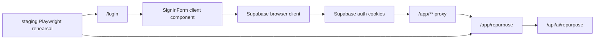

# Design: supabase-auth-staging-rehearsal

## Overall Architecture

## Main Decisions

### ADR-1: Implement password sign-in first

**Context**: The staging test account can use email/password credentials. OAuth,
MFA, password reset, and email confirmation introduce additional provider
configuration.

**Decision**: Implement `SignInForm` with `supabase.auth.signInWithPassword()`.

**Consequences**: The account boundary can be rehearsed with a deterministic
test user. Broader auth UX remains a separate change.

### ADR-2: Keep staging rehearsal env-gated

**Context**: Local CI and developer runs do not have real Supabase staging
credentials.

**Decision**: The staging rehearsal file skips unless
`TOOLARS_RUN_STAGING_AUTH_REHEARSAL=true` and required credentials are present.

**Consequences**: Normal e2e remains fast and deterministic. A missing staging
env cannot be mistaken for a successful live auth rehearsal.

### ADR-3: Use absolute staging URLs only when rehearsal is enabled

**Context**: The default Playwright suite runs against `127.0.0.1:9088`.

**Decision**: Update `playwright.config.ts` so the web server is disabled and
`baseURL` points to `TOOLARS_STAGING_BASE_URL` only when the rehearsal flag is
enabled.

**Consequences**: The same Playwright runner can support local and staging
without starting a local dev server during staging rehearsal.

## Data Model Changes

No schema change is required. The test account must already exist in Supabase
and have a valid `workspace_members` row from the existing auth workspace
foundation migration.

## API Changes

No API route response shape changes are required.

## Deployment, Rollback, And Evidence

- Local default: normal tests run, staging rehearsal skipped.
- Staging: export required env vars, run the staging rehearsal command, and
  record the output in CDC evidence.
- Rollback: revert login form and rehearsal harness; protected app remains
  server-gated.

## Observability

- Do not log staging passwords or Supabase tokens.
- PR closeout must state whether staging was actually run or only harness-ready.

## Risks And Mitigations

| Risk | Probability | Impact | Mitigation |
|---|---|---|---|
| Missing credentials look like success | Medium | High | Skip unless explicit flag and all required values are present. |
| Unsafe `next` redirect | Medium | High | Accept only same-origin paths beginning with a single `/`. |
| Auth form leaks password in logs | Low | High | Tests and docs only reference env names, never values. |
| Login implementation gates calculators | Low | High | Keep auth component under login route and rerun calculator isolation grep. |
