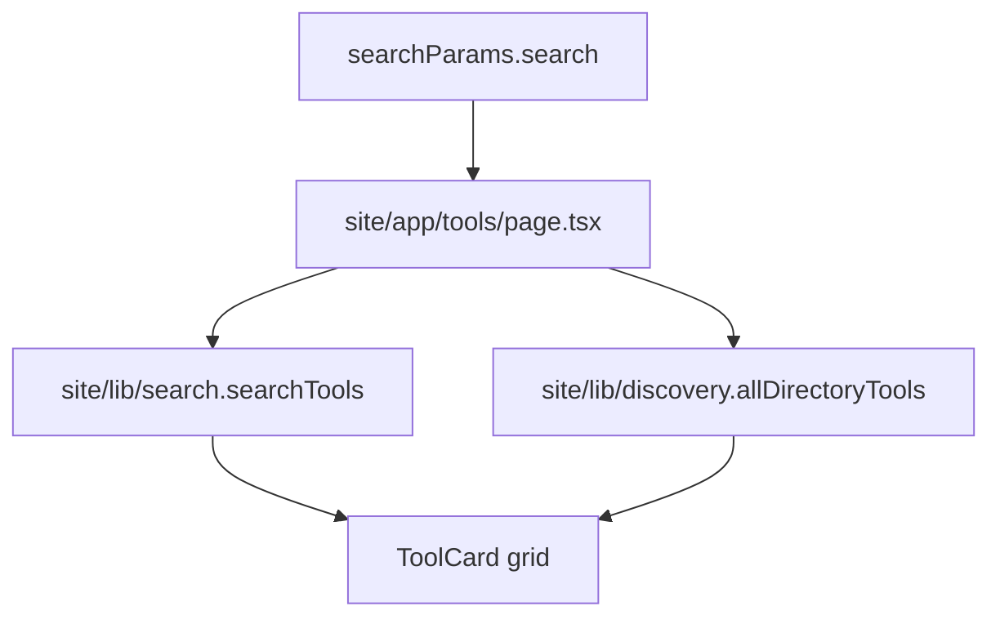

# Design: tools-query-search-pass

## Overall Architecture

## ADR-1: Keep Filtering Server-Rendered

**Context**: The tools directory is a public crawlable page and the SearchAction target is URL-based.  
**Decision**: Read `searchParams` in the App Router page and render matching tools on the server.  
**Consequences**: The result page remains indexable and shareable without adding client-side state.

## ADR-2: Reuse Existing Search Scoring

**Context**: `site/lib/search` already scores by title, slug, category, description, keywords, badges, and popularity.  
**Decision**: Use `searchTools(query, { limit: 12 })` for `/tools?search=...`.  
**Consequences**: Directory URL search and command palette search stay semantically aligned.

## ADR-3: No Live Search Yet

**Context**: Live search needs URL synchronization, keyboard behavior, and mobile focus states.  
**Decision**: Keep this pass to server-rendered query results only.  
**Consequences**: A later pass can add form submission or live updates without changing search semantics.

## Data Model Changes

No persistent data changes.

## API Changes

No API changes.

## Deployment / Rollback

Static/server-rendered page behavior only. Rollback is reverting this change set.

## Observability

- Unit tests assert default and query search rendering.
- E2E tests assert `/tools?search=mortgage` and empty-state behavior.
- Existing SEO E2E continues to cover the SearchAction target.

## Risks And Mitigations

| Risk | Probability | Impact | Mitigation |
|---|---|---|---|
| Async App Router page breaks existing component test | M | M | Update test to render the resolved server component. |
| Query filter silently hides the directory | M | M | Add result summary and empty state copy. |
| Scope expands into full filter system | M | M | Exclude category/type/pricing/sort query params from this pass. |
