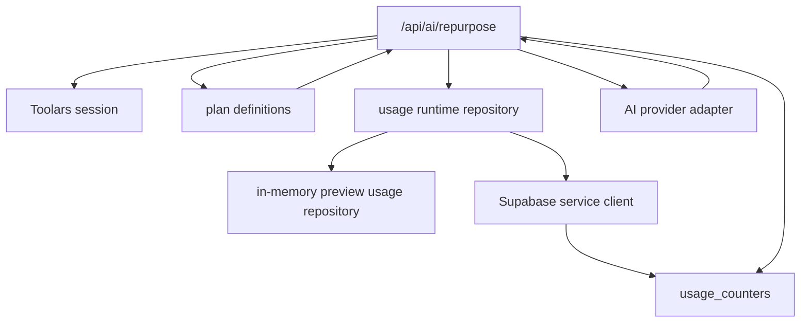

# Design: usage-metering-and-plan-gates

## Overall Architecture



## Source Notes

- Supabase JavaScript upsert/select behavior:
  https://supabase.com/docs/reference/javascript/upsert
- Supabase Row Level Security and service-role boundary:
  https://supabase.com/docs/guides/database/postgres/row-level-security
- Next.js server-only package guidance:
  https://nextjs.org/docs/app/getting-started/server-and-client-components#preventing-environment-poisoning

## ADR-1: Meter Workspace Usage, Not User Usage

**Context**: Toolars sessions are workspace-scoped, billing subscriptions are
workspace-scoped, and Team accounts may include multiple users.

**Decision**: Usage counters use `workspace_id`, `period_start`, and
`period_end` as the durable key. AI route checks read usage by
`session.workspaceId`.

**Consequences**: Cross-device and future team usage behavior aligns with
billing.

## ADR-2: Increment After Provider Success

**Context**: Validation failures, auth failures, rate limits, and provider
errors should not charge quota.

**Decision**: The AI route reads usage before plan evaluation, calls the
provider only when allowed, and increments usage only after the provider returns
a completed job.

**Consequences**: Plan denials and failed requests do not consume monthly quota.

## ADR-3: Keep Preview Rate Limit Separate From Durable Usage

**Context**: The existing preview runtime guard protects local/dev usage from
request bursts. It is not a commercial usage meter.

**Decision**: Keep preview request rate limiting in `runtime-security.ts`, but
replace preview generation counting in the AI route with the usage repository.

**Consequences**: Short-window abuse protection and monthly plan usage remain
separate concerns.

## Data Model

Add migration:

```text
supabase/migrations/20260607133000_usage_counters.sql
```

Table:

| Table | Purpose |
|---|---|
| `usage_counters` | Monthly workspace counters for AI generations, exports, and batch runs |

Key fields:

- `workspace_id`
- `period_start`
- `period_end`
- `ai_generations_used`
- `exports_used`
- `batch_runs_used`
- `created_at`
- `updated_at`

Unique key: `(workspace_id, period_start)`.

## API And Module Changes

Add:

```text
site/lib/usage/index.ts
site/lib/usage/supabase.ts
site/lib/usage/runtime.ts
site/lib/usage/__tests__/usage.test.ts
site/lib/usage/__tests__/supabase.test.ts
site/lib/usage/__tests__/runtime.test.ts
site/lib/db/__tests__/usage-migration.test.ts
```

Update:

```text
site/app/api/ai/repurpose/route.ts
site/app/api/ai/repurpose/route.test.ts
site/lib/db/public-calculator-isolation.ts
```

## Deployment And Rollback

- SQL migration is additive.
- Code can fall back to the preview repository outside production.
- Rollback route behavior by switching AI route usage reads back to preview
  runtime state before removing the DB table.

## Observability

- Plan denials already emit structured security events without source text.
- Usage counter write failures should fail the request before returning a
  successful generation response, because returning success without quota
  accounting would break billing integrity.

## Risks And Mitigations

| Risk | Probability | Impact | Mitigation |
|---|---|---|---|
| Generation succeeds but usage write fails | M | H | Increment immediately after generation and fail closed on write error |
| Free calculator paths import usage | L | H | Extend dependency isolation scanner |
| Month boundary off by timezone | M | M | Use UTC month period helper and tests |
| Duplicate retry double counts usage | M | M | API retries remain one request per route invocation; idempotent AI jobs are a future persistence pass |
